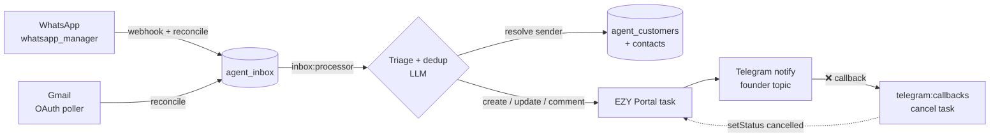

# Agent Orchestrator

A solo-founder **chief-of-staff** service. It ingests inbound messages from your customers (WhatsApp + Gmail), uses an LLM to triage them, opens or updates the right **EZY Portal** task, and pings you on **Telegram** with a one-tap **❌ undo**. The goal is the *money-loop*: nothing a customer asks for falls through the cracks, and every request becomes a tracked task without you touching a keyboard.



A sender is only actioned if it **resolves to a known customer contact** (`agent_customer_contacts` on `channel_type` + `address`); unknown senders are counted and skipped. That is why onboarding a customer is a prerequisite for the loop to do anything — see [Quickstart](#quickstart).

## Prerequisites

| # | Requirement | Notes |
|---|-------------|-------|
| 1 | **PostgreSQL + pgvector** | Dedicated `ao-postgres` (`pgvector/pgvector:pg18`), host-published on `localhost:55432` — `docker compose -f docker-compose.db.yml up -d`. Separate from the shared ops-dev `ezy-postgres` so the vector RAG never bounces the portal stack. The `agent_orchestrator` DB is created by `npm run db:create`. |
| 2 | **whatsapp_manager service** | The WhatsApp bridge, default `http://localhost:3000`. Provides the webhook + the pull/reconcile directory API. |
| 3 | **EZY Portal tenant + scoped key** | Default `http://localhost:5040`. A scoped `ten_…` API key (`EZY_PORTAL_API_KEY`) with task write rights. |
| 4 | **Telegram bot + forum supergroup** | A BotFather token (`TELEGRAM_BOT_TOKEN`) and a **forum-enabled** supergroup (`TELEGRAM_SUPERGROUP_CHAT_ID`); the loop notifies you there and creates a topic per customer. |
| 5 | **≥1 LLM provider key** | `ANTHROPIC_API_KEY` **and** one of `OPENAI_API_KEY` / `DEEPSEEK_API_KEY` (for failover). See [integrations/llm.md](./integrations/llm.md). |
| 6 | **Gmail OAuth** *(optional)* | Only if you ingest email. Add accounts from the console **Connectors** tab (preferred) or mint a token per account via `npm run gmail:oauth`. See [channels/gmail.md](./channels/gmail.md). |

Without Telegram the service still boots, but the **money-loop workers are disabled** (ingestion only). Without a resolvable customer contact, ingested messages are skipped.

Beyond the core money-loop, optional default-off surfaces (managed in the console
**Settings** tab) layer on: cited **draft replies** you approve/edit/revise,
scoped **knowledge RAG**, **historical backfill**, **daily/weekly digests**,
**proactive task-done notices**, and a founder **`/ask` Project Brain** query. See
[configuration.md § Feature flags](./configuration.md#feature-flags).

## Quickstart

From the repo root (`/mnt/dev/tools/agent_orchestrator`):

```bash
# 1. Install
npm install

# 2. Configure — copy the template and fill in the minimum secrets
cp .env.example .env
```

Set at least these in `.env` (full reference in [configuration.md](./configuration.md); never commit real values):

```bash
EZY_PORTAL_API_KEY=          # scoped ten_ key with task write
WHATSAPP_MANAGER_API_KEY=    # whatsapp_manager x-api-key
WEBHOOK_SECRET=              # MUST match whatsapp_manager's WEBHOOK_SECRET
TELEGRAM_BOT_TOKEN=          # from BotFather
TELEGRAM_SUPERGROUP_CHAT_ID= # -100… forum supergroup id
ANTHROPIC_API_KEY=           # + one of OPENAI_API_KEY / DEEPSEEK_API_KEY
```

> These secrets (and the `*_ENABLED` feature flags) can instead be managed from
> the console **Connectors** / **Settings** tabs once the service is up — `.env`
> is the seed/fallback. See [configuration.md § Settings & Connectors](./configuration.md#settings--connectors--the-db-authoritative-overlay).

```bash
# 3. Create the database (idempotent) and run migrations
npm run db:create
npm run migrate

# 4. Run the service (stable, non-watch, in a tmux session)
./debug.sh
#   backend → http://localhost:3100   health → /health

# 5. Onboard your first customer (creates the customer, imports contacts,
#    opens their Telegram topic). bp-ref / project-ref are EZY Portal uuids.
npm run onboard -- --bp-ref=<uuid> --project-ref=<uuid>
```

Verify it is alive with `curl -s http://localhost:3100/health | jq`. Full run/operate detail — logs, workers, all scripts — is in [operations.md](./operations.md).

## Documentation index

| Doc | What's in it |
|-----|--------------|
| [README.md](./README.md) | This page — overview, prerequisites, quickstart. |
| [configuration.md](./configuration.md) | Every environment variable, the sealed credentials store, and the `/admin` API. |
| [operations.md](./operations.md) | Running (`./debug.sh`), logs, `/health`, background workers, npm scripts, onboarding. |
| [channels/whatsapp.md](./channels/whatsapp.md) | WhatsApp ingestion — webhook + pull reconciliation via whatsapp_manager. |
| [channels/gmail.md](./channels/gmail.md) | Gmail ingestion — OAuth setup and the per-instance reconcile poller. |
| [integrations/telegram.md](./integrations/telegram.md) | Telegram notifier — founder topics, admin topic, the ❌-undo callback. |
| [integrations/ezy-portal.md](./integrations/ezy-portal.md) | EZY Portal task target — create/find/comment/status and the dedup contract. |
| [integrations/llm.md](./integrations/llm.md) | LLM gateway — providers, routing, model/effort overrides, cost cap. |
| [project-brain.md](./project-brain.md) | Project Brain — the internal-knowledge RAG, its stdio MCP server (search / get / resync), and how to register it in Claude Code. |
