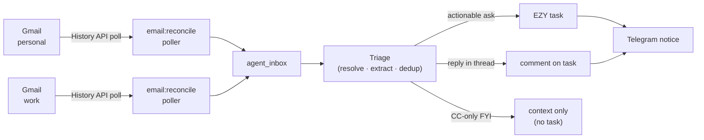

# Gmail channel — configuring the two email accounts

This is the end-to-end guide to wiring your **two Gmail accounts** (personal + work)
into the Agent Orchestrator so inbound mail feeds the money-loop. Follow it once per
account. Do the [Google Cloud one-time setup](#2-google-cloud-one-time-setup) first,
then repeat steps [3](#3-mint-the-refresh-tokens-once-per-account)–[4](#4-store-the-credential--set-the-account-email)
for each account.

See also: [Configuration](../configuration.md) · [Operations](../operations.md).

---

## 1. Overview

Each Gmail account is one row in the `channel_instances` table. Two rows are seeded
(migration `src/db/migrations/001_channel_instances.sql`):

| `name`                  | `channel_type` | `provider` | `credentials_ref`      | `config.accountEmail` (seed placeholder) |
| ----------------------- | -------------- | ---------- | ---------------------- | ---------------------------------------- |
| `email:gmail:personal`  | `email`        | `gmail`    | `GMAIL_PERSONAL_OAUTH` | `CHANGE_ME_personal@gmail.com`           |
| `email:gmail:work`      | `email`        | `gmail`    | `GMAIL_WORK_OAUTH`     | `CHANGE_ME_work@example.com`             |

At boot the channel registry (`src/adapters/channel-registry.ts`) builds one
`EmailChannelAdapter` per row, and `main.ts` starts one **reconcile poller** per
ready Gmail instance. Each poller pulls new inbox mail via the Gmail **History API**
and ingests it into the same triage → dedup → notify money-loop that WhatsApp uses.



Two things must be set per account before its poller runs (either one missing → the
instance is **skipped** at boot, see [Troubleshooting](#7-troubleshooting)):

1. The **OAuth credential** (`GMAIL_PERSONAL_OAUTH` / `GMAIL_WORK_OAUTH`) — a JSON
   blob `{client_id, client_secret, refresh_token}`.
2. The instance's **`config.accountEmail`** — must be a real address (not the
   `CHANGE_ME…` placeholder).

---

## 2. Google Cloud one-time setup

Do this **once** for the project — the same OAuth client works for both accounts.
These steps mirror the header of `scripts/gmail-oauth.ts`.

1. Go to [console.cloud.google.com](https://console.cloud.google.com) → **create or
   select a project**.
2. **APIs & Services → Library** → search for **"Gmail API"** → **Enable**.
3. **APIs & Services → OAuth consent screen**:
   - User type: **External**.
   - Under **Test users**, add **both** of your Gmail addresses (personal and work).
     (An unpublished External app only lets its listed test users authorize — you
     do not need to submit the app for verification.)
   - Add the two scopes the tool requests:
     - `https://www.googleapis.com/auth/gmail.readonly`
     - `https://www.googleapis.com/auth/gmail.send`
4. **APIs & Services → Credentials → Create credentials → OAuth client ID**:
   - Application type: **Desktop app**.
   - Create it, then **Download JSON**. Keep this file safe — it holds the
     `client_id` + `client_secret`.

> Why "Desktop app": the minting script uses a **loopback redirect**
> (`http://localhost:<port>`), which Desktop clients allow with no redirect URI to
> register. A "Web application" client would reject it.

---

## 3. Mint the refresh tokens (once per account)

`npm run gmail:oauth` runs the loopback OAuth flow and prints a **refresh token** for
one account. Run it **twice** — once per account — and pick the matching Google
account in the browser each time.

```bash
cd /mnt/dev/tools/agent_orchestrator

# Point it at the client JSON you downloaded in step 2.4:
npm run gmail:oauth -- --client ~/Downloads/client_secret_XXXX.json
```

Alternative ways to pass the client (any one of these):

```bash
# Explicit id/secret on the CLI:
npm run gmail:oauth -- --client-id <CLIENT_ID> --client-secret <CLIENT_SECRET>

# Or via environment (GOOGLE_CLIENT_ID / GOOGLE_CLIENT_SECRET):
GOOGLE_CLIENT_ID=<id> GOOGLE_CLIENT_SECRET=<secret> npm run gmail:oauth

# If port 4779 is busy, choose another free port for the loopback redirect:
npm run gmail:oauth -- --client ~/Downloads/client_secret_XXXX.json --port 4780
```

What happens:

1. The script opens your browser (or prints the URL if headless) to the Google
   consent page. **Select the account you are connecting** — personal the first
   run, work the second.
2. Approve the `gmail.readonly` + `gmail.send` scopes.
3. Google redirects to `http://localhost:<port>`; the script catches the code,
   exchanges it, and prints:
   - the **refresh token**,
   - the **connected account email** (read from the Gmail profile), and
   - a ready-to-paste **credential blob** + a `curl` for
     [step 4](#4-store-the-credential--set-the-account-email).

The auth request uses `access_type=offline` + `prompt=consent`, so Google returns a
refresh token **every** run — even on a re-auth of an account you previously
connected.

> **No `refresh_token` in the output?** That only happens if a prior grant is still
> active and the consent screen was skipped. Revoke the app at
> [myaccount.google.com/permissions](https://myaccount.google.com/permissions) for
> that account, then re-run — `prompt=consent` will force a fresh one.

> **Which account name did it pick?** The script guesses the credential name from the
> email (`…work / company / corp…` → `GMAIL_WORK_OAUTH`, else `GMAIL_PERSONAL_OAUTH`).
> Confirm the printed name matches the account you meant, and override it in
> [step 4](#4-store-the-credential--set-the-account-email) if the guess is wrong.

---

## 4. Store the credential + set the account email

Two writes per account. The instance stays skipped until **both** are done.

### 4a. Store the OAuth credential

The credential value is the JSON blob the script printed:
`{"client_id":"…","client_secret":"…","refresh_token":"…"}`. Store it under the name
that matches the instance's `credentials_ref` — `GMAIL_PERSONAL_OAUTH` for the
personal account, `GMAIL_WORK_OAUTH` for work.

**Option A — admin API (sealed store, preferred).** The orchestrator must be running
with both `ADMIN_API_KEY` and `CREDENTIALS_ENCRYPTION_KEY` set (see
[Configuration](../configuration.md)); the endpoint is served at
`http://localhost:3100/admin/credentials`:

```bash
# Paste the exact blob the script printed as the "value". Response shows last4 only.
curl -s -X POST http://localhost:3100/admin/credentials \
  -H "x-admin-key: $ADMIN_API_KEY" -H 'content-type: application/json' \
  -d '{"name":"GMAIL_PERSONAL_OAUTH","value":"{\"client_id\":\"…\",\"client_secret\":\"…\",\"refresh_token\":\"…\"}"}'
```

**Option B — `.env`.** Set the same name to the JSON blob (credential resolution is
store-first, env-fallback, so either works):

```bash
GMAIL_PERSONAL_OAUTH={"client_id":"…","client_secret":"…","refresh_token":"…"}
```

Repeat with `GMAIL_WORK_OAUTH` for the work account.

### 4b. Set the instance's account email

Replace the `CHANGE_ME…` placeholder with the real address the script reported. This
is the address the poller treats as "you" (self-sent mail is skipped, and the
[CC-only rule](#the-cc-only-rule) compares against it).

```bash
# Uses the orchestrator's DB connection (DATABASE_URL, or the PG* defaults:
# postgres@localhost:42016/agent_orchestrator — see Configuration).
psql "$DATABASE_URL" -c "UPDATE channel_instances \
  SET config = jsonb_set(config, '{accountEmail}', '\"you@gmail.com\"') \
  WHERE name = 'email:gmail:personal';"
```

Do the same for `email:gmail:work` with the work address.

> **Why both are required.** The factory (`src/adapters/email/factory.ts`) throws —
> and the registry then **skips** the instance — when `accountEmail` is empty or still
> starts with `CHANGE_ME`, **or** when the OAuth credential is missing (it eagerly
> resolves `credentials_ref` at boot). A skipped instance gets no poller.

After both writes, **restart** so the registry rebuilds (see
[step 6](#6-verify--gate)).

---

## 5. How ingestion works

- **Incremental polling.** Each instance polls every `EMAIL_RECONCILE_INTERVAL_MS`
  (default **60 000 ms** = 60s; `src/config/env.ts`), and once immediately on
  startup. Between ticks the client walks the Gmail **History API**
  (`historyTypes=messageAdded`, `labelId=INBOX`), fully paginating each burst.
- **Bootstrap.** On the very first tick (no cursor yet) it backfills the last **2
  days** of inbox mail; on later re-bootstraps it backfills from the last successful
  poll, capped at **30 days**. It captures the profile `historyId` before listing so
  the overlap is dedup-safe.
- **historyId expiry.** If Gmail returns 404 for a too-old `historyId`, the client
  logs `gmail: historyId expired — re-bootstrapping from last poll` and
  auto-rebootstraps — no manual action.
- **Self-sent mail is skipped.** Only `INBOX` is polled (never `SENT`), and the
  adapter additionally drops any message whose `From` equals the instance's
  `accountEmail`. There is no send→ingest loop.
- **Body extraction.** The MIME parser prefers `text/plain`, falls back to stripped
  `text/html`, else null.
- **Threading & dedup.** The Gmail `threadId` is the thread key. A reply in an
  existing thread dedups onto the already-created task (adds a comment) instead of
  opening a duplicate.

### The CC-only rule

When your `accountEmail` is only in **Cc** (not in **To**), you were merely copied,
not asked. The triage service (`src/triage/triage.service.ts`, `isCcOnly`) treats such
a message as **context only — no task and no ping** *unless* the extracted intent is
both an actionable category **and** confident:

- **Actionable categories:** `bug_report`, `new_feature_request`, `custom_development`,
  `question_existing`, `follow_up`.
- **Confidence:** `≥ 0.5`.

A CC-only mail that is unclear or low-confidence is recorded as context and
**does not** notify you.

---

## 6. Verify / gate

Restart to pick up the config, then walk the three cases.

```bash
cd /mnt/dev/tools/agent_orchestrator
./debug.sh                          # stable run in tmux session 'ao-debug'
tmux capture-pane -pt ao-debug      # peek at logs (or: tail -f tmp/ao-debug.log)
```

Confirm the boot log shows your instances as pollers, e.g.
`email pollers registered {"emailInstances":2}` and **no** `instance skipped` warning
for either Gmail row.

Then gate:

1. **Known sender → task.** From a sender whose address/domain resolves to a
   configured customer (see below), send a fresh email. Expect a new **EZY task** and
   a **Telegram** notice.
2. **Reply in-thread → comment, no duplicate.** Reply within that same thread. Expect
   a **comment** added to the same task — not a second task.
3. **CC-only FYI → nothing.** Have someone send a low-stakes FYI that only **Cc**s your
   address (you are not in To). Expect **no task and no ping**.

---

## 7. Troubleshooting

**Instance skipped at boot.** Look for
`channel registry: instance skipped (build failed)` in the log — the `reason` field
says which: `has no accountEmail set` (finish [step 4b](#4b-set-the-instances-account-email))
or `Missing credential "GMAIL_…_OAUTH"` (finish [step 4a](#4a-store-the-oauth-credential)).
Fix, then restart. `email pollers registered {"emailInstances":N}` tells you how many
made it.

**No refresh token from the mint script.** A stale grant let Google skip the consent
screen. Revoke the app at
[myaccount.google.com/permissions](https://myaccount.google.com/permissions) for that
account and re-run [step 3](#3-mint-the-refresh-tokens-once-per-account).

**`historyId` expired.** Handled automatically — the poller re-bootstraps from the
last poll (log line above). No action needed.

**Sender not resolving (mail ingested but no task, log says
`triage: unknown sender — skipped`).** The sender must either:

- match a row in **`agent_customer_contacts`** exactly (`channel_type='email'`,
  lowercased `address`), or
- have an email **domain** that matches **exactly one** customer's
  `agent_customers.email_domain` — in which case you get an "add this contact?"
  proposal in Telegram rather than a silent skip. Zero matches, or an ambiguous
  domain matching two+ customers, resolves as **unknown** and is skipped (a
  `skipped_unknown_senders` counter is bumped).

Add the contact / set the customer's `email_domain`, then the next mail from that
sender will triage. See [Operations](../operations.md) for onboarding a customer.

**Credential store returns 503 on the admin POST.** `CREDENTIALS_ENCRYPTION_KEY` is
unset — the sealed store can't encrypt. Set it (see [Configuration](../configuration.md))
and restart, or use the `.env` fallback in [step 4a](#4a-store-the-oauth-credential).
