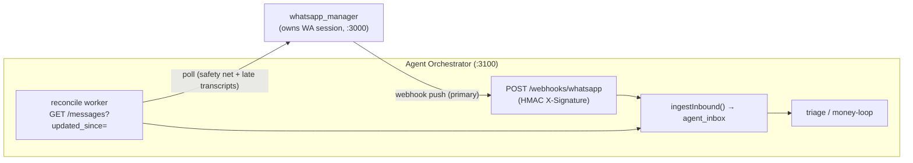

# WhatsApp channel

How to configure the **WhatsApp** channel for the Agent Orchestrator.

Audience: the operator (Yuval). Every env var, endpoint, and path below is verified
against the code — file references are relative to the orchestrator repo root
(`/mnt/dev/tools/agent_orchestrator`) unless noted.

---

## 1. Overview

WhatsApp is **not** owned by the orchestrator. A separate service,
**`whatsapp_manager`** (`/mnt/dev/tools/whatsapp_manager`), owns the actual
WhatsApp Web session (the phone link, whitelist, transcription, media archival).
The orchestrator only talks to it **over HTTP** — it **never** touches the
`whatsapp_manager` database (hard project invariant #5; see
[`../../src/adapters/whatsapp-manager/http.ts`](../../src/adapters/whatsapp-manager/http.ts),
which has no `pg` import by design).

Two independent ingestion paths bring messages in:

1. **Webhook push (primary).** When `whatsapp_manager` captures a routable message
   (a whitelisted 1:1 contact, or a monitored group) it POSTs the message JSON to
   the orchestrator, signed with an HMAC. This is best-effort and fire-and-forget —
   `whatsapp_manager` never retries.
2. **Reconcile poll (safety net).** A background worker periodically calls
   `GET /messages?updated_since=<cursor>` to re-ingest anything the webhook dropped.
   It is also the **only** path that delivers **late voice-note transcripts** —
   `whatsapp_manager` never re-fires the webhook after transcribing; it just bumps
   the row's `updated_at`, which re-surfaces it to the poll.

The channel is a single row in `channel_instances`:

| Column | Value |
| --- | --- |
| `name` | `whatsapp:primary` |
| `channel_type` | `whatsapp` |
| `provider` | `whatsapp_manager` |
| `credentials_ref` | `WHATSAPP_MANAGER_API_KEY` |

Seeded by [`../../src/db/migrations/001_channel_instances.sql`](../../src/db/migrations/001_channel_instances.sql).
The `whatsappPrimary()` lookup in
[`../../src/adapters/channel-registry.ts`](../../src/adapters/channel-registry.ts)
returns this single active `whatsapp_manager` instance.



---

## 2. Orchestrator configuration

Non-secret settings live in the zod schema in
[`../../src/config/env.ts`](../../src/config/env.ts). **Secrets never live there** —
they resolve through `resolveCredential(...)` in
[`../../src/config/credentials.ts`](../../src/config/credentials.ts)
(sealed-store first, `process.env` fallback), so a secret's env var name is
identical to its credential ref.

| Setting | Secret? | Default | Purpose |
| --- | --- | --- | --- |
| `WHATSAPP_MANAGER_BASE_URL` | no | `http://localhost:3000` | Base URL of the `whatsapp_manager` HTTP API. Must be a valid URL. Used for **both** the reads and the directory client (`env.ts` → factory). |
| `WHATSAPP_MANAGER_API_KEY` | **yes** | — (required) | The read key sent as the `x-api-key` header on every read (`GET /messages`, `GET /status`). **Must equal `whatsapp_manager`'s `API_KEY`.** |
| `WEBHOOK_SECRET` | **yes** | — (required) | Shared HMAC-SHA256 secret. **Must match `whatsapp_manager`'s `WEBHOOK_SECRET`** or every webhook 401s. |
| `WHATSAPP_RECONCILE_INTERVAL_MS` | no | `900000` (15 min) | Reconcile poll interval. |
| `WHATSAPP_RECONCILE_LOOKBACK_MS` | no | `5000` | Cursor overlap — query from `cursor − Δ` to absorb boundary rows (the upsert dedups the overlap). |
| `WHATSAPP_RECONCILE_MAX_PAGES` | no | `200` | Page cap per tick (200 × limit-100 = 20k rows). Hitting the cap **alarms and does NOT advance the cursor**. |
| `PORT` | no | `3100` | The port the webhook listens on — this determines the `WEBHOOK_URL` the other side must target. |

Notes verified against the code:

- **`WEBHOOK_SECRET` is resolved eagerly at boot** in
  [`../../src/adapters/whatsapp-manager/factory.ts`](../../src/adapters/whatsapp-manager/factory.ts)
  (`buildWhatsAppAdapter`). If it is unset, the service **fails closed at startup**
  rather than ever accepting an unsigned push.
- **`WHATSAPP_MANAGER_API_KEY` is resolved lazily** (per request). If it is empty,
  `resolveCredential` throws `Missing credential "WHATSAPP_MANAGER_API_KEY"` the
  first time a read is attempted.
- The `baseUrl` in the `channel_instances.config` JSON (`CHANGE_ME_whatsapp_base_url`
  in the seed) is **not** used — the base URL always comes from
  `WHATSAPP_MANAGER_BASE_URL`. Leave the seed value as-is.

Set the values (example — do **not** commit real secrets):

```bash
# .env in /mnt/dev/tools/agent_orchestrator (see .env.example)
WHATSAPP_MANAGER_BASE_URL=http://localhost:3000
WHATSAPP_MANAGER_API_KEY=<read key — same string as whatsapp_manager API_KEY>
WEBHOOK_SECRET=<HMAC secret — same string as whatsapp_manager WEBHOOK_SECRET>

# Generate a strong shared secret once, then paste the SAME value on both sides:
#   openssl rand -hex 32
```

---

## 3. `whatsapp_manager` side

On the `whatsapp_manager` service (`/mnt/dev/tools/whatsapp_manager`, config schema
`src/config/env.ts`) set three matching values so it pushes to — and authorizes
reads from — the orchestrator:

| `whatsapp_manager` var | Set to | Must equal (orchestrator) |
| --- | --- | --- |
| `WEBHOOK_URL` | `http://localhost:3100/webhooks/whatsapp` | (the orchestrator's `PORT` + webhook path) |
| `WEBHOOK_SECRET` | your shared HMAC secret | `WEBHOOK_SECRET` |
| `API_KEY` | your read key | `WHATSAPP_MANAGER_API_KEY` |

```bash
# .env (or .env.test) in /mnt/dev/tools/whatsapp_manager
WEBHOOK_URL=http://localhost:3100/webhooks/whatsapp
WEBHOOK_SECRET=<same value as the orchestrator's WEBHOOK_SECRET>
API_KEY=<same value as the orchestrator's WHATSAPP_MANAGER_API_KEY>
```

Behavior to know (from `whatsapp_manager`'s `src/router/message-router.ts`,
`webhook-message-router.ts`, and `auth/auth.middleware.ts`):

- The webhook fan-out is wired **only when `WEBHOOK_URL` is set**. It fires for
  already-routable messages only (whitelisted 1:1 + monitored groups) — it does not
  re-check the privacy policy.
- When `WEBHOOK_SECRET` is set, each POST carries
  `X-Signature: sha256=<hex HMAC-SHA256 of the exact request body>`. Delivery is
  best-effort; a failing webhook never blocks persistence.
- When `JWT_SECRET` is also configured (it is, in the test clone), `API_KEY` is
  **read-only (GET endpoints only)** — exactly what the orchestrator needs. It
  cannot send outbound, edit the whitelist, or touch credentials.

### Test clone (`run_test.sh`)

[`/mnt/dev/tools/whatsapp_manager/run_test.sh`](/mnt/dev/tools/whatsapp_manager/run_test.sh)
runs an **isolated test instance** on the normal port **`3000`** so you can drive
the orchestrator end-to-end without disturbing prod data:

- Reads `.env.test` (via `DOTENV_CONFIG_PATH`), which already contains
  `API_KEY` / `WEBHOOK_URL` / `WEBHOOK_SECRET` wired for the orchestrator.
- Isolated DB `whatsapp_manager_test`; points at the local-dev portal
  (`account-test.portal.net`).
- **Cloned** WhatsApp session — no QR rescan.
- Launches in a tmux session `wm-test` (backend + `frontend/`), **stopping the prod
  instance first** (it calls `stop.sh` and kills any prior test/debug session).

```bash
bash /mnt/dev/tools/whatsapp_manager/run_test.sh
# backend: http://localhost:3000   |   detach: Ctrl-b d
# stop:    tmux kill-session -t wm-test
```

---

## 4. How ingestion works

Both paths converge on the same idempotent writer, `ingestInbound()` in
[`../../src/inbox/ingestion.ts`](../../src/inbox/ingestion.ts), which upserts into
`agent_inbox` keyed on `(channel_instance_id, channel_message_id)` — so a webhook
delivery and a reconcile tick for the same message dedup to one row. Inbound rows
land `pending` (picked up by the triage money-loop); our own `outbound` rows are
stored `skipped`. A late voice transcript **enriches** the existing row's `body`
without disturbing its triage state.

**Webhook path (primary)** —
[`../../src/adapters/whatsapp-manager/webhook.router.ts`](../../src/adapters/whatsapp-manager/webhook.router.ts):

1. Mounted at `/webhooks/whatsapp`, with a **path-scoped raw body parser** so the
   global `express.json()` never re-serializes the bytes.
2. HMAC is verified over the **exact raw bytes** against `WEBHOOK_SECRET` —
   constant-time, in
   [`../../src/adapters/whatsapp-manager/signature.ts`](../../src/adapters/whatsapp-manager/signature.ts)
   (`sha256=<hex>`). A missing/bad signature → **401, no DB write**.
3. Valid signature but unparseable JSON → **400**. Ingest failure → **500**
   (the reconcile poll recovers the row). The message body is never logged.

**Reconcile path (safety net + late transcripts)** —
[`../../src/adapters/whatsapp-manager/reconcile.worker.ts`](../../src/adapters/whatsapp-manager/reconcile.worker.ts):

1. Cursor is `channel_instances.sync_cursor` (ISO). **First run** (cursor NULL):
   it stores `now()` and ingests **no history** (backfill is a separate change).
2. Each tick pages `GET /messages?updated_since=<cursor − lookback>&limit=100&offset=…`
   (adapter `fetchSince`), ingests every row, then advances the cursor to
   `max(updated_at)` **only on a full drain**.
3. If the page cap is hit, it **alarms and does not advance** — advancing past a
   capped, timestamp-DESC tail would lose transcribed rows.

> **Outbound send is not enabled yet.** `send()` POSTs `/outbound/send`, but the
> read-only `x-api-key` returns 403 until milestone **M1.8**. Do not expect the
> orchestrator to reply on WhatsApp.

---

## 5. Verify

Both scripts require the orchestrator's `.env` (they read the same config/creds).
The smoke test also needs the orchestrator **running** on `PORT` (default 3100).

**Synthetic signed webhook** —
[`../../scripts/smoke-webhook.ts`](../../scripts/smoke-webhook.ts) signs a fake
message with `WEBHOOK_SECRET` and POSTs it to `http://localhost:<PORT>/webhooks/whatsapp`:

```bash
npm run smoke:webhook -- --body="test"
```

Flags (all optional):

| Flag | Effect |
| --- | --- |
| `--id=<msgId>` | Message id (default `smoke-<epoch>`). |
| `--body="text"` | Message text (ignored for `--voice`). |
| `--from=<number>` | Sender/contact number (default `50768087246`). |
| `--voice` | Send a `ptt` voice note (empty body + audio media) instead of a chat. |
| `--outbound` | Mark `direction=outbound` (stored `skipped`, not triaged). |
| `--tamper` | Corrupt the signature by one char → proves the **401** path. |

After a run, check the row it wrote:

```bash
psql "$DATABASE_URL" -c \
  "SELECT id, status, body FROM agent_inbox WHERE channel_message_id='<msgId>';"
```

**Force one reconcile tick** —
[`../../scripts/reconcile-once.ts`](../../scripts/reconcile-once.ts) runs exactly
one pass and exits (same wiring as the background worker, same cursor):

```bash
npm run reconcile:once
```

**End-to-end:** a real message from a **monitored** contact (whitelisted on
`whatsapp_manager`) that is also **linked** in the orchestrator's
`agent_customer_contacts` should create an EZY task and a Telegram notice.

---

## 6. Troubleshooting

| Symptom | Likely cause | Fix |
| --- | --- | --- |
| Webhook returns **401** (`invalid signature`) | `WEBHOOK_SECRET` differs between the two services (or is unset on one) | Set the **identical** secret on both sides; restart both. `smoke:webhook` without `--tamper` should then return 200. |
| Reads throw `Missing credential "WHATSAPP_MANAGER_API_KEY"` | The key is empty in the orchestrator | Set `WHATSAPP_MANAGER_API_KEY`. |
| Reads fail with `whatsapp_manager GET /messages failed (401)` | The key is set but ≠ `whatsapp_manager`'s `API_KEY` | Make the two strings identical. |
| Service **won't boot** (missing `WEBHOOK_SECRET`) | Eager fail-closed in the adapter factory | Set `WEBHOOK_SECRET` — the webhook cannot run unsigned. |
| Message ingested but **no EZY task / Telegram notice** | Sender not resolved: no matching row in `agent_customer_contacts` for `channel_type='whatsapp'` + the digits-only number → resolves as `unknown` | Link the contact (onboarding) so it matches exactly. See [`../../src/customers/contact-resolution.ts`](../../src/customers/contact-resolution.ts). |
| Nothing arrives at all | `WEBHOOK_URL` unset/wrong on `whatsapp_manager`, or the contact isn't whitelisted/monitored there | Set `WEBHOOK_URL=http://localhost:3100/webhooks/whatsapp`; confirm the contact is whitelisted. The reconcile poll is the fallback — run `npm run reconcile:once`. |
| Late **voice transcript** never appears | Only the reconcile poll delivers it; the poller may be off or the cursor stuck at a page cap | Check the worker interval / a page-cap alarm; force it with `npm run reconcile:once`. |
