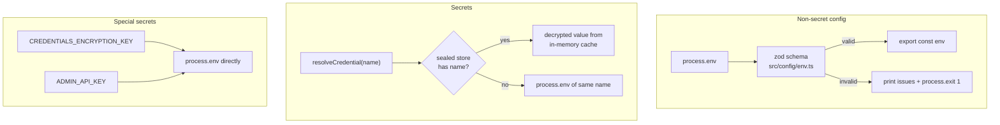

# Configuration

The central config reference for the Agent Orchestrator. Everything the service
reads at boot or first use lives here: how config is loaded, every environment
variable, every secret, and the sealed credentials store.

> **Secrets:** this document never prints real secret values. Wherever you see
> `<your-key>`, substitute your own value. Never commit real keys to `.env`.

## How config works

Config splits into two lanes with different trust models:



### Non-secret config — env, zod-validated

All non-secret settings are declared in `src/config/env.ts` as a zod schema,
parsed once against `process.env` at import time. Invalid config (wrong type,
bad enum, malformed URL) prints the offending fields and **exits the process**
— the service refuses to boot on bad config rather than limping along. Valid
config is frozen into the exported `env` object; nothing reads `process.env`
for these values afterward.

**Secrets are never in this schema** (invariant #4 / D8). Adding a secret to
the zod schema is prohibited — it would risk logging it and blur the trust
boundary.

### Secrets — `resolveCredential(name)`, store-first

Every adapter obtains a secret through the single choke point in
`src/config/credentials.ts`:

- **`resolveCredential(name)`** — returns the value or **throws** if missing
  (for required secrets; used eagerly at boot so a missing one fails fast).
- **`tryResolveCredential(name)`** — returns the value or `undefined` (for
  optional secrets; the LLM router resolves provider keys this way, lazily, so
  a missing key becomes a soft failover rather than a crash).

Both check **the sealed credentials store FIRST, then the environment variable
of the same name.** The store key and the env var never diverge — both use the
env-var-style name (e.g. `ANTHROPIC_API_KEY`). This means an env-only setup
keeps working unchanged: if the store is disabled or the name isn't in it, the
plain env var is used.

### Two special secrets — read directly from `process.env`

`CREDENTIALS_ENCRYPTION_KEY` and `ADMIN_API_KEY` bypass both the zod schema
**and** `resolveCredential`, reading straight from `process.env`:

| Secret | Read at | Why it can't go through the normal paths |
|---|---|---|
| `CREDENTIALS_ENCRYPTION_KEY` | `src/crypto/secret-box.ts` | It is the master key that *unlocks* the sealed store, so it cannot live inside the store. Kept out of the zod schema to preserve "no secrets in `env.ts`". |
| `ADMIN_API_KEY` | `src/main.ts` | It guards the endpoint that *writes* the store, so it cannot depend on the store. It is a secret, so it stays out of the zod schema. |

## Environment variable reference

Defaults are the schema defaults from `src/config/env.ts`. A blank default
means the value is optional/unset by default. "Secret?" marks values resolved
through `resolveCredential` (sealed store or env) or read directly from
`process.env` — these must never appear in the zod schema, logs, or
`channel_instances.config`.

### Core

| Variable | Secret? | Default | Purpose |
|---|---|---|---|
| `NODE_ENV` | | `development` | `development` \| `production` \| `test`. |
| `PORT` | | `3100` | HTTP listen port (`/health`, webhooks, `/admin`, and the fail-closed `/console`). |
| `LOG_LEVEL` | | `info` | pino level: `fatal` \| `error` \| `warn` \| `info` \| `debug` \| `trace` \| `silent`. |

### Database

`DATABASE_URL` wins when present and non-empty; otherwise a libpq URL is built
from the discrete `PG*` vars. Defaults target the dedicated `ao-postgres`
(`pgvector/pgvector:pg18`, `docker-compose.db.yml`) host-published on `55432` —
separate from the shared ops-dev `ezy-postgres` so the vector RAG never bounces
the portal stack.

| Variable | Secret? | Default | Purpose |
|---|---|---|---|
| `DATABASE_URL` | | *(unset)* | Full libpq connection string; overrides the `PG*` vars when set. |
| `PGHOST` | | `localhost` | Postgres host. |
| `PGPORT` | | `55432` | Postgres port (dedicated `ao-postgres`, pgvector). |
| `PGUSER` | | `postgres` | Postgres user. |
| `PGPASSWORD` | | `postgres` | Postgres password (dev default; treat as secret in prod). |
| `PGDATABASE` | | `agent_orchestrator` | The service's own database (never the whatsapp_manager DB). |

### Founder console

The console is disabled unless **both** secrets below are set and valid. It is
for a single founder session and must be served only behind Tailscale Serve / a
MagicDNS HTTPS name — never a public port-forward or tunnel. It queries only the
orchestrator database and does not replace Telegram's draft-approval authority.

| Variable | Secret? | Default | Purpose |
|---|---|---|---|
| `CONSOLE_PASSWORD_HASH` | yes | *(unset)* | bcrypt hash for the founder password. Invalid/missing → `/console` is not mounted. |
| `CONSOLE_SESSION_SECRET` | yes | *(unset)* | At least 32 random characters; signs the process-local console session boundary. |
| `CONSOLE_SESSION_TTL_MS` | | `43200000` | Session lifetime (12h); restart always invalidates sessions. |
| `CONSOLE_LOGIN_WINDOW_MS` | | `900000` | Login rate-limit window (15 min). |
| `CONSOLE_LOGIN_MAX_ATTEMPTS` | | `5` | Failed login attempts allowed per source address/window. |
| `CONSOLE_WEB_PUSH_ENABLED` | | `false` | Set literally `true` only after VAPID and encrypted subscription storage are configured. |
| `WEB_PUSH_VAPID_SUBJECT` | | *(unset)* | VAPID contact URI, normally `mailto:...`; required with web push. |
| `WEB_PUSH_VAPID_PUBLIC_KEY` | | *(unset)* | Browser VAPID public key; returned only to authenticated console sessions. |
| `WEB_PUSH_VAPID_PRIVATE_KEY` | yes | *(unset)* | VAPID private key; server-only and never logged or returned. |

### Channels — WhatsApp, Gmail, EZY Portal

Base URLs are non-secret; the API keys and webhook secret are credentials. See
[channels/whatsapp.md](./channels/whatsapp.md),
[channels/gmail.md](./channels/gmail.md), and
[EZY Portal](./integrations/ezy-portal.md) for full setup.

| Variable | Secret? | Default | Purpose |
|---|---|---|---|
| `EZY_PORTAL_BASE_URL` | | `http://localhost:5040` | EZY Portal API base. |
| `WHATSAPP_MANAGER_BASE_URL` | | `http://localhost:3000` | whatsapp_manager API base. |
| `WHATSAPP_RECONCILE_INTERVAL_MS` | | `900000` | Pull-reconciliation poll interval (15 min). Test env may lower it. |
| `WHATSAPP_RECONCILE_LOOKBACK_MS` | | `5000` | Boundary overlap window to avoid missing rows at the page edge. |
| `WHATSAPP_RECONCILE_MAX_PAGES` | | `200` | Page cap per reconcile run (≈20k rows @ limit 100). |
| `EMAIL_RECONCILE_INTERVAL_MS` | | `60000` | Gmail poll interval per ready instance. |
| `EZY_PORTAL_API_KEY` | **secret** | *(required)* | EZY Portal tenant API key (scoped `ten_` key). Resolved eagerly — boot fails if missing when the portal adapter is used. |
| `WHATSAPP_MANAGER_API_KEY` | **secret** | *(required)* | whatsapp_manager read key (`x-api-key`). Also the default ref for a WA instance with no explicit `credentials_ref`. |
| `WEBHOOK_SECRET` | **secret** | *(required)* | Shared HMAC secret; MUST match whatsapp_manager's `WEBHOOK_SECRET` so the `X-Signature: sha256=…` webhook verifies. Resolved eagerly → fail-closed at boot. |
| `GMAIL_PERSONAL_OAUTH` | **secret** | *(per instance)* | OAuth credential for the `email:gmail:personal` seed instance (`credentials_ref`). |
| `GMAIL_WORK_OAUTH` | **secret** | *(per instance)* | OAuth credential for the `email:gmail:work` seed instance (`credentials_ref`). |

> Gmail instances resolve **whatever `credentials_ref` their `channel_instances`
> row names** (`GMAIL_PERSONAL_OAUTH` / `GMAIL_WORK_OAUTH` are the seed defaults
> from migration 001). Adding a third mailbox = a new row with a new ref name,
> then a matching credential.

### LLM gateway

Routing and base URLs are non-secret; provider keys are credentials (resolved
lazily via `tryResolveCredential`, so a missing key fails over instead of
crashing). See [integrations/llm.md](./integrations/llm.md) for the router,
failover chain, cost cap, and per-role model/effort tuning.

| Variable | Secret? | Default | Purpose |
|---|---|---|---|
| `LLM_DEFAULT_PROVIDER` | | `anthropic` | Provider tried first. |
| `LLM_FALLBACK_CHAIN` | | `openai,deepseek` | Ordered CSV of failover providers. |
| `LLM_DAILY_COST_CAP_USD` | | `10` | Daily spend cap / kill-switch (R17), summed from `llm_costs`. |
| `ANTHROPIC_BASE_URL` | | `https://api.anthropic.com` | Anthropic API base. |
| `OPENAI_BASE_URL` | | `https://api.openai.com/v1` | OpenAI API base. |
| `DEEPSEEK_BASE_URL` | | `https://api.deepseek.com` | DeepSeek API base. |
| `ANTHROPIC_API_KEY` | **secret** | *(unset)* | Anthropic key. Missing → the router fails over. |
| `OPENAI_API_KEY` | **secret** | *(unset)* | OpenAI key. |
| `DEEPSEEK_API_KEY` | **secret** | *(unset)* | DeepSeek key. |

**Dynamic per-(provider, role) overrides** — read directly from `process.env`
in `src/adapters/llm/factory.ts`, not the zod schema (too many combinations).
`<PROVIDER>` ∈ `ANTHROPIC` \| `OPENAI` \| `DEEPSEEK`; `<ROLE>` ∈ `TRIAGE` \|
`CLASSIFY` \| `DRAFT`. All optional.

| Pattern | Example | Purpose |
|---|---|---|
| `LLM_MODEL_<PROVIDER>_<ROLE>` | `LLM_MODEL_OPENAI_TRIAGE=gpt-4.1` | Override the model for one provider+role. Defaults: anthropic `triage`/`draft`=`claude-sonnet-5`, `classify`=`claude-haiku-4-5`; openai `triage`/`draft`=`gpt-4.1`, `classify`=`gpt-4.1-mini`; deepseek all=`deepseek-chat`. |
| `LLM_<PROVIDER>_EFFORT` | `LLM_ANTHROPIC_EFFORT=low` | Provider-level reasoning effort (`low`\|`medium`\|`high`\|`xhigh`\|`max`). Applies to `triage`/`draft` only — **not** `classify` (its default model has no adaptive thinking and would 400). |
| `LLM_EFFORT_<PROVIDER>_<ROLE>` | `LLM_EFFORT_ANTHROPIC_TRIAGE=low` | Fine-grained effort for one provider+role. **Overrides** `LLM_<PROVIDER>_EFFORT`, and unlike it *can* target `classify`. |

### Outbound delivery & response drafting

The outbound drainer and the draft→approve loop. All kill-switches are strict
string→bool (only the literal `"true"` enables) and default **off** so nothing
sends or drafts by surprise. `OPENAI_API_KEY` (a credential) is needed wherever
embeddings are involved (retrieval, drafting, feedback).

| Variable | Default | Purpose |
|---|---|---|
| `OUTBOUND_ENABLED` | `false` | Register the outbound drainer (WhatsApp send). Master switch for all delivery. |
| `OUTBOUND_EMAIL_ENABLED` | `false` | Second switch **under** `OUTBOUND_ENABLED`: also claim + send approved **email** drafts, threaded into the original thread from the originating account (work/personal never cross). See [channels/gmail.md](./channels/gmail.md). |
| `KNOWLEDGE_SYNC_ENABLED` | `false` | Register the customer knowledge-sync worker (folder-sourced docs → `agent_memory`). |
| `KNOWLEDGE_RETRIEVAL_ENABLED` | `false` | Inject scoped RAG retrieval into triage (best-effort; degrades to no-knowledge). |
| `KNOWLEDGE_DRAFT_ENABLED` | `false` | Enable the response drafter — `question_existing` → cited draft parked in Telegram for approve / ✏️edit / reject. Drafts **never** auto-send. Needs `KNOWLEDGE_RETRIEVAL_ENABLED`; the ✏️edit capture needs BotFather privacy mode OFF. |
| `FEEDBACK_LEARNING_ENABLED` | `false` | On a **modified/rejected** draft, embed a customer-scoped feedback memory so a later similar question retrieves the correction. |
| `ACCEPTANCE_REPORT_ENABLED` | `false` | Post a daily draft-acceptance report (24h/7d/30d, per customer + overall) to the Telegram Admin topic. One post/day. |

Interval / tuning knobs (all optional, sensible defaults) live in `.env.example`:
`OUTBOUND_*` rate/gap/failure windows, `KNOWLEDGE_SYNC_INTERVAL_MS`,
`KNOWLEDGE_RETRIEVAL_K_*` / `_MAX_DISTANCE`, `KNOWLEDGE_TOMBSTONE_MAX_RATIO`,
`FEEDBACK_LEARNING_INTERVAL_MS` / `_BATCH`, `ACCEPTANCE_REPORT_INTERVAL_MS` / `_TZ`.

### Project Brain — internal knowledge (isolated)

A **separate** internal-only knowledge base (table `internal_knowledge`) for founder/dev
recall via an MCP server — structurally unreachable from customer replies. Full setup,
the MCP registration command, and its tools (`search` / `get` / `resync`) are in
[project-brain.md](./project-brain.md).

| Variable | Default | Purpose |
|---|---|---|
| `KNOWLEDGE_INTERNAL_ENABLED` | `false` | Register the hourly internal re-sync worker. (The MCP server reads the corpus regardless.) |
| `KNOWLEDGE_INTERNAL_SYNC_INTERVAL_MS` | `3600000` | Internal re-scan cadence (1h). |
| `KNOWLEDGE_INTERNAL_K` | `8` | Default top-k chunks per internal search. |
| `KNOWLEDGE_INTERNAL_MAX_DISTANCE` | `0.6` | Cosine-distance ceiling for internal search. |
| `OPENAI_EMBEDDING_MODEL` / `OPENAI_EMBEDDING_DIM` | `text-embedding-3-small` / `1536` | Shared embedding model + dim (must match the `vector(N)` columns). |

### Telegram

Forum ids are non-secret; the bot token is a credential. See
[integrations/telegram.md](./integrations/telegram.md) for onboarding and topic
setup. If Telegram isn't configured, the money-loop workers are skipped and
ingestion still runs.

| Variable | Secret? | Default | Purpose |
|---|---|---|---|
| `TELEGRAM_SUPERGROUP_CHAT_ID` | | *(unset)* | Supergroup chat id (the `-100…` number). Optional in schema; the notifier factory fails fast if missing when Telegram is actually used. |
| `TELEGRAM_ADMIN_TOPIC_ID` | | *(unset)* | `message_thread_id` of the pinned "Admin" topic. Blank = General topic. |
| `TELEGRAM_BOT_TOKEN` | **secret** | *(required for Telegram)* | Bot token from BotFather (`12345:AA…`). Resolved eagerly by the notifier. |

### Admin & credentials store

Both read directly from `process.env` (see [above](#two-special-secrets--read-directly-from-processenv)).

| Variable | Secret? | Default | Purpose |
|---|---|---|---|
| `ADMIN_API_KEY` | **secret** | *(unset)* | Guards `/admin/*` via the `x-admin-key` header. **Unset ⇒ the admin router is not mounted** (fail-closed). |
| `CREDENTIALS_ENCRYPTION_KEY` | **secret** | *(unset)* | Master key (KEK) for the sealed store. **Unset ⇒ the store is disabled** and all secrets fall back to env vars. |

## The sealed credentials store

An optional, encrypted-at-rest store for secrets, so provider keys and OAuth
credentials never sit in plaintext env files. It is a drop-in *upgrade* to the
env vars above — never a replacement you're forced to adopt.

**How it protects secrets:** each value is sealed with **AES-256-GCM**
(`src/crypto/secret-box.ts`) — a random 12-byte IV per write, a 16-byte auth
tag, and a 32-byte key derived from `CREDENTIALS_ENCRYPTION_KEY` via scrypt with
a fixed app salt. Ciphertext, IV, and auth tag are stored in the `credentials`
table (migration 009); only `last4` is kept in the clear, for masked display.
Plaintext lives **only** in an in-memory cache, decrypted once at boot — never
logged, never returned by the API.

**Boot order** (`src/main.ts`): migrations → `credentialsStore.load()` →
channel registry. The store loads *before* the registry because the registry
eagerly resolves `WEBHOOK_SECRET`; a store-only secret would be missed if it
loaded later.

**Optional / fail-soft:** if `CREDENTIALS_ENCRYPTION_KEY` is unset, `load()`
logs a warning and the store stays empty — `resolveCredential` then serves
every secret from the environment. Writes (`POST /admin/credentials`) require
the key and return `503` when it's absent.

### Admin API

Mounted at `/admin` **only when `ADMIN_API_KEY` is set** (else fail-closed and a
log line says so). Every request must carry `x-admin-key: <ADMIN_API_KEY>`
(constant-time compared); a bad or missing key returns `401`. Values are never
returned or logged — responses expose `last4` only.

| Method & path | Body | Returns |
|---|---|---|
| `POST /admin/credentials` | `{"name":"…","value":"…"}` | `{data:{name,last4,updated_at}}` — sets/rotates a credential (upsert). `503` if `CREDENTIALS_ENCRYPTION_KEY` unset. |
| `GET /admin/credentials` | — | `{data:[{name,last4,updated_at},…]}` — masked list. |
| `DELETE /admin/credentials/:name` | — | `{data:{removed:bool}}` — `200` if removed, `404` if it didn't exist. |

### Example — store, list, rotate, delete

Assumes the service on `localhost:3100` (default `PORT`) with `ADMIN_API_KEY`
and `CREDENTIALS_ENCRYPTION_KEY` both set in its environment.

```bash
ADMIN_KEY='<your-admin-key>'
BASE='http://localhost:3100'

# Store (or rotate) a provider key — response shows last4 only, never the value
curl -sS -X POST "$BASE/admin/credentials" \
  -H "x-admin-key: $ADMIN_KEY" \
  -H 'content-type: application/json' \
  -d '{"name":"ANTHROPIC_API_KEY","value":"<your-key>"}'

# List all stored credentials (masked)
curl -sS "$BASE/admin/credentials" -H "x-admin-key: $ADMIN_KEY"

# Delete one
curl -sS -X DELETE "$BASE/admin/credentials/ANTHROPIC_API_KEY" \
  -H "x-admin-key: $ADMIN_KEY"
```

> After storing a secret in the sealed store you can remove its plaintext env
> var — `resolveCredential` finds it in the store first. Newly stored values are
> cached immediately; on a fresh boot they're loaded and decrypted at startup.

## See also

- Env template: [`../.env.example`](../.env.example) — copy to `.env` to start.
- Channels: [WhatsApp](./channels/whatsapp.md) · [Gmail](./channels/gmail.md) · [EZY Portal](./integrations/ezy-portal.md)
- Integrations: [LLM gateway](./integrations/llm.md) · [Telegram](./integrations/telegram.md)
