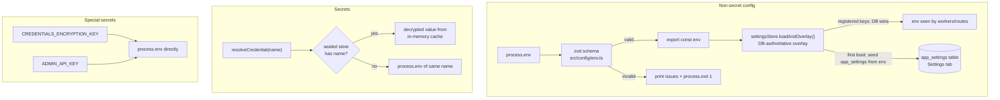

# Configuration

The central config reference for the Agent Orchestrator. Everything the service
reads at boot or first use lives here: how config is loaded, every environment
variable, every secret, and the sealed credentials store.

> **Secrets:** this document never prints real secret values. Wherever you see
> `<your-key>`, substitute your own value. Never commit real keys to `.env`.

## How config works

Config splits into two lanes with different trust models:



> **Three config homes.** As of the Settings/Connectors migration most live
> configuration is **not** in `.env` anymore: the `*_ENABLED` feature flags and
> the pass-2 tuning knobs are **DB-authoritative** (managed in the console
> **Settings** tab), and secrets/OAuth tokens live in the **encrypted credentials
> store** (managed in the console **Connectors** tab). `.env` keeps only the
> bootstrap (DB + master key + port), the console/OAuth bootstrap secrets, and a
> few non-secret runtime knobs. The tables below list every variable; the
> [feature-flags](#feature-flags) section notes they are Settings-managed, and
> secret rows are marked `**secret**` (resolved through the store, env-fallback).

### Non-secret config — env, zod-validated

All non-secret settings are declared in `src/config/env.ts` as a zod schema,
parsed once against `process.env` at import time. Invalid config (wrong type,
bad enum, malformed URL) prints the offending fields and **exits the process**
— the service refuses to boot on bad config rather than limping along. Valid
config is frozen into the exported `env` object; nothing reads `process.env`
for these values afterward.

**Secrets are never in this schema** (invariant #4 / D8). Adding a secret to
the zod schema is prohibited — it would risk logging it and blur the trust
boundary.

### Secrets — `resolveCredential(name)`, store-first

Every adapter obtains a secret through the single choke point in
`src/config/credentials.ts`:

- **`resolveCredential(name)`** — returns the value or **throws** if missing
  (for required secrets; used eagerly at boot so a missing one fails fast).
- **`tryResolveCredential(name)`** — returns the value or `undefined` (for
  optional secrets; the LLM router resolves provider keys this way, lazily, so
  a missing key becomes a soft failover rather than a crash).

Both check **the sealed credentials store FIRST, then the environment variable
of the same name.** The store key and the env var never diverge — both use the
env-var-style name (e.g. `ANTHROPIC_API_KEY`). This means an env-only setup
keeps working unchanged: if the store is disabled or the name isn't in it, the
plain env var is used.

### Two special secrets — read directly from `process.env`

`CREDENTIALS_ENCRYPTION_KEY` and `ADMIN_API_KEY` bypass both the zod schema
**and** `resolveCredential`, reading straight from `process.env`:

| Secret | Read at | Why it can't go through the normal paths |
|---|---|---|
| `CREDENTIALS_ENCRYPTION_KEY` | `src/crypto/secret-box.ts` | It is the master key that *unlocks* the sealed store, so it cannot live inside the store. Kept out of the zod schema to preserve "no secrets in `env.ts`". |
| `ADMIN_API_KEY` | `src/main.ts` | It guards the endpoint that *writes* the store, so it cannot depend on the store. It is a secret, so it stays out of the zod schema. |

## Settings & Connectors — the DB-authoritative overlay

The console has two management tabs that supersede `.env` for the values they
own. The overlay runs **once at boot, before any worker/route composition**
(`settingsStore.loadAndOverlay()` in `src/main.ts`), so every downstream
`if (env.*_ENABLED)` gate and every tuned knob sees the DB value with zero
call-site changes.

### Settings tab — feature flags + tuning knobs (`app_settings`)

A typed registry (`src/config/settings-registry.ts`) is the single source of
truth for the ~22 `*_ENABLED` kill-switches plus the pass-2 tuning knobs the
founder actually retunes (LLM routing/effort, backfill determinism, style-lane
size). Behavior:

- **First boot seeds `app_settings` from the current `env`** — no data loss, no
  forced re-edit. Thereafter the **DB wins**: an `*.env` value for a registered
  key is the *seed/default only* and is ignored once a row exists.
- **`applyMode`** is per setting: `restart` (read at boot — worker
  registration / gated composition; change takes effect after `./debug.sh`) vs
  `live` (re-read per operation — LLM `*_EFFORT` on every call, backfill knobs
  at the start of each sweep; no restart needed).
- **`dependsOn`** marks a child whose parent must be on for it to have any
  effect (the UI greys it out otherwise — e.g. `OUTBOUND_EMAIL_ENABLED` under
  `OUTBOUND_ENABLED`, `STYLE_LANE_ENABLED` under `KNOWLEDGE_DRAFT_ENABLED`).
- Import/export a snapshot with `npm run settings:import` (seeds/migrates
  values; never deletes). The full keyed list is in the [flag reference](#feature-flags)
  below; the table there marks each "Managed in → Settings".

> The DB overlay is **fail-soft**: if the `app_settings` read fails, `env`
  keeps the zod-parsed values and the service still boots (a WARN is logged).

### Connectors tab — secrets & OAuth (the sealed store, CRUD UI)

The Connectors tab is a UI over the same sealed credentials store documented
[below](#the-sealed-credentials-store). It manages two kinds of rows:

- **Raw secrets** — `ANTHROPIC_API_KEY`, `OPENAI_API_KEY`, `DEEPSEEK_API_KEY`,
  `EZY_PORTAL_API_KEY`, `WHATSAPP_MANAGER_API_KEY`, `TELEGRAM_BOT_TOKEN`,
  `WEBHOOK_SECRET`, `WHATSAPP_MANAGER_WRITE_KEY`. Listed with `last4` only;
  values never returned or logged. (Equivalent to `POST /admin/credentials`.)
- **Google accounts (Gmail + Calendar)** — dynamic, labeled, multi-account.
  Add an account → the console starts a Google OAuth redirect flow (the
  `GOOGLE_OAUTH_CLIENT` bootstrap credential is the "Web application" client),
  stores the resulting refresh-token blob as its own credential, and creates a
  row in `channel_instances` (Gmail) or `calendar_accounts` (Calendar). Each
  account carries its own `credentials_ref`, label, enabled flag, and
  account email; enable/disable/relabel/remove from the UI. This replaces the
  legacy two-seed-instance + `npm run gmail:oauth` flow documented in
  [channels/gmail.md](./channels/gmail.md) (still works; Connectors is the
  primary path).

The Google OAuth callback (`/console/api/connectors/oauth/callback`) is a
**public** top-level redirect (the strict-sameSite session cookie is absent on a
cross-site redirect), so it authenticates via the **signed `state`** (HMAC of
`credentialName + service + accountId` with the console session secret) instead
of the session. Register `<CONSOLE_PUBLIC_URL>/console/api/connectors/oauth/callback`
as an authorized redirect URI in your GCP "Web application" client.

## Environment variable reference

Defaults are the schema defaults from `src/config/env.ts`. A blank default
means the value is optional/unset by default. "Secret?" marks values resolved
through `resolveCredential` (sealed store or env) or read directly from
`process.env` — these must never appear in the zod schema, logs, or
`channel_instances.config`.

### Core

| Variable | Secret? | Default | Purpose |
|---|---|---|---|
| `NODE_ENV` | | `development` | `development` \| `production` \| `test`. |
| `PORT` | | `3100` | HTTP listen port (`/health`, webhooks, `/admin`, and the fail-closed `/console`). |
| `LOG_LEVEL` | | `info` | pino level: `fatal` \| `error` \| `warn` \| `info` \| `debug` \| `trace` \| `silent`. |

### Database

`DATABASE_URL` wins when present and non-empty; otherwise a libpq URL is built
from the discrete `PG*` vars. Defaults target the dedicated `ao-postgres`
(`pgvector/pgvector:pg18`, `docker-compose.db.yml`) host-published on `55432` —
separate from the shared ops-dev `ezy-postgres` so the vector RAG never bounces
the portal stack.

| Variable | Secret? | Default | Purpose |
|---|---|---|---|
| `DATABASE_URL` | | *(unset)* | Full libpq connection string; overrides the `PG*` vars when set. |
| `PGHOST` | | `localhost` | Postgres host. |
| `PGPORT` | | `55432` | Postgres port (dedicated `ao-postgres`, pgvector). |
| `PGUSER` | | `postgres` | Postgres user. |
| `PGPASSWORD` | | `postgres` | Postgres password (dev default; treat as secret in prod). |
| `PGDATABASE` | | `agent_orchestrator` | The service's own database (never the whatsapp_manager DB). |

### Founder console

The console is disabled unless **both** secrets below are set and valid. It is
for a single founder session and must be served only behind Tailscale Serve / a
MagicDNS HTTPS name — never a public port-forward or tunnel. It queries only the
orchestrator database and does not replace Telegram's draft-approval authority.

> The procedures for these secrets — creating the bcrypt hash, rotating the
> session secret, and console backup/rollback — are in
> [operations.md § Console secrets](./operations.md#console-secrets).

| Variable | Secret? | Default | Purpose |
|---|---|---|---|
| `CONSOLE_PASSWORD_HASH` | yes | *(unset)* | bcrypt hash for the founder password. Invalid/missing → `/console` is not mounted. |
| `CONSOLE_SESSION_SECRET` | yes | *(unset)* | At least 32 random characters; signs the process-local console session boundary. |
| `CONSOLE_SESSION_TTL_MS` | | `43200000` | Session lifetime (12h); restart always invalidates sessions. |
| `CONSOLE_LOGIN_WINDOW_MS` | | `900000` | Login rate-limit window (15 min). |
| `CONSOLE_LOGIN_MAX_ATTEMPTS` | | `5` | Failed login attempts allowed per source address/window. |
| `CONSOLE_WEB_PUSH_ENABLED` | | `false` | Set literally `true` only after VAPID and encrypted subscription storage are configured. |
| `WEB_PUSH_VAPID_SUBJECT` | | *(unset)* | VAPID contact URI, normally `mailto:...`; required with web push. |
| `WEB_PUSH_VAPID_PUBLIC_KEY` | | *(unset)* | Browser VAPID public key; returned only to authenticated console sessions. |
| `WEB_PUSH_VAPID_PRIVATE_KEY` | yes | *(unset)* | VAPID private key; server-only and never logged or returned. |
| `CONSOLE_PUBLIC_URL` | | *(unset)* | Public origin (`scheme://host`, no path) the console is reached at — used to build the Google OAuth redirect URI for the Connectors tab. Falls back to the request origin if unset. |
| `GOOGLE_OAUTH_CLIENT` | yes | *(unset)* | The "Web application" Google OAuth client JSON (`{"web":{"client_id":"…","client_secret":"…"}}`, or a flat `{client_id,client_secret}`) the Connectors tab drives the redirect flow with. Without it, Connectors can still reuse the client from any stored Gmail credential. |

### Channels — WhatsApp, Gmail, EZY Portal

Base URLs are non-secret; the API keys and webhook secret are credentials. Gmail
and Calendar accounts are now added/managed in the console **Connectors** tab
(dynamic, multi-account); see [channels/gmail.md](./channels/gmail.md) and
[integrations/telegram.md](./integrations/telegram.md) for full setup.

| Variable | Secret? | Default | Purpose |
|---|---|---|---|
| `EZY_PORTAL_BASE_URL` | | `http://localhost:5040` | EZY Portal API base (portal-business — tasks/BP/service-desk). |
| `EZY_PORTAL_CORE_BASE_URL` | | `http://localhost:3450` | Portal-core base for the generic files service (`/api/files/*` — task attachments). A **different** service than `EZY_PORTAL_BASE_URL`. |
| `WHATSAPP_MANAGER_BASE_URL` | | `http://localhost:3000` | whatsapp_manager API base. |
| `WHATSAPP_RECONCILE_INTERVAL_MS` | | `900000` | Pull-reconciliation poll interval (15 min). Test env may lower it. |
| `WHATSAPP_RECONCILE_LOOKBACK_MS` | | `5000` | Boundary overlap window to avoid missing rows at the page edge. |
| `WHATSAPP_RECONCILE_MAX_PAGES` | | `200` | Page cap per reconcile run (≈20k rows @ limit 100). |
| `EMAIL_RECONCILE_INTERVAL_MS` | | `60000` | Gmail poll interval per ready instance. |
| `SERVICE_DESK_RECONCILE_INTERVAL_MS` | | `60000` | EZY service-desk poll interval per ready instance. |
| `SERVICE_DESK_BOOTSTRAP_WINDOW_DAYS` | | `7` | First-run lookback for the service-desk poller (`0` = start from now()). |
| `EZY_PORTAL_API_KEY` | **secret** | *(required)* | EZY Portal tenant API key (scoped `ten_` key). Resolved eagerly — boot fails if missing when the portal adapter is used. |
| `WHATSAPP_MANAGER_API_KEY` | **secret** | *(required)* | whatsapp_manager read key (`x-api-key`). Also the default ref for a WA instance with no explicit `credentials_ref`. |
| `WHATSAPP_MANAGER_WRITE_KEY` | **secret** | *(unset)* | whatsapp_manager **write** key (matches its `OUTBOUND_API_KEY`, scoped to `POST /outbound/send`). Needed when `OUTBOUND_ENABLED=true`; without it sends fall back to the read key and 403. |
| `WEBHOOK_SECRET` | **secret** | *(required)* | Shared HMAC secret; MUST match whatsapp_manager's `WEBHOOK_SECRET` so the `X-Signature: sha256=…` webhook verifies. Resolved eagerly → fail-closed at boot. |

> Gmail/Calendar accounts no longer use fixed seed credential names. The legacy
> `GMAIL_PERSONAL_OAUTH` / `GMAIL_WORK_OAUTH` seed instances (migration 001)
> still work, but the **Connectors** tab creates a dedicated, labeled
> `credentials_ref` per account — add as many mailboxes/calendars as you like.

### LLM gateway

Routing and base URLs are non-secret; provider keys are credentials (resolved
lazily via `tryResolveCredential`, so a missing key fails over instead of
crashing). See [integrations/llm.md](./integrations/llm.md) for the router,
failover chain, cost cap, and per-role model/effort tuning.

| Variable | Secret? | Default | Purpose |
|---|---|---|---|
| `LLM_DEFAULT_PROVIDER` | | `anthropic` | Provider tried first. |
| `LLM_FALLBACK_CHAIN` | | `openai,deepseek` | Ordered CSV of failover providers. |
| `LLM_DAILY_COST_CAP_USD` | | `10` | Daily spend cap / kill-switch (R17), summed from `llm_costs`. |
| `ANTHROPIC_BASE_URL` | | `https://api.anthropic.com` | Anthropic API base. |
| `OPENAI_BASE_URL` | | `https://api.openai.com/v1` | OpenAI API base. |
| `DEEPSEEK_BASE_URL` | | `https://api.deepseek.com` | DeepSeek API base. |
| `ANTHROPIC_API_KEY` | **secret** | *(unset)* | Anthropic key. Missing → the router fails over. |
| `OPENAI_API_KEY` | **secret** | *(unset)* | OpenAI key. |
| `DEEPSEEK_API_KEY` | **secret** | *(unset)* | DeepSeek key. |

**Dynamic per-(provider, role) overrides** — read directly from `process.env`
in `src/adapters/llm/factory.ts`, not the zod schema (too many combinations).
`<PROVIDER>` ∈ `ANTHROPIC` | `OPENAI` | `DEEPSEEK`; `<ROLE>` ∈ `TRIAGE` |
`CLASSIFY` | `DRAFT` | `ANSWER`. All optional.

| Pattern | Example | Purpose |
|---|---|---|
| `LLM_MODEL_<PROVIDER>_<ROLE>` | `LLM_MODEL_OPENAI_TRIAGE=gpt-4.1` | Override the model for one provider+role. Defaults: anthropic `triage`/`draft`/`answer`=`claude-sonnet-5`, `classify`=`claude-haiku-4-5`; openai `triage`/`draft`/`answer`=`gpt-4.1`, `classify`=`gpt-4.1-mini`; deepseek all=`deepseek-chat`. The `answer` role synthesizes cited founder-query replies (Telegram `/ask`, console query). |
| `LLM_<PROVIDER>_EFFORT` | `LLM_ANTHROPIC_EFFORT=low` | Provider-level reasoning effort (`low`\|`medium`\|`high`\|`xhigh`\|`max`). Applies to `triage`/`draft`/`answer` only — **not** `classify` (its default model has no adaptive thinking and would 400). |
| `LLM_EFFORT_<PROVIDER>_<ROLE>` | `LLM_EFFORT_ANTHROPIC_TRIAGE=low` | Fine-grained effort for one provider+role. **Overrides** `LLM_<PROVIDER>_EFFORT`, and unlike it *can* target `classify`. |

### Feature flags

Every `*_ENABLED` toggle and every pass-2 tuning knob below is **DB-authoritative**
(managed in the console **Settings** tab → `app_settings`; the env var is the
seed/default only). All kill-switches are strict string→bool (only the literal
`"true"` enables) and default **off** so nothing sends, drafts, embeds, or
notifies by surprise. `OPENAI_API_KEY` (a credential) is needed wherever
embeddings are involved; a missing key degrades gracefully (retried next tick)
rather than crashing. Categories mirror the Settings UI.

#### Outbound

| Variable | Default | Purpose |
|---|---|---|
| `OUTBOUND_ENABLED` | `false` | Register the outbound drainer (WhatsApp send). Master switch for all delivery. |
| `OUTBOUND_EMAIL_ENABLED` | `false` | Under `OUTBOUND_ENABLED`: also claim + send approved **email** drafts, threaded into the original thread from the originating account (work/personal never cross). See [channels/gmail.md](./channels/gmail.md). |

Outbound rate/gap/failure tuning (`OUTBOUND_DRAIN_INTERVAL_MS`,
`OUTBOUND_RATE_PER_HOUR`, `OUTBOUND_MIN_GAP_MS`,
`OUTBOUND_MAX_RECIPIENT_FAILURES`, `OUTBOUND_FAILURE_WINDOW_MIN`,
`OUTBOUND_DEFAULT_TZ`, `OUTBOUND_STUCK_MINUTES`, `HOLIDAY_COUNTRY`) stay in env
— see [`../.env.example`](../.env.example).

#### Knowledge & Drafting

| Variable | Default | Purpose |
|---|---|---|
| `KNOWLEDGE_SYNC_ENABLED` | `false` | Register the customer knowledge-sync worker (folder-sourced docs → `agent_memory`). |
| `KNOWLEDGE_RETRIEVAL_ENABLED` | `false` | Inject scoped RAG retrieval into triage (best-effort; degrades to no-knowledge). Needed for the drafter to have sources. |
| `KNOWLEDGE_DRAFT_ENABLED` | `false` | Enable the response drafter — `question_existing` → cited draft parked in Telegram for approve / ✏️edit / reject. Drafts **never** auto-send. Needs `KNOWLEDGE_RETRIEVAL_ENABLED`; the ✏️edit capture needs BotFather privacy mode OFF. |
| `DRAFT_REVISE_ENABLED` | `false` | Under `KNOWLEDGE_DRAFT_ENABLED`: wire the 🔁 **Revise** button — a founder instruction regenerates the draft (grounded + directive authoritative) and learns the correction into the right scope (shared product fact vs one customer's preference). Same Telegram privacy-mode OFF precondition. |
| `STYLE_LANE_ENABLED` | `false` | Under `KNOWLEDGE_DRAFT_ENABLED`: inject **all** of a customer's active tone/style corrections into every draft (not embedding-gated) as persistent voice guidance. Reads corrections learned by the revise loop; a pure DB read (no embeddings). |
| `STYLE_LANE_MAX` | `12` | Max voice directives injected per draft (blast-radius guard), newest-first. Restart-read. |
| `KNOWLEDGE_INTERNAL_ENABLED` | `false` | Register the hourly internal (Project Brain) re-sync worker. See [project-brain.md](./project-brain.md). |
| `QUERY_ENGINE_ENABLED` | `false` | Wire Telegram `/ask <question>` → internal-knowledge search → LLM-synthesized **cited** answer in the founder topic. Reuses `KNOWLEDGE_INTERNAL_K` / `_MAX_DISTANCE`. Same privacy-mode OFF precondition. |
| `QUERY_FREE_TEXT_ENABLED` | `false` | Answer **plain** founder text (no `/ask`) in a topic: scoped to that topic's customer, or **cross-customer** in the Admin topic. Requires `QUERY_ENGINE_ENABLED` (warns and stays dormant without it). Runs **last**, only after every pending-answer capture (askFounder question, ✏️ Edit, 🔁 Revise, scheduling clarification) has declined the message. Same privacy-mode OFF precondition. |
| `SLASH_COMMANDS_ENABLED` | `false` | Wire the Telegram command router — `/pending` (queue counts + oldest age), `/briefing` (daily digest on demand), `/help` — replied in the requesting thread. `/ask` stays its own handler. Same privacy-mode OFF precondition. |

Retrieval/knowledge tuning (`KNOWLEDGE_SYNC_INTERVAL_MS`,
`KNOWLEDGE_RETRIEVAL_K_CUSTOMER` / `_K_SHARED` / `_MAX_DISTANCE`,
`KNOWLEDGE_TOMBSTONE_MAX_RATIO`, `OPENAI_EMBEDDING_MODEL` / `_DIM`) stay in env.

#### Backfill

The historical-thread → task reconcile: memory-link on match, draft a task
proposal on an unmatched work-request, resolved-history on a done/cancelled
match. A false link is worse than a miss, so a match clears **both** the distance
gate and the LLM-judge threshold. `backfill:dry` writes NOTHING (default); live
sweeps write links + post one ✅/❌ Telegram card each. See
[operations.md](./operations.md) for the scripts.

| Variable | Default | Purpose |
|---|---|---|
| `BACKFILL_ENABLED` | `false` | Master switch for the historical-thread reconcile (Layer-2). |
| `BACKFILL_WA_ENABLED` | `false` | Under `BACKFILL_ENABLED`: add the WhatsApp history leg — drains the whatsapp_manager archive, windows each chat, reconciles. |
| `BACKFILL_STARRED_ENABLED` | `false` | Under `BACKFILL_ENABLED`: add the starred-Gmail leg — sweeps the founder's `is:starred` threads (∩ customer identity) as high-signal review candidates. |
| `BACKFILL_MATCH_MAX_DISTANCE` | `0.65` | Vector-distance **recall** gate (0–2). Calibrated so true email-thread↔task-title matches (0.53–0.62) reach the judge. |
| `BACKFILL_JUDGE_THRESHOLD` | `0.6` | LLM-judge **precision** confirm gate (0–1). |
| `BACKFILL_JUDGE_VOTES` | `1` | Judge samples per candidate; their **median** decides the link (stabilizes run-to-run variance). Live-read at sweep start. |
| `BACKFILL_MATCH_K` | `5` | Candidate fan-out per thread. |
| `BACKFILL_PROPOSE_MIN_CONFIDENCE` | `0.7` | Strict "explicit request" confidence floor for a proposal (0–1). |
| `BACKFILL_COLLAPSE_MAX_DISTANCE` | `0.2` | Sweep-wide near-duplicate collapse ceiling (0–2) → one card per subject. Live-read at sweep start. |
| `BACKFILL_WA_IDLE_GAP_MS` | `21600000` | WhatsApp chat windowing — idle gap that starts a new window (6h). |
| `BACKFILL_WA_MAX_PER_WINDOW` | `40` | Messages per WA window. |
| `BACKFILL_WA_MAX_WINDOWS` | `60` | Windows-per-customer cap. |
| `BACKFILL_STARRED_MAX_THREADS` | `50` | Starred-threads-per-account cap. |

#### Intelligence & Digests

Read-only aggregations posted to the Telegram Admin topic; all idempotent per
day/week and require Telegram. `TASK_INVENTORY_ENABLED` (below) is their data
foundation.

| Variable | Default | Purpose |
|---|---|---|
| `DAILY_BRIEFING_ENABLED` | `false` | Once-a-day digest of what's WAITING on the founder (pending drafts + backfill proposals, counts + oldest age) and a ranked "needs attention" list. Idempotent per calendar day. |
| `DAILY_BRIEFING_INTERVAL_MS` | `21600000` | Sub-daily poll (6h); posts exactly once/day. |
| `DAILY_BRIEFING_TZ` | `America/Panama` | Day-boundary timezone. |
| `DAILY_BRIEFING_TOP_N` | `5` | Max customers in the attention list. |
| `WEEKLY_PATTERNS_ENABLED` | `false` | Weekly digest that clusters the week's Layer-A signal memories (corrections + conversation/task themes) by their **stored** embeddings and posts the top recurring patterns. Read-only (no new embeds). Idempotent per ISO week. |
| `WEEKLY_PATTERNS_INTERVAL_MS` | `21600000` | Sub-weekly poll (6h); posts once/week. |
| `WEEKLY_PATTERNS_TZ` / `_WINDOW_DAYS` | `America/Panama` / `7` | Week boundary / signal look-back. |
| `WEEKLY_PATTERNS_MAX_DISTANCE` | `0.2` | Cosine ceiling for two signals to join a cluster (tight). |
| `WEEKLY_PATTERNS_MIN_COUNT` | `3` | Minimum cluster size to count as a recurring pattern. |
| `WEEKLY_PATTERNS_TOP_K` / `_MAX_SIGNALS` | `5` / `2000` | Patterns per section / signals fetched per tick. |
| `ACCEPTANCE_REPORT_ENABLED` | `false` | Daily draft-acceptance report (24h/7d/30d, per customer + overall). Idempotent per calendar day. |
| `ACCEPTANCE_REPORT_INTERVAL_MS` | `21600000` | Sub-daily poll (6h); posts once/day. |
| `ACCEPTANCE_REPORT_TZ` | `America/Panama` | Day-boundary timezone. |
| `FEEDBACK_LEARNING_ENABLED` | `false` | On a **modified/rejected** draft, embed a customer-scoped feedback memory so a later similar question retrieves the correction. |
| `FEEDBACK_LEARNING_INTERVAL_MS` / `_BATCH` | `300000` / `50` | Poll (5m) / decisions per tick. |
| `RELEASE_NOTE_DRAFTS_ENABLED` | `false` | On ingest of a release note (from `RELEASE_NOTES_DIR`), semantically match it against each customer's history and draft one personalized cited notification per matched customer (draft only). |
| `RELEASE_NOTE_SYNC_INTERVAL_MS` | `3600000` | Release-note scan cadence (1h). |
| `RELEASE_NOTES_DIR` | *(unset)* | Directory of `*.md` release notes to scan (per-file path is the idempotency key). Required when the flag is on. |
| `RELEASE_NOTE_MATCH_MAX_DISTANCE` | `0.35` | Nearest-history distance ceiling for a customer to be notified (tight — a spurious proactive notification erodes trust). |
| `RELEASE_NOTE_MAX_CUSTOMERS` | `50` | Cap on customers drafted per note (blast-radius guard). |

#### Triage

| Variable | Default | Purpose |
|---|---|---|
| `TASK_INVENTORY_ENABLED` | `false` | Mirror each onboarded customer's portal project tasks (all statuses) into `agent_memory` as `memory_type='task'` — unlocks "status of X" answers and gives backfill a content-keyed inventory. Own advisory-lock key; reuses the knowledge-sync reconciler. |
| `TASK_INVENTORY_SYNC_INTERVAL_MS` | `1200000` | Inventory poll (20m). |
| `LIVE_DEDUP_FINGERPRINT_ENABLED` | `false` | Under `TASK_INVENTORY_ENABLED`: re-fingerprint each customer's **OPEN** portal tasks into `agent_conversation_links` so live triage folds a new inbound into an existing task instead of duplicating it. Read path unchanged. |
| `CROSS_CHANNEL_DEDUP_ENABLED` | `false` | Fold a new message into an existing task for the **same customer** when semantic content matches within a window and clears a tight confidence gate. Different customers are never merged. |
| `CROSS_CHANNEL_DEDUP_WINDOW_MINUTES` | `4320` | How far back a prior task's fingerprint stays a candidate (72h). |
| `CROSS_CHANNEL_DEDUP_MAX_DISTANCE` | `0.15` | Confidence gate (0–2); above it stays a separate task (false-merge > duplicate). |
| `CALENDAR_ENABLED` | `false` | Under `KNOWLEDGE_DRAFT_ENABLED`: at draft time, pull the drafted customer's **upcoming** meetings from the founder's Google Calendar and inject them as draft context (read-only, synchronous, best-effort). Credential `GOOGLE_CALENDAR_OAUTH` (or a Connectors Calendar account) via the store. |
| `CALENDAR_LOOKAHEAD_DAYS` | `7` | Forward window for the customer's meetings. |
| `CALENDAR_MAX_EVENTS` | `5` | Max meeting lines injected per draft. |
| `CALENDAR_ID` | `primary` | Legacy single-account calendar id (back-compat `GOOGLE_CALENDAR_OAUTH` fallback only; dynamic accounts carry their own `calendar_id`). |
| `CALENDAR_TZ` | `America/Panama` | IANA timezone for rendering meeting date/time lines. |
| `TRIAGE_FAILURE_ALERT_THRESHOLD` | `3` | Early-warning: after this many consecutive row failures, one admin Telegram notice (re-armed on recovery). |

#### Proactive

| Variable | Default | Purpose |
|---|---|---|
| `PROACTIVE_NOTIFICATIONS_ENABLED` | `false` | Poll each customer's portal for tasks moved to a terminal status; for every **customer-originated** done task, draft one `is_draft=true` "your request is resolved" reply on the origin channel (approve/edit/reject — never auto-sent). A customer's first tick only **watermarks** — no historical backlog notifies. |
| `TASK_EVENT_POLL_INTERVAL_MS` | `900000` | Portal poll interval for the task-event worker (15m). |

### Project Brain — internal knowledge (isolated)

A **separate** internal-only knowledge base (table `internal_knowledge`) for founder/dev
recall via an MCP server — structurally unreachable from customer replies. Full setup,
the MCP registration command, and its tools (`search` / `get` / `resync`) are in
[project-brain.md](./project-brain.md).

| Variable | Default | Purpose |
|---|---|---|
| `KNOWLEDGE_INTERNAL_ENABLED` | `false` | Register the hourly internal re-sync worker. (The MCP server reads the corpus regardless.) |
| `KNOWLEDGE_INTERNAL_SYNC_INTERVAL_MS` | `3600000` | Internal re-scan cadence (1h). |
| `KNOWLEDGE_INTERNAL_K` | `8` | Default top-k chunks per internal search. |
| `KNOWLEDGE_INTERNAL_MAX_DISTANCE` | `0.6` | Cosine-distance ceiling for internal search. |
| `OPENAI_EMBEDDING_MODEL` / `OPENAI_EMBEDDING_DIM` | `text-embedding-3-small` / `1536` | Shared embedding model + dim (must match the `vector(N)` columns). |

### Telegram

Forum ids are non-secret; the bot token is a credential. See
[integrations/telegram.md](./integrations/telegram.md) for onboarding and topic
setup. If Telegram isn't configured, the money-loop workers are skipped and
ingestion still runs.

| Variable | Secret? | Default | Purpose |
|---|---|---|---|
| `TELEGRAM_SUPERGROUP_CHAT_ID` | | *(unset)* | Supergroup chat id (the `-100…` number). Optional in schema; the notifier factory fails fast if missing when Telegram is actually used. |
| `TELEGRAM_ADMIN_TOPIC_ID` | | *(unset)* | `message_thread_id` of the pinned "Admin" topic. Blank = General topic. |
| `TELEGRAM_BOT_TOKEN` | **secret** | *(required for Telegram)* | Bot token from BotFather (`12345:AA…`). Resolved eagerly by the notifier. |
| `TELEGRAM_SCHEDULING_ENABLED` | | `false` | Settings-managed restart flag for natural-language reminders and scheduled customer sends. |
| `TELEGRAM_SCHEDULING_TZ` | | `America/Panama` | Timezone used to resolve founder schedule expressions. |
| `TELEGRAM_SCHEDULING_INTERVAL_MS` | | `15000` | Due-action worker cadence. |
| `TELEGRAM_SCHEDULING_GRACE_MINUTES` | | `15` | Late-action grace before a schedule is marked missed. |

### Admin & credentials store

Both read directly from `process.env` (see [above](#two-special-secrets--read-directly-from-processenv)).

| Variable | Secret? | Default | Purpose |
|---|---|---|---|
| `ADMIN_API_KEY` | **secret** | *(unset)* | Guards `/admin/*` via the `x-admin-key` header. **Unset ⇒ the admin router is not mounted** (fail-closed). |
| `CREDENTIALS_ENCRYPTION_KEY` | **secret** | *(unset)* | Master key (KEK) for the sealed store. **Unset ⇒ the store is disabled** and all secrets fall back to env vars. |

## The sealed credentials store

An optional, encrypted-at-rest store for secrets, so provider keys and OAuth
credentials never sit in plaintext env files. It is a drop-in *upgrade* to the
env vars above — never a replacement you're forced to adopt.

**How it protects secrets:** each value is sealed with **AES-256-GCM**
(`src/crypto/secret-box.ts`) — a random 12-byte IV per write, a 16-byte auth
tag, and a 32-byte key derived from `CREDENTIALS_ENCRYPTION_KEY` via scrypt with
a fixed app salt. Ciphertext, IV, and auth tag are stored in the `credentials`
table (migration 009); only `last4` is kept in the clear, for masked display.
Plaintext lives **only** in an in-memory cache, decrypted once at boot — never
logged, never returned by the API.

**Boot order** (`src/main.ts`): migrations → `credentialsStore.load()` →
channel registry. The store loads *before* the registry because the registry
eagerly resolves `WEBHOOK_SECRET`; a store-only secret would be missed if it
loaded later.

**Optional / fail-soft:** if `CREDENTIALS_ENCRYPTION_KEY` is unset, `load()`
logs a warning and the store stays empty — `resolveCredential` then serves
every secret from the environment. Writes (`POST /admin/credentials`) require
the key and return `503` when it's absent.

### Admin API

Mounted at `/admin` **only when `ADMIN_API_KEY` is set** (else fail-closed and a
log line says so). Every request must carry `x-admin-key: <ADMIN_API_KEY>`
(constant-time compared); a bad or missing key returns `401`. Values are never
returned or logged — responses expose `last4` only.

| Method & path | Body | Returns |
|---|---|---|
| `POST /admin/credentials` | `{"name":"…","value":"…"}` | `{data:{name,last4,updated_at}}` — sets/rotates a credential (upsert). `503` if `CREDENTIALS_ENCRYPTION_KEY` unset. |
| `GET /admin/credentials` | — | `{data:[{name,last4,updated_at},…]}` — masked list. |
| `DELETE /admin/credentials/:name` | — | `{data:{removed:bool}}` — `200` if removed, `404` if it didn't exist. |

### Example — store, list, rotate, delete

Assumes the service on `localhost:3100` (default `PORT`) with `ADMIN_API_KEY`
and `CREDENTIALS_ENCRYPTION_KEY` both set in its environment.

```bash
ADMIN_KEY='<your-admin-key>'
BASE='http://localhost:3100'

# Store (or rotate) a provider key — response shows last4 only, never the value
curl -sS -X POST "$BASE/admin/credentials" \
  -H "x-admin-key: $ADMIN_KEY" \
  -H 'content-type: application/json' \
  -d '{"name":"ANTHROPIC_API_KEY","value":"<your-key>"}'

# List all stored credentials (masked)
curl -sS "$BASE/admin/credentials" -H "x-admin-key: $ADMIN_KEY"

# Delete one
curl -sS -X DELETE "$BASE/admin/credentials/ANTHROPIC_API_KEY" \
  -H "x-admin-key: $ADMIN_KEY"
```

> After storing a secret in the sealed store you can remove its plaintext env
> var — `resolveCredential` finds it in the store first. Newly stored values are
> cached immediately; on a fresh boot they're loaded and decrypted at startup.

## See also

- Env template: [`../.env.example`](../.env.example) — copy to `.env` to start.
- Channels: [WhatsApp](./channels/whatsapp.md) · [Gmail](./channels/gmail.md) · [EZY Portal](./integrations/ezy-portal.md)
- Integrations: [LLM gateway](./integrations/llm.md) · [Telegram](./integrations/telegram.md)
