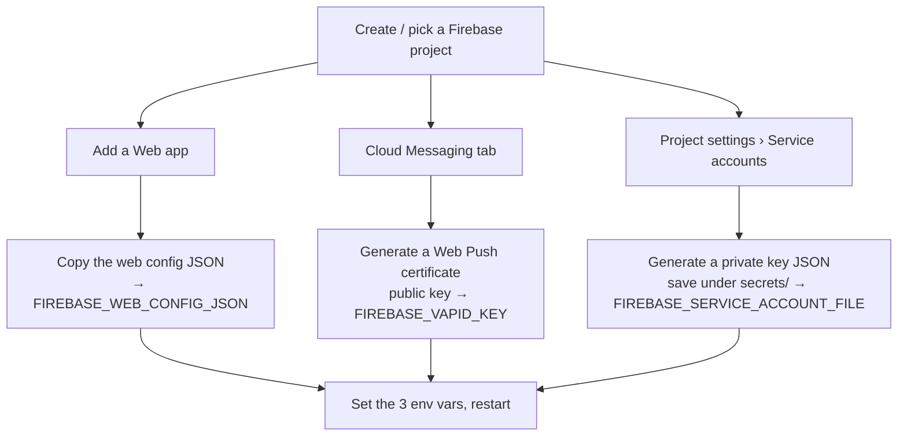

# AO Founder PWA — Firebase Cloud Messaging setup

The AO Founder app (`/app`, milestone M6) pushes **every** founder notification to your
phone through Firebase Cloud Messaging (FCM). This is a one-time setup the founder does
in the Firebase console; the app works without it (the feed, chat, and decision taps all
function), you just don't get background push until these three env vars are set.

All three inputs are **optional**. If any is missing or invalid the service logs a single
`founder-app FCM push disabled …` warning at boot and the rest of `/app` keeps working —
FCM never blocks the app.



## 1. Create (or choose) a Firebase project

1. Go to <https://console.firebase.google.com/> and **Add project** (or open an existing
   one). Analytics is not required.

## 2. Add a Web app → get the public web config

1. In the project, **Project settings** (gear icon) → **General** → **Your apps** →
   **Add app** → the **Web** (`</>`) platform.
2. Give it a nickname (e.g. `AO Founder`). You do **not** need Firebase Hosting.
3. Firebase shows a `firebaseConfig` object. Copy the object's fields into a single-line
   JSON string and set it as **`FIREBASE_WEB_CONFIG_JSON`**. Example:

   ```bash
   FIREBASE_WEB_CONFIG_JSON='{"apiKey":"AIza…","authDomain":"ao-founder.firebaseapp.com","projectId":"ao-founder","storageBucket":"ao-founder.appspot.com","messagingSenderId":"1234567890","appId":"1:1234567890:web:abcdef"}'
   ```

   These values are **public** by design — they are echoed to the authed client at
   `GET /app/api/config` so the service worker can initialize Firebase in the browser.

## 3. Cloud Messaging → Web Push certificate (the VAPID key)

1. **Project settings** → **Cloud Messaging** tab.
2. Under **Web configuration** → **Web Push certificates**, click **Generate key pair**.
3. Copy the **public** key string and set it as **`FIREBASE_VAPID_KEY`**. The browser
   passes it to `getToken({ vapidKey })` when the founder enables push. It is public too;
   only the server-side service account (next step) is secret.

   ```bash
   FIREBASE_VAPID_KEY='BF…the-long-public-key…'
   ```

## 4. Service account → private key (the one secret)

1. **Project settings** → **Service accounts** tab.
2. Click **Generate new private key** → confirm. A JSON file downloads.
3. Save it under this repo's `secrets/` directory (which is git-ignored), e.g.
   `secrets/firebase-service-account.json`, and point **`FIREBASE_SERVICE_ACCOUNT_FILE`**
   at it. A relative path is resolved from the process working directory.

   ```bash
   FIREBASE_SERVICE_ACCOUNT_FILE=secrets/firebase-service-account.json
   ```

   > ⚠️ This file is a **credential** — it can send push on your behalf. Never commit it,
   > never log it, never expose it through an API. The service reads it only to initialize
   > `firebase-admin`; it is never surfaced in `/app/api/config` or anywhere else.

## 5. Wire it up and restart

Set the three variables in `.env` (see `.env.example` for the block) and restart the
service:

```bash
FIREBASE_SERVICE_ACCOUNT_FILE=secrets/firebase-service-account.json
FIREBASE_WEB_CONFIG_JSON='{ …the web config object… }'
FIREBASE_VAPID_KEY='BF…public-vapid-key…'
```

On boot you should see `founder-app FCM push enabled`. In the app: open **Settings**,
toggle **Push**, grant the browser permission — the device's registration token is stored
server-side and every subsequent founder notification arrives as a push.

## What the push actually contains

The push payload is deliberately **generic** — a title (`AO Founder` / `Founder attention
needed`), a "Tap to open" body, and a small data blob (`messageId`, `kind`, `severity`,
and a `/app/` deep link). It carries **no customer names, message titles, or bodies**:
customer content must not transit Google's relay. Tapping the notification opens the app,
which then loads the real content over the authenticated `/app/api` channel. This mirrors
the same privacy stance as the console's web-push channel.

## Troubleshooting

| Symptom | Cause / fix |
|---|---|
| Boot logs `FCM push disabled (FIREBASE_* config absent or incomplete)` | One of the three vars is empty or the web config isn't valid JSON. All three are required together. |
| Boot logs `firebase-admin is not installed` | Run `npm ci` (production installs it); it is a runtime-only dependency. |
| Boot logs `service-account file missing or unreadable` | `FIREBASE_SERVICE_ACCOUNT_FILE` path is wrong or the file isn't readable by the process. |
| Boot logs `firebase-admin failed to initialize (invalid service account)` | The JSON isn't a valid service-account key for this project. Re-generate it. |
| Push toggles on but nothing arrives | Confirm the browser granted notification permission and that the device shows under enabled devices; a token FCM reports as `registration-token-not-registered` is auto-disabled (re-toggle push to re-register). |
