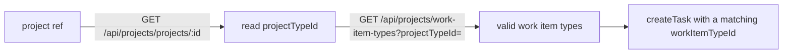

# EZY Portal — task target

The **EZY Portal** (the `portal-business` Go binary) is where the orchestrator
writes work: every triaged customer request becomes an EZY **task**, and
follow-ups become **comments** on that task. All portal I/O goes through **one
gateway** — `EzyPortalGateway` over a thin HTTP client (invariant #4: EZY Portal
sits behind ports; core stores portal ids as opaque `TEXT` refs and never
interprets them).

This doc is the **task-target (write) side**. The service-desk **inbound** side
(ingesting tickets as messages) is planned for **M1.7** and is not yet built.
For the env reference see
[configuration.md § Channels](../configuration.md#channels--whatsapp-gmail-ezy-portal).

## Configuration

Verified against `src/config/env.ts` and `src/adapters/ezy-portal/factory.ts`.

| Variable | Secret? | Default | Purpose |
|---|---|---|---|
| `EZY_PORTAL_BASE_URL` | no | `http://localhost:5040` | Portal API base. `portal-business` serves Projects, Service Desk, and Business Partners from this one binary. |
| `EZY_PORTAL_API_KEY` | **secret** | *(required)* | Tenant API key — a `ten_…` value sent as the `X-Api-Key` header. Resolved lazily via `resolveCredential('EZY_PORTAL_API_KEY')` (sealed store first, env fallback), on the first network call rather than at boot. |

```bash
# In .env — base url is not a secret; the tenant key is
EZY_PORTAL_BASE_URL=http://localhost:5040
EZY_PORTAL_API_KEY=            # scoped ten_ key (see Auth below)
```

The **test tenant** used by the contract test is `account-test` on `:5040`.

## Auth — use a scoped tenant key, not a nil-group key

Authenticate with an `X-Api-Key: ten_…` tenant key. A nil-group key has **full
tenant access** — do not use one. Create a scoped **AuthorizationGroup** named
e.g. `agent-orchestrator` and bind the key to it, granting only what the gateway
actually calls:

| Scope | Why the gateway needs it |
|---|---|
| `projects.projects:Read` | Read a project to resolve its `projectTypeId` (hop 1 of work-item-type lookup). |
| `projects.tasks:Write` | Create tasks, add comments, set status. |
| `service-desk.view` | Read service-desk tickets (inbound ingestion, M1.7). |
| `service-desk.manage` | Post ticket replies/notes (outbound). |
| `business-partners.access:Read` | Resolve customers (BP get/search) and list their contacts during onboarding. |

Source: `plan/project.md` § Auth and `plan/changes/01-add-channel-foundation-and-triage/tasks.md` task 1.1.

> **Idempotency-Key.** The gateway mints an `Idempotency-Key` (a fresh UUID) on
> **every** POST, once before the retry loop and reused across attempts. The BP
> module honors it; the **projects/tasks module does not** — see
> [Task creation is not exactly-once](#task-creation-is-not-exactly-once).

## Endpoints the gateway calls

Verified against `src/adapters/ezy-portal/ezy-portal.gateway.ts`. Paths are
relative to `EZY_PORTAL_BASE_URL`.

| Gateway method | HTTP call | Notes |
|---|---|---|
| `getCustomer(ref)` | `GET /api/business-partners/bp/:ref` | Returns `{ref, name, website?, email?}`. |
| `searchCustomers(q)` | `GET /api/business-partners/bp?query=&page=1&perPage=50` | Directory search for onboarding. |
| `listContacts(ref)` | `GET /api/business-partners/contacts?bpId=&page=1&perPage=100` | Contacts carry `email/phone/mobile/whatsapp/telegram/isPrimary`. |
| `searchProjects(q)` | `GET /api/projects/projects?search=&page=1&pageSize=50` | Project directory search for console onboarding — the portal has no BP→project link, so the operator picks the target project. Returns `{ref, code, name, status}`. |
| `listWorkItemTypes(projectRef)` | `GET /api/projects/projects/:ref` → `GET /api/projects/work-item-types?projectTypeId=` | **Two-hop** (see below). |
| `createTask(input)` | `POST /api/projects/tasks` | camelCase body; `workItemTypeId` required. |
| `addComment(task, body)` | `POST /api/projects/tasks/:ref/comments` `{body}` | |
| `findOpenTasks(q)` | `GET /api/projects/tasks?…&status=backlog,todo,in-progress,review` | Non-terminal only; needs `projectRef` **or** `sourceEntity`. |
| `findTasksBySource(q)` | `GET /api/projects/tasks?…&status=<all statuses>` | Dedup across **all** statuses. |
| `setStatus(task, status)` | `POST /api/projects/tasks/:ref/status` `{status}` | Dedicated endpoint, **not** `PATCH /:id`. |

**Statuses:** `backlog` · `todo` · `in-progress` · `review` · `done` ·
`cancelled` (the first four are "open"). **Priorities:** `low` · `medium` ·
`high` · `urgent`.

## Work-item-type: the two-hop resolution

A task requires a `workItemTypeId`, and it must belong to the project's
**project type** — not the project directly. The gateway resolves it in two hops:



The catch (why this isn't one call): passing a **`projectId`** filter to
`/api/projects/work-item-types` is **silently ignored** and returns the whole
tenant's list. Picking a type from that unfiltered list can yield one whose
`ProjectTypeID` doesn't match the project — and the portal then **422s** at
`createTask` on `wit.ProjectTypeID != proj.ProjectTypeID`. Always filter by
`projectTypeId`.

## Source-uniqueness: one task per thread

The portal enforces a **unique** `(sourceService, sourceEntityType,
sourceEntityId)` triple across **all** statuses. The orchestrator's identity in
that triple is `sourceService = 'agent-orchestrator'`. Two consequences the
operator should understand:

- A `createTask` with a source triple that already exists **400s** — even when
  the owning task is `done` or `cancelled`. A closed task still "owns" its
  source.
- So the money-loop **dedups a thread to one task**: before creating, it looks
  up the owning task with `findTasksBySource` (all statuses). A follow-up on a
  closed thread therefore **comments on the existing task** instead of failing
  to create a duplicate. `findOpenTasks` (non-terminal statuses only) is the
  separate open-work view.

`findOpenTasks` **rejects an unscoped query**: it needs `projectRef` or
`sourceEntity`, because the portal's task list has no BP/customer filter and an
unscoped call would return tenant-wide tasks (a wrong-scope dedup hazard). Note
also the list search param is **`search`**, not `text` (unknown params are
silently ignored).

## Task creation is not exactly-once

The HTTP client sends an `Idempotency-Key` on every POST, but the **portal's
projects/tasks module does not honor it** (only the BP module wired that
middleware). So a transport-retry after a create that already committed on the
server would **double-create**. `createTask` is therefore *not* exactly-once on
its own — the compensating control is the pre-create `findTasksBySource`
reconcile above (and, eventually, a portal-side idempotency handler). Keep this
in mind when reading task-create retries in the logs.

## Field limits (defensive truncation)

The gateway truncates before sending so a long LLM-generated title/description
never trips a portal `422`. Limits match the portal's own counting (verified
against `task_input.go`):

| Field | Limit | Counted as |
|---|---|---|
| `title` | 240 | Unicode code points (runes) |
| `description` | 4000 | Unicode code points (runes) |
| each `tag` | 64 | UTF-8 bytes |
| `tags` count | 50 | array length |

Titles/descriptions are cut on **rune** boundaries (so an emoji is never split
into `U+FFFD`); tags are cut on rune boundaries but capped by **byte** length
(the portal's tag limit is `len()` in Go).

## Errors & retries

From `src/adapters/ezy-portal/http-client.ts`. Non-2xx responses become an
`EzyHttpError` carrying `.status`, so callers distinguish cases:

| Status | Meaning | Retried? |
|---|---|---|
| `422` | Validation — bad/missing `workItemTypeId`, or a field over the portal's own limit. | No |
| `409` | `Project is read-only` (terminal project) on create, or `WIP limit exceeded` on `setStatus`. | No |
| `429` | Rate-limited — honors the `Retry-After` header (delta-seconds or HTTP-date). | Yes |
| `5xx` | Server error. | Yes |
| transport / timeout | Fresh `AbortSignal` per attempt (15s default). | Yes |
| other `4xx` | Client error. | No |

The client **never logs request/response bodies or the API key** — only
`{method, path, status, attempt, durationMs}` (no customer content in logs).

## Prerequisite: deploy M0 for the service-desk channel

The task-target write path above works against the portal as-is. But the
**service-desk inbound channel** (ingesting tickets, M1.7) needs the **"Business
Web Hooks" module — change 00 / M0**: it adds the `updatedAfter` ticket filter
and a tenant webhook emitter portal-side. Today the orchestrator **polls**
(`TicketingPort.listChangedTickets`, cursor = `updatedAfter`), so the poll cursor
depends on M0 being deployed; the webhook push is the later upgrade. Portal
integration is HTTPS-only — the portal's RabbitMQ broker is never a dependency
(production portal is a remote cloud instance).

## See also

- [configuration.md § Channels](../configuration.md#channels--whatsapp-gmail-ezy-portal) — env reference and the sealed credentials store.
- Service-desk **inbound** channel (tickets → inbox) — planned for M1.7, not yet built.
- [telegram.md](./telegram.md) — the founder-notification channel and the ❌ button that calls `setStatus('cancelled')`.
- [operations.md](../operations.md) — onboarding (project/work-item-type selection), workers, the `contract:ezy` test.
