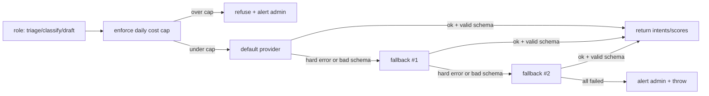

# LLM Gateway

The Agent Orchestrator sends **every** model call — triage, dedup classification,
draft generation, founder-query answer synthesis — through a single multi-provider
gateway, the `LlmRouter` (`src/adapters/llm/llm-router.ts`). This doc covers how to
point it at providers, tune routing and reasoning effort, and cap spend.

## Overview

For a given **role** (`triage` / `classify` / `draft` / `answer`) the router:

1. Resolves the model for the preferred provider (per-`(provider, role)`).
2. Calls the **default provider**; on a hard failure (or schema-invalid output)
   it **fails over** down the fallback chain, using each provider's *own* model.
3. Records the cost of every call that returned token usage into `llm_costs`
   (billed even when the output later fails schema validation — the tokens were
   spent).
4. Refuses all calls once the day's spend hits the **daily cost cap** (kill-switch).

Each failover emits **one** admin notice; exhausting the whole chain emits a
final `❌ … FAILED on all providers` notice and throws.



All three providers are called over **raw `fetch`** (no vendor SDK):

| Provider  | Endpoint (default base URL)                        | Structured output          | Reasoning effort              |
| --------- | -------------------------------------------------- | -------------------------- | ----------------------------- |
| Anthropic | `https://api.anthropic.com` + `/v1/messages`       | `output_config.format` (json_schema) | `output_config.effort` (adaptive-thinking models: sonnet-5 / opus) |
| OpenAI    | `https://api.openai.com/v1` + `/chat/completions`  | strict `json_schema` (provider-enforced) | `reasoning_effort` (reasoning models only) |
| DeepSeek  | `https://api.deepseek.com` + `/chat/completions`   | `json_object` (schema in prompt, validated client-side) | none — pick the model |

DeepSeek is intentionally the **last** link: its `json_object` mode has no
schema enforcement, so it is the flakiest for the golden schema.

## Provider keys

The three keys are **secrets** — resolved via `resolveCredential`
(`src/config/credentials.ts`), **sealed store first, env fallback second**. They
are never read from the `env.ts` zod schema.

| Credential ref      | Provider  |
| ------------------- | --------- |
| `ANTHROPIC_API_KEY` | Anthropic |
| `OPENAI_API_KEY`    | OpenAI    |
| `DEEPSEEK_API_KEY`  | DeepSeek  |

You need **at least the default provider's key**. Add a **second** provider's key
to exercise the failover path. A missing key surfaces as a `config` error, which
the router treats as a hard failure and fails over from (it never crashes the
process).

### Option A — sealed store (recommended)

Store keys encrypted-at-rest via the admin API (see
[Configuration](../configuration.md) for the store and its master key). Requires
`CREDENTIALS_ENCRYPTION_KEY` (the KEK) and `ADMIN_API_KEY` (guards `/admin/*` via
the `x-admin-key` header) to be set. The response echoes `last4` only — never the
value.

```bash
# default PORT is 3100
curl -sS -X POST http://localhost:3100/admin/credentials \
  -H "x-admin-key: $ADMIN_API_KEY" \
  -H 'Content-Type: application/json' \
  -d '{"name":"ANTHROPIC_API_KEY","value":"sk-ant-..."}'
# → {"data":{"name":"ANTHROPIC_API_KEY","last4":"...","updated_at":"..."}}
```

List (`last4` only) or remove:

```bash
curl -sS http://localhost:3100/admin/credentials -H "x-admin-key: $ADMIN_API_KEY"
curl -sS -X DELETE http://localhost:3100/admin/credentials/OPENAI_API_KEY \
  -H "x-admin-key: $ADMIN_API_KEY"
```

### Option B — `.env` fallback

If the sealed store is unset (no `CREDENTIALS_ENCRYPTION_KEY`), keys fall back to
plain env vars:

```bash
ANTHROPIC_API_KEY=sk-ant-...
OPENAI_API_KEY=sk-...
# DEEPSEEK_API_KEY=sk-...
```

## Routing config

All non-secret; defaults come from `src/config/env.ts` and
`src/adapters/llm/factory.ts`. Defaults shown are what the service uses if unset.

| Env var                  | Default                     | Meaning                                          |
| ------------------------ | --------------------------- | ------------------------------------------------ |
| `LLM_DEFAULT_PROVIDER`   | `anthropic`                 | Provider tried first for every role.             |
| `LLM_FALLBACK_CHAIN`     | `openai,deepseek`           | Ordered CSV of failover providers.               |
| `LLM_DAILY_COST_CAP_USD` | `10`                        | Daily spend kill-switch (see [Cost cap](#cost-cap)). |
| `ANTHROPIC_BASE_URL`     | `https://api.anthropic.com` | Override for a proxy/gateway.                     |
| `OPENAI_BASE_URL`        | `https://api.openai.com/v1` | Override for a proxy/gateway.                     |
| `DEEPSEEK_BASE_URL`      | `https://api.deepseek.com`  | Override for a proxy/gateway.                     |

The effective chain is `[LLM_DEFAULT_PROVIDER, ...LLM_FALLBACK_CHAIN]`, deduped
and filtered to providers that exist.

### Model overrides

Override any `(provider, role)` model with `LLM_MODEL_<PROVIDER>_<ROLE>`
(`<PROVIDER>` = `ANTHROPIC` / `OPENAI` / `DEEPSEEK`; `<ROLE>` = `TRIAGE` /
`CLASSIFY` / `DRAFT` / `ANSWER`). Defaults from `factory.ts`:

| Provider  | `triage`          | `classify`         | `draft`           | `answer`          |
| --------- | ----------------- | ------------------ | ----------------- | ----------------- |
| anthropic | `claude-sonnet-5` | `claude-haiku-4-5` | `claude-sonnet-5` | `claude-sonnet-5` |
| openai    | `gpt-4.1`         | `gpt-4.1-mini`     | `gpt-4.1`         | `gpt-4.1`         |
| deepseek  | `deepseek-chat`   | `deepseek-chat`    | `deepseek-chat`   | `deepseek-chat`   |

The `answer` role synthesizes cited founder-query replies for Telegram `/ask`
(`QUERY_ENGINE_ENABLED`) and the console query view. It is segregated from
`AgentLlmPort` as `AnswerSynthesizerPort` so the customer-drafting path can't
accidentally route through it.

```bash
# e.g. drive triage with opus, keep the cheap classify model
LLM_MODEL_ANTHROPIC_TRIAGE=claude-opus-4-8
```

> If you set a model whose `(provider, model)` pair is missing from the pricing
> table (`src/adapters/llm/pricing.ts`), its calls record **$0** cost (with a
> warn) and never count toward the cap.

### Reasoning effort

Effort is **opt-in** and applies to the `triage`, `draft`, and `answer` roles
**only** — not `classify`, because the default classify models (`claude-haiku-4-5`,
`gpt-4.1-mini`) have no reasoning/adaptive-thinking mode and would `400`.

| Var                                | Scope                                  |
| ---------------------------------- | -------------------------------------- |
| `LLM_<PROVIDER>_EFFORT`            | Provider default for `triage` + `draft` + `answer`. |
| `LLM_EFFORT_<PROVIDER>_<ROLE>`    | Fine-grained; overrides the provider default for that one role. |

Documented values: `low` \| `medium` \| `high` \| `xhigh` \| `max` (passed
verbatim to the provider — the router does not validate them). `low` is the
cheapest/fastest and handy for testing.

How each provider consumes it:

- **Anthropic** → sent as `output_config.effort` alongside
  `thinking: { type: 'adaptive' }`. Only meaningful on adaptive-thinking models
  (`claude-sonnet-5`, `claude-opus-4-8`).
- **OpenAI** → sent as `reasoning_effort`, **only** forwarded for OpenAI and
  **only** if the configured model is a reasoning model (o-series / gpt-5). The
  default `gpt-4.1` is **not** a reasoning model and rejects it — so leave effort
  unset unless you also switch the model.
- **DeepSeek** → no effort parameter; choose reasoning by model
  (`deepseek-chat` vs `deepseek-reasoner`) via `LLM_MODEL_DEEPSEEK_*`.

```bash
LLM_ANTHROPIC_EFFORT=low                 # provider default for triage + draft + answer
# LLM_EFFORT_ANTHROPIC_TRIAGE=high       # bump triage only
# LLM_EFFORT_ANTHROPIC_DRAFT=            # set-but-empty disables effort for draft
```

> Forcing effort on `classify` (`LLM_EFFORT_<PROVIDER>_CLASSIFY=...`) works
> mechanically, but only if you *also* point that role at an effort-capable model
> — otherwise the default classify model will `400` and fail over.

## Cost cap

`LLM_DAILY_COST_CAP_USD` (default `10`) is a hard kill-switch. Before each call
the router sums `cost_usd` from `llm_costs` for the current day; if that total is
`>= cap` it refuses the call (throws `CostCapExceeded`) and fires **one** admin
alert per day:

```
⛔ LLM daily cost cap hit: $10.0123 ≥ $10. Calls paused.
```

Two things to know:

- It is a **soft, check-then-act** cap: under concurrency, in-flight calls can
  each read "under cap" and then bill, overshooting by up to
  `in-flight × per-call cost`. (Harmless in M1.4 — the only caller is the
  single-shot `triage:sample` CLI.)
- The **day boundary is pinned to `America/Panama`**, not UTC — spend resets at
  local midnight there.

Costs are estimated from `src/adapters/llm/pricing.ts` (USD per 1M tokens; rates
drift — this is for relative visibility + the cap, not billing accuracy):

| Provider  | Model              | Input / 1M | Output / 1M |
| --------- | ------------------ | ---------- | ----------- |
| anthropic | `claude-sonnet-5`  | $3         | $15         |
| anthropic | `claude-haiku-4-5` | $1         | $5          |
| anthropic | `claude-opus-4-8`  | $5         | $25         |
| openai    | `gpt-4.1`          | $2         | $8          |
| openai    | `gpt-4.1-mini`     | $0.40      | $1.60       |
| deepseek  | `deepseek-chat`    | $0.27      | $1.10       |

## Verify

`npm run triage:sample` runs the router on a **canned** message and prints the
structured intents plus the `llm_costs` row(s) it recorded:

```bash
npm run triage:sample                        # default provider + fallback chain
npm run triage:sample -- --provider=anthropic  # force ONE provider (no failover)
```

`--provider=<name>` is the only flag; it pins the router to that single provider
(empty fallback chain) — use it to prove the golden schema works on each provider
individually.

Expected shape:

```
=== INTENTS ===
[ { ... } ]

=== llm_costs (latest) ===
  anthropic/claude-sonnet-5 [triage] in=412 out=133 $0.003231
(added 1 cost row(s))
```

**Failover drill:** set a bad default-provider key (e.g. store a garbage
`ANTHROPIC_API_KEY`) and run `npm run triage:sample`. The default provider `401`s
(hard `auth` failure), the router advances to the next provider, and you'll see
an admin notice logged:

```
⚠️ LLM triage failed over to openai after: anthropic(auth)
```

## Notes

- Anthropic structured output uses the top-level `output_config.format`
  (`json_schema`) mechanism; the JSON answer lands in a `text` content block
  after any `thinking` block. When effort is set, it is merged into that same
  `output_config` object.
- Pairing `effort=low` with the sample CLI is the cheapest way to smoke-test the
  gateway end-to-end.
- For the sealed credentials store and its master key, see
  [Configuration](../configuration.md).
