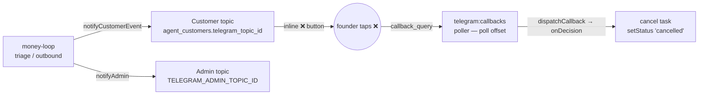

# Telegram — founder notifications

Telegram is the orchestrator's **founder-notification channel**: the one place the
service pings *you*. It runs on a single **forum supergroup** with **one topic per
customer** (created at onboarding) plus a pinned **Admin topic** for
cross-customer notices. The money-loop posts triage notices into a customer's
topic and attaches a one-tap **❌ cancel** inline button; tapping it cancels the
task.

This doc covers the one-time bot/supergroup setup, runtime configuration, and the
behaviors an operator needs to know. For the full env reference see
[configuration.md § Telegram](../configuration.md#telegram); for the customer
onboarding flow that creates a topic see [operations.md](../operations.md).

## What it does



- **Founder topics.** Each onboarded customer gets its own forum topic. The
  onboarding flow calls `createForumTopic` once and stores the returned
  `message_thread_id` in `agent_customers.telegram_topic_id`. All later notices
  for that customer post into that thread.
- **Admin topic.** Cross-customer notices (failure alerts, ungrouped proposals)
  go to the pinned Admin topic when `TELEGRAM_ADMIN_TOPIC_ID` is set, otherwise
  to the supergroup's **General** topic.
- **Triage notices.** The loop posts: new task, comment added, needs-input, new
  contact proposal, and failure alerts — a title + body + optional deep-link URL
  (rendered by `render()` in `telegram-notifier.ts`).
- **❌ cancel button.** A notice can carry inline buttons. The cancel button's
  `callback_data` encodes the target task; tapping it lands as a `callback_query`
  that the `telegram:callbacks` poller routes back to cancel the task
  (`setStatus('cancelled')`). See [The ❌ callback loop](#the--callback-loop).

## Natural-language scheduling

When `TELEGRAM_SCHEDULING_ENABLED` is enabled, plain founder messages in an
onboarded customer's topic are checked after `/ask`, slash commands, and armed
draft edit/revise captures. Examples:

- `Send her a WhatsApp message at 1:30 pm: what's up?`
- `Remind me tomorrow at 9 am to follow up`
- Reply to a draft or customer notice with `Send this Friday at 2 pm`.

The bot requires every customer-message command to explicitly choose **WhatsApp**
or **email**; it asks instead of falling back to a contact channel. It then confirms
the exact local time, route, and body and adds a **Cancel schedule** button.
Customer-facing wording must be copied exactly from the
command or a mapped outbound draft; the AI never invents text that will be sent
automatically. A replied notification reuses its original active contact,
account, thread, and quote when available, otherwise the customer's primary
one-to-one contact is used. Reminders return to the same customer topic.

Scheduling is one-time only. A requested time without a date means its next
occurrence in `TELEGRAM_SCHEDULING_TZ`. Actions more than the configured grace
period late are marked missed instead of being delivered stale. Explicit
customer schedules bypass business-hour/holiday deferral, but rate limits,
account isolation, and delivery-failure protections still apply.

### Voice and audio commands

Voice notes and uploaded audio in a customer topic are downloaded from Telegram,
transcribed with OpenAI (`gpt-4o-mini-transcribe`), and passed through the same
command pipeline as typed text. This includes `/ask`, draft edit/revise, reminders,
and scheduled customer messages. `OPENAI_API_KEY` must be configured in Connectors.
Audio is limited to 10 minutes and 20 MB; wrong-chat and bot-authored media is
rejected before download.

## One-time setup

Do this once, before setting the env vars. You need Telegram on a phone or
desktop client that can create supergroups and enable Topics.

### 1. Create the bot (BotFather → token)

1. Open a chat with **@BotFather** in Telegram.
2. Send `/newbot`, choose a name and a username (must end in `bot`).
3. BotFather replies with the **bot token** — the `12345:AA…` string. This is
   `TELEGRAM_BOT_TOKEN` (a secret). Keep it out of `.env` commits.

### 2. Create a forum supergroup (Topics enabled)

1. Create a **new group**, add the bot (and yourself).
2. Open **group settings → Edit → Topics** and turn **Topics on**. This converts
   the group to a **forum supergroup** — the mode the orchestrator requires (a
   plain group has no `message_thread_id`, so per-customer topics can't exist).

### 3. Add the bot as an admin with "Manage Topics"

1. Group settings → **Administrators → Add Admin →** select the bot.
2. Grant it the **Manage Topics** permission (at minimum). Without it,
   `createForumTopic` at onboarding fails and no customer topic can be created.

### 4. Get the supergroup chat id (the `-100…` number)

The chat id of a supergroup is a negative number that starts with `-100`. Two
easy ways to read it:

- **@RawDataBot / @getidsbot** — add it to the group briefly; it prints the
  chat id, then remove it.
- **getUpdates** — send any message in the group, then call the Bot API and read
  `result[].message.chat.id`:

  ```bash
  # Substitute your bot token; prints recent updates including chat.id
  curl -s "https://api.telegram.org/bot<your-bot-token>/getUpdates" | jq '.result[].message.chat'
  ```

This value is `TELEGRAM_SUPERGROUP_CHAT_ID` (non-secret env).

### 5. (Optional) Create the pinned "Admin" topic and get its thread id

1. In the forum, create a topic named e.g. **Admin** and pin it.
2. Read its `message_thread_id`. Send a message in that topic and call
   `getUpdates` — the update's `message.message_thread_id` is the value:

   ```bash
   curl -s "https://api.telegram.org/bot<your-bot-token>/getUpdates" \
     | jq '.result[].message | {thread: .message_thread_id, text}'
   ```

This value is `TELEGRAM_ADMIN_TOPIC_ID` (non-secret env, optional). If you skip
it, admin notices land in the supergroup's **General** topic.

### 6. Disable the bot's privacy mode — required for free-text features

The **response drafter** (M2c) lets you **✏️edit** a draft by typing the replacement
text as a plain message in the customer's topic. By default a bot's **privacy mode**
is **ON**, so a bot in a group only receives commands, @mentions, and replies *to the
bot* — it would **never see** your free-text edit. The drafter's edit capture
(`onMessage`) therefore needs privacy mode **OFF**:

1. Open **@BotFather → `/setprivacy` →** select your bot **→ Disable**.
2. ⚠️ **Re-add the bot to the supergroup.** Telegram applies the privacy setting
   only to groups the bot joins *after* the change — if the bot is **already** in
   your supergroup, the new setting does **not** take effect until you **remove it
   and add it back**, then **re-grant the "Manage Topics" admin** (step 3). Existing
   customer topics survive (they belong to the group, not the bot).

Skip this only if you never enable any **message-reading** surface — the
❌-cancel and approve/reject **buttons** work with privacy mode on (they arrive
as `callback_query`, not messages). The free-text **✏️edit**, the **🔁 Revise**
instruction capture, **`/ask`**, and the **`/pending` / `/briefing` / `/help`**
commands, plus natural-language scheduling, all read plain `message` updates, so
each needs privacy mode **OFF**.

## Configuration

Verified against `src/config/env.ts` and `src/adapters/telegram/factory.ts`.
Only the bot token is a secret (resolved through `resolveCredential`); forum ids
and scheduling knobs are non-secret.

| Variable | Secret? | Required | Purpose |
|---|---|---|---|
| `TELEGRAM_BOT_TOKEN` | **secret** | yes (for Telegram) | Bot token from BotFather (`12345:AA…`). Resolved lazily via `resolveCredential('TELEGRAM_BOT_TOKEN')` — sealed store first, env fallback. Embedded in the Bot API request URL, so the client logs the method name only, never the URL. |
| `TELEGRAM_SUPERGROUP_CHAT_ID` | no | yes (for Telegram) | The `-100…` supergroup chat id. **Optional in the zod schema** so the service still boots without Telegram, but `buildTelegramNotifier()` throws `TELEGRAM_SUPERGROUP_CHAT_ID is not set` the moment Telegram is actually used. |
| `TELEGRAM_ADMIN_TOPIC_ID` | no | no | `message_thread_id` of the pinned Admin topic. Blank ⇒ admin notices go to the **General** topic. |
| `TELEGRAM_SCHEDULING_ENABLED` | no | no | Settings-managed restart flag for natural-language scheduling. Default `false`. |
| `TELEGRAM_SCHEDULING_TZ` | no | no | Founder timezone used to interpret and display schedule times. Default `America/Panama`. |
| `TELEGRAM_SCHEDULING_INTERVAL_MS` | no | no | Due-action worker cadence. Default `15000`. |
| `TELEGRAM_SCHEDULING_GRACE_MINUTES` | no | no | Maximum late execution window before an action is marked missed. Default `15`. |

```bash
# In .env — the token is a secret; the two ids are not
TELEGRAM_BOT_TOKEN=            # 12345:AA… from BotFather
TELEGRAM_SUPERGROUP_CHAT_ID=   # -100XXXXXXXXXX forum supergroup id
TELEGRAM_ADMIN_TOPIC_ID=       # optional; blank = General topic
```

> **Boots without Telegram.** Because the supergroup id is optional in the
> schema, the service starts even when Telegram isn't configured — but the
> money-loop workers (including the callback poller) are skipped, so only
> ingestion runs. Configure all three values to enable notifications.

## Topics are created at onboarding, not on notify

A customer's topic is created by the **onboarding flow**, not lazily on the first
notification. `TelegramNotifier.notifyCustomerEvent(customerId, …)` resolves the
customer's `agent_customers.telegram_topic_id` and **throws if it is null**:

```
No Telegram topic for customer <id> — onboard before notifying
```

So the ordering is strict: **onboard the customer first** (which runs
`ensureCustomerTopic` → `createForumTopic` → stores `telegram_topic_id`), then
the loop can notify. `ensureCustomerTopic` is idempotent — it returns the
existing ref when one is already stored and only creates a fresh topic
otherwise. See [operations.md](../operations.md) for the `npm run onboard`
command.

## The ❌ callback loop

The cancel button is a two-part contract between the notifier and the
`telegram:callbacks` poller:

1. **Send side.** A notice attaches an inline keyboard; each button carries a
   `callback_data` string of the form `<optionId>:<notificationRef>` — e.g.
   `x:<taskRef>` for the ❌-cancel button.
2. **Tap → poll.** The `telegram:callbacks` poller calls
   `TelegramNotifier.poll(offset)`, which fetches `callback_query` updates via
   `getUpdates(offset)` (short poll, `allowed_updates: ['callback_query']`),
   routes each through `dispatchCallback` → the registered `onDecision` handler,
   then acks the tap with `answerCallbackQuery` (stops the client spinner).
3. **Offset durability.** The offset advances **only after an update is fully
   handled**, and is **held (not advanced) on a failed dispatch** so the tap
   re-delivers next poll instead of being silently lost — the ❌ is the only
   durable record of the founder's intent. Replay is safe because the cancel is
   idempotent.

`answerCallbackQuery` is best-effort: a stale callback id (older than ~48h, or
after a restart) fails harmlessly and is swallowed.

## Draft approvals & the 🔁 Revise loop

When the response drafter is on (`KNOWLEDGE_DRAFT_ENABLED`), an answerable
`question_existing` intent produces a **cited draft reply** parked in the
customer's topic with inline buttons. The same guarded decision records back the
Telegram buttons and the console **Approvals** tab — only the first surface to
act creates the task / flips the queue (see
[operations.md § Cross-surface approvals](../operations.md#cross-surface-approvals)).

| Button | Outcome |
|---|---|
| ✅ **Approve** | The draft is armed (`is_draft=false`) and the outbound drainer sends it (threaded, same-account for email). |
| ✏️ **Edit** | Type the replacement text as a plain message in the topic; the next draft is replaced and approved. (Needs privacy mode **OFF**.) |
| ❌ **Reject** | The draft is cancelled and the decision resolved `rejected`. |
| 🔁 **Revise** *(needs `DRAFT_REVISE_ENABLED`)* | Type a correction **instruction** (e.g. "be warmer, mention the Tuesday meeting"); the drafter regenerates the draft grounded in the original inbound + prior draft + your directive, then re-presents a fresh draft for approve/edit/reject. The correction is learned into the right scope (a shared product fact for every customer, or one customer's preference) so it never repeats. |

- **Nothing is ever auto-sent.** Revise re-presents a *draft* the founder still
  approves/edits/rejects.
- **Style/persona corrections** (tone, warmth, formality) have no lexical overlap
  with any given question, so they'd never clear the retrieval distance gate. The
  **style lane** (`STYLE_LANE_ENABLED`) injects all of a customer's active style
  corrections into every draft as persistent voice guidance — a directive, never a
  cited source.
- **Calendar context** (`CALENDAR_ENABLED`): at draft time the drafter also pulls
  the customer's upcoming meetings from the founder's Google Calendar and injects
  them as context the reply may acknowledge ("see you Tuesday"), never a citation.

## Founder commands (/ask, /pending, /briefing, /help)

Three optional, default-off surfaces turn the founder topic into a query/command
surface. All read `message` updates, so they need the bot's **group privacy mode
OFF** (same as the ✏️edit / 🔁 Revise capture — see [§6](#6-disable-the-bots-privacy-mode--required-for-the-response-drafters-edit)).

| Command | Gate | What it does |
|---|---|---|
| `/ask <question>` | `QUERY_ENGINE_ENABLED` | Semantic search over the **internal** Project Brain corpus (`internal_knowledge`) → LLM-synthesized **cited** answer posted back in the founder topic. Reuses `KNOWLEDGE_INTERNAL_K` / `_MAX_DISTANCE`. Isolation holds — the customer-drafting path still can't reach internal rows. See [project-brain.md](../project-brain.md). |
| `/pending` | `SLASH_COMMANDS_ENABLED` | Counts + oldest age of the pending draft-reply and backfill-proposal queues, replied in the requesting thread. |
| `/briefing` | `SLASH_COMMANDS_ENABLED` | The [daily briefing](../configuration.md#intelligence--digests) on demand, posted to the requesting thread. |
| `/help` | `SLASH_COMMANDS_ENABLED` | Lists the commands. |

`/ask` is its own handler; the others share a core router (`src/query/commands.ts`).
Both the daily briefing and the weekly-patterns digest also post **automatically**
to the Admin topic when their workers are enabled (idempotent per day/week).

## Telegram Bot API notes (client behavior)

From `src/adapters/telegram/telegram-client.ts` — worth knowing when a call
misbehaves:

- **Body-level success, not just HTTP 2xx.** The Bot API returns `200` with
  `{ ok: false, description }` for logical failures. The client treats
  `ok !== true` as an error regardless of status.
- **Rate limits (429).** A `429` carries `parameters.retry_after` (seconds); the
  client honors it via the shared retry helper. 5xx and transport/timeout errors
  also retry; other 4xx do not.
- **No secrets in logs.** The token lives in the request URL, so the client logs
  the **method name only** (`sendMessage`, `createForumTopic`, …) — never the
  URL — plus `{status, attempt, durationMs}`.

## Troubleshooting

| Symptom | Likely cause |
|---|---|
| `TELEGRAM_SUPERGROUP_CHAT_ID is not set` at startup | The env var is blank but Telegram is being used (e.g. onboarding). Set the `-100…` id. |
| `Missing credential "TELEGRAM_BOT_TOKEN"` | Neither the sealed store nor the env has the token. Set `TELEGRAM_BOT_TOKEN` (or store it via `/admin/credentials`). |
| `createForumTopic` fails at onboarding | The bot isn't an admin, or lacks **Manage Topics**. Re-check step 3. |
| `No Telegram topic for customer <id> — onboard before notifying` | The customer has no `telegram_topic_id`. Onboard the customer first. |
| Notices land in General instead of an Admin topic | `TELEGRAM_ADMIN_TOPIC_ID` is unset — that's the documented fallback. Set it to the pinned topic's `message_thread_id`. |
| Bot API returns `chat not found` / `400` | Wrong chat id (must be the `-100…` supergroup id), or the bot was removed from the group. |

## See also

- [configuration.md § Telegram](../configuration.md#telegram) — env reference and the sealed credentials store.
- [ezy-portal.md](./ezy-portal.md) — the task target the ❌ button cancels against.
- [operations.md](../operations.md) — onboarding, background workers, logs.
- [README.md](../README.md) — the money-loop overview.
