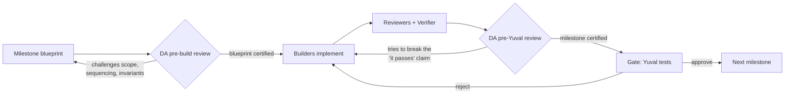
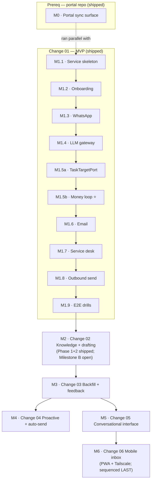

# Execution Plan — Agent Orchestrator

How we build the [Agent Orchestrator](project.md) from the OpenSpec plan: a **milestone-gated** delivery model where every milestone ends in something *you* (Yuval) can test with a concrete action before we move on, executed by a **team of agents** overseen by a persistent **devil's advocate**.

- **What is built** → [`specs/`](specs/) (shipped capability specs — source of truth for current behavior)
- **What should change** → [`changes/`](changes/) (proposals for 02–06; 00/01 shipped, archived to `changes/archive/`)
- **How we execute it** → this file
- **Live risk register** → [`RISK-REGISTER.md`](RISK-REGISTER.md) (owned by the devil's advocate)

> **Status (2026-07-10): ★ PHASE 1 (change 01, M1.1–M1.9) CLOSED; M2 (change 02) well underway.** The two-way loop is complete: WhatsApp/email/service-desk ingestion → LLM triage → EZY task/comment → Telegram notify + ❌-undo → real outbound send, hardened with rate/window/circuit-breaker gates + an early-warning failure alert. All 8 §9 drills verified, merged to `master`, pushed. **M2 shipped so far:** muted-group @-mention (Phase 1+2, live) and Milestone B (outbound media + quoted replies, live, `7ea3a18`). **M2(a) knowledge memory — BUILT + LIVE (2026-07-10):** committed `feat/m2a-knowledge-sync` (`006d9a5`); hash-controlled doc-sync into a dedicated pgvector Postgres (`ao-postgres` :55432, NOT the shared ezy-postgres), RAG holds 638 docs/4,754 chunks, both customer corpora (HolaDoc, Pilates Gal) onboarded + scoped. **M2(b) retrieval-into-triage — committed (`e370e4a`, dormant behind `KNOWLEDGE_RETRIEVAL_ENABLED`).** **M2(c) response drafter — BUILT 2026-07-10 (uncommitted, 305 tests green, team-built + DA-certified + gates re-verified):** `question_existing` + retrieved knowledge → LLM 'draft' role → cited reply enqueued `is_draft=true` (migration 015 links it to an `agent_decisions` audit row) → posted to the customer's Telegram topic with approve/✏️edit/reject; approve→release to the existing drainer (channel-correct/threaded), edit→send founder text + record `modified`, reject→cancel+record. Two invariants verified from source: gated OFF by default (`KNOWLEDGE_DRAFT_ENABLED`), and `is_draft=true` rows are structurally un-drainable until an explicit approve (drainer claims `status='approved' AND is_draft=false` only). **Live gate PASSED 2026-07-10:** real WhatsApp question (ReyEl → Test Customer) → triage → retrieval from shared portal guides → cited Spanish draft in Telegram → founder tapped Approve → sent to WhatsApp, threaded as a quote. The full M2 knowledge→drafting loop works end-to-end (M2c still uncommitted). **Wave 2 now building in parallel (2026-07-10): #4 M2(e+f) release-note drafts + cross-channel dedup, and #5 M5(a) query engine + the Telegram `/ask` "Project Brain" channel — see "Wave 2" below.**

## Shipped (M0, M1.1–M1.9)

Detail lives in `changes/archive/`, `specs/`, `blueprints/archive/`, and git history — this table is a pointer, not the record.

| Milestone | Outcome | Blueprint |
|---|---|---|
| **M0** portal sync surface | Built, DA + standards-guardian certified, committed on `portal-business` (`feat/change-00-portal-sync-webhooks`). 3 push-path HTTP gates pending a webhooks-enabled tenant key (non-blocking — only needed at M4; pull path fully verified) | `blueprints/archive/M0-portal-sync-surface.md` |
| **M1.1** orchestrator scaffold | Service skeleton, migrations 001–008, ports/ESLint boundary, `/health` with backlog metrics | `blueprints/archive/M1.1-orchestrator-scaffold.md` |
| **M1.2** onboarding | EZY read + contact resolution + idempotent onboarding + Telegram topic. Gate: onboarded "Test Customer" live | `blueprints/archive/M1.2-onboarding.md` |
| **M1.3** WhatsApp ingestion | Webhook (HMAC) + pull reconciliation (sole path for late voice transcripts) + enrichment-upsert. **Gate passed live** (real device) | `blueprints/archive/M1.3-whatsapp-ingestion.md` |
| **M1.4** LLM gateway | Anthropic/OpenAI/DeepSeek clients, sealed credentials, fallback chain, tz-pinned daily cost cap. **Gate passed live** (Anthropic) | `blueprints/archive/M1.4-llm-gateway.md` |
| **M1.5a** TaskTargetPort | `EzyPortalGateway implements TaskTargetPort`; contract suite. **Live contract passed** vs `account-test` | `blueprints/archive/M1.5a-task-target.md` |
| **M1.5b** ⭐ money loop | Inbox → context → triage → dedup → create/comment → Telegram notify + ❌ undo. **Gate passed live** (create, dedup, notify, undo all confirmed) | `blueprints/archive/M1.5b-money-loop.md` |
| **M1.6** email ingestion | Gmail ×2 (OAuth2 + History API) + CC-only rule. **Gate passed live** | `blueprints/archive/M1.6-email-ingestion.md` |
| **M1.7** service desk ingestion | Poll-only SD channel, bp-ref primary resolution. **Gate passed live** | `blueprints/archive/M1.7-service-desk-ingestion.md` |
| **M1.8** outbound delivery | Queue drainer, rate/window/circuit-breaker gates, real send. **Gate passed live** (1:1 + group) | `blueprints/archive/M1.8-outbound-delivery.md` |
| **M1.9** full E2E drills | All 8 `changes/archive/01-.../tasks.md §9.1–9.8` drills verified live. **Phase 1 done.** | — |
| **M2 Phase 1+2** muted-group @-mention | Mute+mention detection → group summary → triage → EZY task + attached images. **Gate passed live** | plan-mode plan, not a blueprint file |
| **M2 Milestone B** outbound media + quoted replies | Phase 3 outbound media (migration 013 `attachment_ref` JSONB; ref→bytes at send time, `413`/`400`→permanent failReview) + Phase 4 quoted replies (`in_reply_to`→`quotedMessageId`). **Gate passed live** (row #382 → Test group received the image with caption sent as a quote; DA build+delta CERTIFIED, /code-review clean, 200 tests). | `blueprints/M2-milestone-B-outbound-media-quoted-reply.md` |

Corrections folded in along the way (now reflected in `specs/`, not repeated here): the EZY work-item-type lookup is two-hop; the portal enforces one task per thread across *all* statuses, not just open ones; `Idempotency-Key` isn't honored on task-create; cross-channel conversation identity isn't modeled (deferred to M2). See `RISK-REGISTER.md` §3 for the full resolved list.

**M2 Milestone B is DONE — gate passed live**, merged to `master` (`7ea3a18`) and pushed: Phase 3 outbound media (migration 013 `attachment_ref` JSONB) + Phase 4 quoted replies (`in_reply_to`→`quotedMessageId`). Full protocol: DA pre-review CERTIFIED → build → freeze → DA adversarial verify **BUILD CERTIFIED** + `/code-review` (1 correctness + DRY fixes folded, DA delta CERTIFIED) → tsc/eslint/lint:boundary 0, 200 tests → **live gate passed** (row #382 → Test group received image + caption as a quote).

**M2(a) — Knowledge memory (Change 02 §1): BUILT + LIVE 2026-07-10.** The design evolved past the paused blueprint after two Yuval corrections + a 5-agent adversarial panel (verdict REVISE, architecture-sound): the doc source became a **typed `KNOWLEDGE_SOURCES` folder reference read from on-disk portal/ai-agent repos** (not copied, not the Docs API — which has no bulk list-with-hashes endpoint), and ingestion became a **boot-time hash-controlled sync worker** (new→embed / changed→re-embed / unchanged→skip / removed→tombstone) rather than a manual CLI. Migration 014 = `knowledge_documents` manifest (content_hash + status) + `agent_memory` `vector(1536)`/hnsw. Infra: a **dedicated `ao-postgres` (`pgvector/pgvector:pg18`, :55432)** was stood up so the shared `ezy-postgres` was never swapped/touched. **Live:** RAG holds 638 docs / 4,754 chunks (7 shared portal/ai-agent corpora + HolaDoc + Pilates Gal, each customer-scoped, verified leak-free), total embed spend ~$0.012. Committed on `feat/m2a-knowledge-sync` (`006d9a5`). Detail in memory `knowledge-sync-build` + `system-tenant-docs-api`.

**M2(b) — retrieval into triage: BUILT 2026-07-10 (uncommitted, 264 tests green).** Scoped RAG retrieval injected into the triage context (embed inbound message → `memoryRepo.search(customerId, shared)` → cited "Relevant knowledge" section in the triage prompt), gated behind `KNOWLEDGE_RETRIEVAL_ENABLED`, best-effort (degrades to no-knowledge, never a triage failure). **Next: M2(c) response drafter** (turn a `question_existing` hit into a cited Telegram draft the founder taps to send).

### Wave 2 — in flight + cutover model (decisions 2026-07-10, authoritative)

**#4 + #5 building now (parallel background agents).** Each lands a branch for Yuval's live gate; **all flags default-false — nothing committed / enabled / migrated / restarted until he gates.**
- **#4 — M2(e+f):** release-note customer-notification drafts + cross-channel conversation dedup (R52). Branch `feat/m2-ef`, migrations 019/020. BUILDING.
- **#5 — M5(a):** founder query engine + the **Telegram `/ask` "Project Brain" channel** (the headline deliverable): `/ask <question>` in the founder topic → internal-knowledge search (MI `internal` scope) → LLM-synthesized cited answer. Branch `feat/query-engine`. BUILDING.

**Path to "the agent actually running the business" (priority order):**
1. Land the in-flight functional streams #4 + #5.
2. **Onboard real customers + run live traffic** — the real gap between "gates pass" and "working." Onboard **Pilates Gal** (BP ref known) and obtain **HolaDoc's `bp_ref`** (currently unknown → its source is fail-closed-skipped until we have it).
3. **Accumulate M2c acceptance data toward M4 auto-send** — time-gated on ~30 days of acceptance data; the feedback/acceptance worker already started that clock. M4 is what makes the loop hands-off.
4. *(Parallel, non-blocking)* unblock the M0 push path / M4 `TaskEventSource` — still gated on a webhooks-enabled portal tenant key.

**Test → Production cutover (a config + credentials switch, NOT a code fork).** We're in TEST mode now; moving to prod is acceptable **mid-development** because **every outbound is draft-gated** — Yuval approves each send in Telegram, M4 auto-send isn't built and is itself time-gated, so production = real inbound → agent drafts → Yuval approves each send; **nothing sends autonomously.** The switch = repoint at the real portal (needs the webhooks-enabled tenant key), the real `whatsapp_manager` instance, and the real Gmail accounts, then onboard all customers (`agent_customers` rows + contacts, `is_group=true` for WhatsApp groups). **Two distinct backfill modes to keep separate at cutover:**
- **(A) Context backfill** — an optional one-time **read-only** sweep of historical email/WhatsApp threads into `agent_memory` to seed each customer's voice/history so first drafts are warm. Small job, likely not built yet.
- **(B) Action watermark** — set the ingestion `updatedAfter` cursor to the go-live moment so only **new** inbound triggers the triage→draft loop; the agent does not re-draft old / already-answered threads.

**#6 (M6 mobile inbox) — client + transport decided; sequenced LAST.** It is a **surface, not new capability** (Telegram already gives full control of the loop), so it comes after all functional waves — build it only once the agent reliably runs the business.
- **Client = PWA** (not React Native, not native): Android-only + founder-only makes RN's cross-platform advantage inert, and Android Chrome PWAs have first-class Web Push (rides FCM) so the usual PWA push weakness (iOS) doesn't apply — lowest maintenance, reuses the repo `frontend/` area.
- **Transport = Tailscale** (WireGuard mesh), NOT port-forwarding and NOT Cloudflare Tunnel: zero public exposure (reachable only from Yuval's own enrolled devices, no open inbound ports), and `tailscale serve` / MagicDNS supplies the valid HTTPS cert the PWA needs (secure context + web push); Android "always-on VPN" keeps the phone on the tailnet so data loads on notification-tap. App-level session auth (sub-milestone a) is still required as defense-in-depth — **two gates: network + app.**
- **UI spec = `plan/ui/founder-operations-console.md`** (design-reviewed 2026-07-13). The desktop "Founder Operations Console" and the M6 mobile PWA are **ONE responsive React/Vite app** (served at `/console` from the Express service, installable as a PWA) — do NOT build two founder UIs. Same **Tailscale-only** exposure (renders customer PII → never internet-facing). **Phasing:** an optional **thin observability slice** (Overview + worker-health + read-only inbox/decisions lists) may be **pulled forward** ahead of M6's last-place sequencing — runtime state is currently only visible via raw `psql`, and the slice is low-risk/mostly-read; then **v1** = observability + LLM-cost analytics + the two safe recovery mutations (requeue failed inbox, cancel approved outbound); **v2** = manual WhatsApp send (deferred — only surface that reaches a customer bypassing triage). See the spec for the full page/API/auth/audit design.

---

## 1. Operating model

### 1.1 The team

| Role | Who (agent) | Responsibility |
|---|---|---|
| **Orchestrator** | main session (me) | Owns this plan. Sequences milestones, spawns the build team per milestone, integrates work, runs the gate with Yuval. Single point of contact. |
| **Devil's Advocate** | persistent agent `devils-advocate` | Full-scope adversarial monitor. Reviews the plan, each milestone's blueprint *before* build and each milestone's output *before* it reaches Yuval. Enforces the architecture invariants, owns [`RISK-REGISTER.md`](RISK-REGISTER.md), and challenges every "done" claim. Lives for the whole project (addressed via SendMessage). |
| **Architect** | `feature-dev:code-architect` (per milestone) | Turns a milestone's `tasks.md` slice + `design.md` into a concrete build blueprint (files, wiring, sequence). |
| **Builders** | `general-purpose` / `claude` (per milestone, parallel where independent) | Implement the tasks. |
| **Standards reviewer** | `standards-guardian` | Mandatory gate on all **portal** (`/mnt/dev/portal`) work. |
| **Code reviewer** | `feature-dev:code-reviewer` + `/code-review` | Gate on all **orchestrator** work. |
| **Verifier** | `general-purpose` + `/verify` `/restart` `/logs` | Runs the milestone's acceptance drills and produces the evidence pack Yuval reviews. |

### 1.2 Devil's-advocate protocol (runs at every milestone)

The DA's standing mandate — it must actively try to **falsify** each of these before certifying a milestone:

1. **Invariants held?** Core imports no adapter code; every external system is behind a port; refs are opaque `TEXT`; no AMQP anywhere; secrets never in DB plaintext; no message bodies in logs.
2. **Actually testable?** The stated acceptance test exercises the real slice end-to-end — not a mock, not a happy-path-only demo.
3. **No smuggled scope / no deferred debt?** Nothing from a later change was half-built; nothing this change owns was quietly stubbed.
4. **Failure paths exist?** Retry/`failed`/admin-alert lifecycle is real, not aspirational.

### 1.3 Milestone gate (Yuval)

Every milestone ends with an **evidence pack** from me containing exactly three things:

1. **What changed** — the slice, in one paragraph + file list.
2. **Your acceptance test** — the precise action to run and the expected result (copy-pasteable commands / click path).
3. **DA certification + residual risks** — what the devil's advocate tried to break, and what it couldn't sign off.

**We do not start the next milestone until you have run the test and approved.** That is the hard gate you asked for.

---

## 2. Milestone map

M0 and M1.1–M1.4 had no dependency on each other and ran in parallel. M0→M1.7 was a hard block (no polling can detect a ticket reply without M0's thread-touch migration) — both shipped, resolved.

---

## 3. Changes 02–06 (milestone-level; detailed when we reach them)

Each is gated the same way as Phase 1 (§1). Detail is deliberately lighter here — we re-derive sub-milestones from the change's `tasks.md` (and write a `design.md` where missing) at the start of that change, so the plan reflects what Phase 1 actually taught us.

| ID | Change | Sub-milestones | **Yuval's milestone acceptance test** |
|---|---|---|---|
| **M2** | 02 Knowledge + drafting | (a) pgvector + `agent_memory` + embedding pipeline + guide/release-note ingestion → (b) retrieval into triage → (c) response drafter + Telegram approve/edit/reject → (d) email send hardening → (e) release-notes→customer drafts → (f) cross-channel conversation identity (R52, `RISK-REGISTER.md` §2) — the embedding signal from (a) enables dedup across channels (customer + semantic content within a time window + confidence gate), so a WhatsApp+email same-conversation folds into **one** task instead of two. Own gated sub-milestone; a false-merge across unrelated threads is worse than a duplicate, so it ships behind a confidence gate, not a threshold tweak. **Already shipped ahead of schedule:** muted-group @-mention detection (Phase 1+2, gate-passed live) — see the shipped table above. **Remaining = Milestone B:** outbound media (migration 013 `attachment_ref` JSONB) + quoted replies (`in_reply_to`→`quotedMessageId`, no migration). | A `question_existing` message whose answer is in a guide → a **cited draft** appears in Telegram; one tap sends it via the original channel, correctly threaded. **(f):** a customer request raised on WhatsApp then re-sent by email → the email **comments on the existing task**, no duplicate. **Milestone B:** an outbound message with an image attachment sends via the drainer; a quoted reply threads correctly. |
| **M3** | 03 Backfill + feedback | (a) resumable backfill engine per source + checkpoints → (b) starred-email review → (c) feedback→memory → (d) daily acceptance report → (e) weekly pattern detection | After onboarding+backfill, "history with HolaDoc on the audit feature" returns accurate backfilled context; a correction demonstrably changes the next similar draft; daily report posts. |
| **M4** | 04 Proactive + auto-send | (a) `TaskEventSource` (webhook + `updatedAfter`, exactly-once) → (b) resolution notifications via source channel → (c) auto-send gates (≥85%/30d, exclusions) → (d) stale-task + needs-info | A task moved to `done` → customer gets a resolution notice through the original channel with no founder tap; auto-send fires only on gated categories; zero auto-sends on excluded ones. **Needs M0's push path** — resolve R15/R16/R28/R29 first (`RISK-REGISTER.md` §1). |
| **M5** | 05 Conversational interface | (a) query engine (scope→retrieve→cited answer) → (b) daily briefing → (c) slash commands → (d) Google Calendar read/write | "What's the status with HolaDoc?" → accurate, sourced answer <10s; morning briefing arrives; a draft references a real upcoming calendar meeting. |
| **M6** | 06 Mobile inbox | **Client = PWA; transport = Tailscale; sequenced LAST (surface, not capability) — see "Wave 2" above + spec `plan/ui/founder-operations-console.md` (unified console+PWA, phased v1/v2, thin observability slice pull-forwardable).** (a) authenticated API/SSE layer → (b) per-customer timeline + inline approvals → (c) unified cross-customer inbox + urgency score → (d) web push (VAPID over FCM) → (e) in-app chat (reuse M5 engine) | Run a full day — triage confirms, draft approvals, queries — entirely from the phone PWA, no Telegram/desktop, full approval-flow parity. |

### Invariant guardrails (carry forward into every future blueprint)

- **Never query an external service's DB directly** — whatsapp_manager and the portal are HTTP-only (invariant #5).
- **Secrets → sealed `credentials` table via `credentials_ref`**, never into a `config` JSONB column.
- **No AMQP anywhere** — portal integration is HTTPS webhooks + `updatedAfter` polling only (invariant #9/D11).
- **Opaque refs stay `TEXT`** — never typed `uuid` or parsed in core (invariant #4).
- **No provider SDK call outside the LLM gateway; no message bodies in logs.**

---

## MI — "Project Brain": internal-knowledge RAG + MCP (future, agreed 2026-07-10; sequence after M2c)

A **founder/dev-facing** semantic memory over our OWN internal docs — architecture, planning, decisions, backlog, risk register — across `yuval_dev_manager/plan`, `ai-agent/plan|docs`, `portal/plan|docs`. Reachable from **Telegram** (`/ask`) AND as an **MCP server** so Claude Code / Codex can search our architecture + decisions mid-task instead of grepping md. Reuses the M2(a) engine wholesale (embedding adapter, chunker, pgvector, hash-sync worker, cosine search); the net-new is a scope + a transport.

**Design decisions (settled in discussion):**
- **`internal` is a THIRD scope** — NOT `shared` (=every customer) and NOT `customer` (=one). Internal docs must be **structurally unreachable from the customer-drafting retrieval path** (M2b) — an internal planning/decision/audit chunk leaking into a *customer* reply is the nightmare case. **Decision: a SEPARATE `internal_knowledge` table + its own search fn used ONLY by the founder/MCP path**, so the customer path *cannot* return an internal row by construction (belt-and-suspenders, per the "impossible-by-construction, not by discipline" principle). (Alt considered: a `visibility` column on the existing table — DRYer but one filter to never break; rejected in favor of structural isolation.)
- **Curated `INTERNAL_SOURCES`, not a dump** — ingest referential material (decisions, executed plans, backlog, architecture, risk register); **exclude** session logs, prompt archives, throwaway checklists, superseded scratch (e.g. `ai-agent/plan` is ~125 files, mostly session noise). Reuse the earlier per-file classification.
- **Transport = stdio MCP** (`npx tsx scripts/mcp-project-brain.ts`) — no network surface, no auth to fumble, works whenever `ao-postgres` + the OpenAI key are up (orchestrator process need not be running). `claude mcp add project-brain -- …` + the Codex equivalent point at the same script. HTTP/SSE on the orchestrator is the alt if it must be shared across machines. Tools (read-only): `search_project_knowledge({query,k})` → cited `{repo,path,section,snippet,distance}`; `get_project_doc({source,docKey})` → full markdown. Optional Telegram `/ask` → same search → LLM-synthesized cited answer to the founder topic.
- **Caveats:** freshness lags the sync interval (1h) unless a manual re-sync is triggered — fine for architecture/planning, add a trigger if wanted. Keep it a SEPARATE MCP process + separate table so a dev-tool change never risks the money-loop.

**Acceptance test:** from a Claude Code session, `search_project_knowledge("why disk-sourced instead of the Docs API")` returns the right decision with a citation; the same via Telegram `/ask`; and a customer-drafting retrieval provably cannot surface any `internal_knowledge` row.
