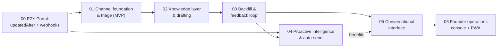

# Agent Orchestrator — Build Plan (OpenSpec)

Plan for building the [AI Agent Orchestration product spec](../agent-orchestration-product-spec.md) as an OpenSpec workspace. Start with [`project.md`](project.md) (context + architecture invariants), then work changes in order. Conventions: [`AGENTS.md`](AGENTS.md).

## Roadmap

| Change | Product phase | Key outcome | Estimate |
|---|---|---|---|
| [00-add-ezy-portal-sync-and-webhooks](changes/archive/00-add-ezy-portal-sync-and-webhooks/proposal.md) — ✅ shipped, see [`specs/portal-sync-events`](specs/portal-sync-events/spec.md) | prereq (portal-side) | `updatedAfter` filters + tenant webhooks on EZY Portal | ~1 wk |
| [01-add-channel-foundation-and-triage](changes/archive/01-add-channel-foundation-and-triage/proposal.md) — ✅ shipped (M1.1–M1.9), see [`specs/`](specs/README.md) | 1 | All channels → EZY tasks, Telegram alerts | 3–4 wks |
| [02-add-knowledge-and-drafting](changes/02-add-knowledge-and-drafting/proposal.md) | 2 | Cited reply drafts, one-tap send | 2–3 wks |
| [03-add-backfill-and-feedback](changes/03-add-backfill-and-feedback/proposal.md) | 3 | Historical memory, learning from corrections | 2–3 wks |
| [04-add-proactive-intelligence](changes/04-add-proactive-intelligence/proposal.md) | 4 | Resolution notifications, gated auto-send | 2 wks |
| [05-add-conversational-interface](changes/05-add-conversational-interface/proposal.md) | 5 | Ask the agent anything, briefings, calendar | 2–3 wks |
| [06-add-mobile-inbox](changes/06-add-mobile-inbox/proposal.md) | 6 | PWA handoff inbox, push | 3–4 wks |

## The extensibility mandates (baked into change 01's design)

1. **Channels are generic.** WhatsApp (via whatsapp_manager) is the first implementation of a `ChannelAdapter` port with a `channel_instances` registry — Teams/Slack later are adapter + row, no schema change. See design decision D2.
2. **Email is multi-account, multi-provider.** Two Gmail instances now; the email adapter delegates to an `EmailProviderClient` so more accounts or Outlook are additive. See D2/D3.
3. **EZY Portal is the target, behind interfaces.** `TaskTargetPort` / `CustomerDirectoryPort` / `TicketingPort` with opaque refs — tightly integrated today, swappable in principle. See D4.
4. **LLM providers are pluggable.** Anthropic, OpenAI, and DeepSeek supported out of the box with per-role model selection, runtime-settable API tokens, and a default-provider + fallback chain. See D10.
5. **Portal eventing is HTTPS-only.** Webhooks when connected, `updatedAfter` backfill after downtime (portal-side surface added in change 00) — no broker dependency, cloud-instance ready. See D11.
