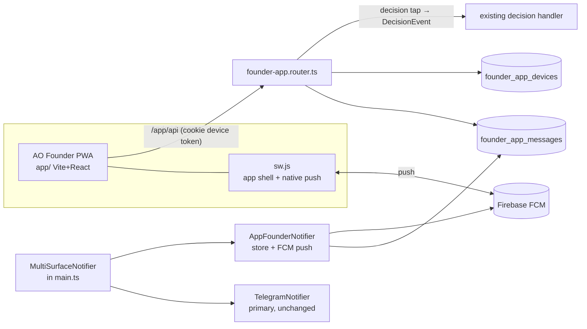

# M6 — Founder PWA ("AO Founder")

Chat-first installable PWA for the founder's Android phone, served by this service at
`/app`. Replaces the *interaction* limits of Telegram: one scrollable feed of everything
the assistant tells/asks the founder, tappable decision buttons, free-text chat, and
**Firebase Cloud Messaging push** for all founder notifications (not just `urgent`).

Telegram remains wired and authoritative; the app is a second first-class surface.

## Architecture invariants (inherited — do not violate)

- Ports & adapters: new code lives in `src/adapters/founder-app/`; core never imports it.
  Wiring only in `src/main.ts`. `lint:boundary` must stay green.
- No message content in logs — IDs/metadata only.
- Own DB, migrations under `src/db/migrations/` (next free numbers).
- Existing tests + typecheck must pass; new code ships with tests in the repo's style.

## Component map

## Schema (new migrations, next free numbers)

`founder_app_devices` — one row per logged-in phone/browser:
`id uuid pk`, `label text`, `token_hash text unique` (sha256 of opaque device token),
`fcm_token text null`, `push_enabled bool default false`, `failure_count int default 0`,
`created_at`, `last_seen_at`, `revoked_at timestamptz null`.

`founder_app_messages` — the single feed:
`id uuid pk`, `direction text ('in'|'out')`, `kind text ('chat'|'notification'|'question')`,
`title text null`, `body text not null`, `severity text null`, `customer_ref text null`,
`notification_ref text null`, `buttons jsonb null` (`[{id,label}]`),
`decided_option_id text null`, `created_at timestamptz default now()`.

## Backend — `src/adapters/founder-app/`

Mounted at `/app` in `main.ts`, gated by the same `ConsoleConfig` presence as `/console`.

- **Static**: serve the built `app/dist` (dev) / packaged copy (prod) with SPA fallback,
  mirroring how the console serves `web/dist`. `sw.js` and `manifest.webmanifest` must be
  reachable inside the `/app/` scope.
- **Auth**: `POST /app/api/login {password, label}` — verify against the console bcrypt
  hash with the console's rate-limit pattern; mint an opaque 32-byte token, store its
  sha256 in `founder_app_devices`, set httpOnly cookie `ao_app_device` (SameSite=Lax,
  Path=/app, maxAge 180d). Unlike console sessions this is **DB-backed and survives
  restarts** — it's a phone. `POST /app/api/logout` revokes. Middleware touches
  `last_seen_at`.
- **Feed**: `GET /app/api/messages?before=<iso|id>&limit=50` newest-first page.
- **Send**: `POST /app/api/messages {text}` → insert `in/chat` row; route the text through
  the **grounded query service** the console `/query` endpoint already uses (internal
  scope); insert the answer as `out/chat`; return both rows. (Full
  founder-message-router parity is a later phase — its reply paths are
  Telegram-thread-bound today.)
- **Decisions**: `POST /app/api/decisions {messageId, optionId}` → load the row's
  `notification_ref`, invoke the SAME decision handler Telegram's callback poller invokes
  with `DecisionEvent {notificationRef, optionId, by: 'founder-app'}`, set
  `decided_option_id`. **Investigate `telegram-notifier.ts` + the callback poller /
  `src/decisions` first** to confirm where `notificationRef` is minted so both surfaces
  share one ref; if it's minted inside the Telegram adapter, lift minting to the
  composite so the app stores the same ref.
- **Live**: `GET /app/api/events` — SSE of new feed rows (in-process emitter is fine).
- **Push**: `POST /app/api/push/register {fcmToken}` / `DELETE /app/api/push/register`
  per device. `GET /app/api/config` → `{firebase: <public web config>, vapidKey}` (authed).
- **`AppFounderNotifier`**: mirrors `notifyAdmin`, `notifyCustomerEvent` (with buttons),
  and `askFounder` into `founder_app_messages` + sends FCM push for **all** severities
  via `firebase-admin` `sendEachForMulticast` to enabled devices (collapse key = ref;
  disable a device token on `messaging/registration-token-not-registered`). Compose with
  Telegram by generalizing `FanoutFounderNotifier` (primary + N mirrors) rather than
  forking it. Web-push (VAPID) stays as-is.
- **Env** (all optional → feature disables itself with a `logger.warn`, no content):
  `FIREBASE_SERVICE_ACCOUNT_FILE` (path under `secrets/`), `FIREBASE_WEB_CONFIG_JSON`,
  `FIREBASE_VAPID_KEY`.
- **Build**: root `package.json` gets `"build:app": "npm --prefix app run build"`;
  Dockerfile packages `app/dist` exactly the way it packages the console build.

## Frontend — `app/` (sibling of `web/`)

Vite + React 19 + TS + Tailwind 4 (same dependency set/style as `web/`), `base: '/app/'`,
dev server port **3102** with proxy `/app/api → http://localhost:3100`.

- **Login screen** → password + device label.
- **Chat feed** (the whole app): one stream of `founder_app_messages` — assistant
  notifications/questions as left bubbles (title, body, severity accent), founder
  messages as right bubbles, `question` rows render their `buttons` as tappable chips
  (disabled + checkmarked once `decided_option_id` is set), day separators, sticky
  bottom composer, safe-area insets, auto-scroll, SSE live updates + refetch on focus,
  infinite scroll-back via `before` cursor.
- **Settings sheet**: push toggle (permission → `getToken({vapidKey, serviceWorkerRegistration})`
  → register), device label, logout, install-to-home-screen hint.
- **PWA**: `manifest.webmanifest` (name "AO Founder", `display: standalone`, dark theme,
  maskable icon) and **ONE** service worker, `sw.js` — app shell (precache, offline
  fallback) *and* background push. A scope allows a single registration, so a separate
  `firebase-messaging-sw.js` would only fight `sw.js` for `/app/`.

  **DEVIATION (shipped): no Firebase SDK in the worker.** The plan assumed the compat
  `importScripts` from gstatic. It works, and it cost three bugs that were invisible from
  outside the worker: the SDK suppresses notifications whenever any window of the whole
  ORIGIN is visible (an open `/console` tab silently swallowed every push); a worker
  snapshots its CSP at INSTALL time, so one installed under a policy that blocked
  `importScripts` stays permanently FCM-less while the UI still reports push as "on"; and
  the gstatic version must be hand-matched to the bundled SDK. FCM is only a relay — the
  worker receives a plain push event carrying the envelope `fcm-sender.ts` sent, and
  rendering it is ~15 lines. The SDK is needed solely to MINT the token, which happens in
  the page. So the worker imports nothing, `script-src` stays `'self'`, and the
  suppression rule is ours: scoped to visible `/app` clients, because an open console tab
  is not the app, and an app on screen is already kept live by SSE.

  Notification click focuses a running app and postMessages it the route (SPA nav, no
  reload). Push degrades gracefully when `GET /app/api/config` reports Firebase
  unconfigured.
- Tests with vitest + testing-library, mirroring `web/`.

## Firebase setup (founder does once)

Documented in `docs/founder-app-firebase-setup.md`: create Firebase project → add Web
app (get web config JSON) → Cloud Messaging: generate Web Push certificate (VAPID key
pair, public key = `FIREBASE_VAPID_KEY`) → Project settings → Service accounts →
generate private key JSON → save under `secrets/` → set the three env vars.

## v2 — Founder cockpit (supersedes the single-feed UX)

Founder feedback on v1: a single chat feed is just Telegram in a browser. The app's
actual advantage is STRUCTURE — the service already holds per-customer timelines,
pending decisions, urgency scores, and drill-down read models (`console-repo.ts`:
`listCustomers`, `customerDetail`, `customerTimeline`, `listInbox/Outbound/Decisions`,
urgency repo, customer-scoped query). v2 is a mobile cockpit over those read models.

### Navigation — bottom tab bar + client-side router (deep-linkable routes)

1. **Attention** (default, badge = pending count) — the action queue. Every undecided
   question/buttoned notification as a card: customer name, title, expandable body
   (draft preview), inline decision chips (same POST /app/api/decisions). Below it,
   top urgency-inbox items. Empty state = "all clear". This is the zero-inbox screen.
2. **Customers** — searchable list; each row: name, last-activity snippet + time,
   badges (pending decisions count). Tap → **Customer screen** `/customer/:id`:
   header + segmented control:
   - **Timeline** — `customerTimeline` rendered as a proper thread: inbound customer
     messages (left), outbound replies with status (right), decision/notification
     events as inline markers; tapping any row opens a detail sheet
     (inbox/outbound/decision detail passthrough) — this is the "click a message and
     see the whole thread" ask.
   - **Pending** — that customer's undecided cards.
   - **Ask** — chat composer scoped to THIS customer's memory (query scope=customer).
3. **Activity** — the v1 global feed, kept as the audit stream (unchanged mechanics).
4. **Assistant** — the internal-scope chat (v1 composer/query, unchanged).

Push deep links: FCM `data.route` becomes `/app/customer/<id>` for customer-scoped
notifications and `/app/attention` otherwise; the SW notificationclick navigates there.

### Backend additions (all device-auth'd, camelCase, `{data,nextCursor}` paging)

REUSE the console-repo read models — adapter-to-adapter import is fine, forking their
SQL is not (DRY):

- `GET /app/api/attention` → `{decisions:[…undecided founder_app_messages joined with
  customer display names…], urgency:[…top urgency items…]}`
- `GET /app/api/customers?search&cursor` → `listCustomers` rows augmented with
  `pendingCount` (undecided app messages per customer_ref) + last activity
- `GET /app/api/customers/:id` → `customerDetail`
- `GET /app/api/customers/:id/timeline?cursor` → `customerTimeline`
- `GET /app/api/items/:kind/:id` (kind ∈ inbox|outbound|decision) → detail sheets
- `POST /app/api/messages` gains optional `{customerId}` → customer-scoped query
- `AppFounderNotifier` sets the FCM `data.route` per the deep-link scheme above

### Out of scope (later phases)

Full founder-message-router parity (slash commands, revise/edit captures, scheduling)
from the app; iOS; media attachments; composing outbound customer messages from the
app (the approval money-loop must not be bypassable from a new surface).
