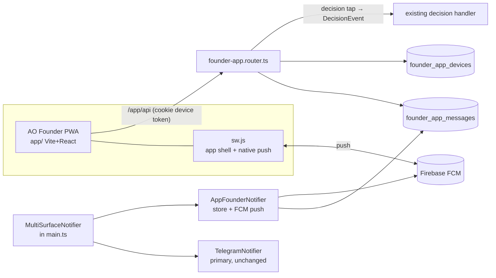
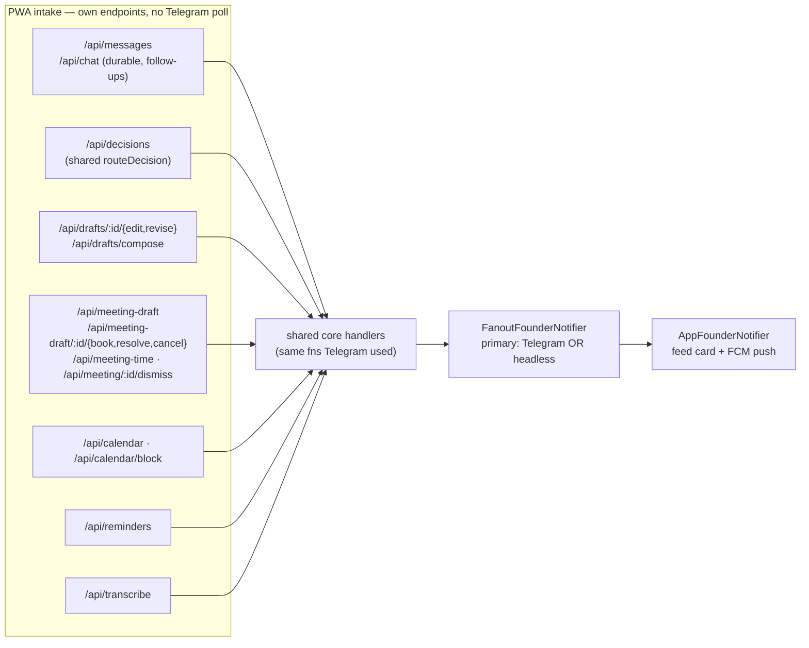

# M6 — Founder PWA ("AO Founder")

Chat-first installable PWA for the founder's Android phone, served by this service at
`/app`. Replaces the *interaction* limits of Telegram: one scrollable feed of everything
the assistant tells/asks the founder, tappable decision buttons, free-text chat, and
**Firebase Cloud Messaging push** for all founder notifications (not just `urgent`).

Telegram remains wired and authoritative; the app is a second first-class surface.

## Architecture invariants (inherited — do not violate)

- Ports & adapters: new code lives in `src/adapters/founder-app/`; core never imports it.
  Wiring only in `src/main.ts`. `lint:boundary` must stay green.
- No message content in logs — IDs/metadata only.
- Own DB, migrations under `src/db/migrations/` (next free numbers).
- Existing tests + typecheck must pass; new code ships with tests in the repo's style.

## Component map

## Schema (new migrations, next free numbers)

`founder_app_devices` — one row per logged-in phone/browser:
`id uuid pk`, `label text`, `token_hash text unique` (sha256 of opaque device token),
`fcm_token text null`, `push_enabled bool default false`, `failure_count int default 0`,
`created_at`, `last_seen_at`, `revoked_at timestamptz null`.

`founder_app_messages` — the single feed:
`id uuid pk`, `direction text ('in'|'out')`, `kind text ('chat'|'notification'|'question')`,
`title text null`, `body text not null`, `severity text null`, `customer_ref text null`,
`notification_ref text null`, `buttons jsonb null` (`[{id,label}]`),
`decided_option_id text null`, `created_at timestamptz default now()`.

## Backend — `src/adapters/founder-app/`

Mounted at `/app` in `main.ts`, gated by the same `ConsoleConfig` presence as `/console`.

- **Static**: serve the built `app/dist` (dev) / packaged copy (prod) with SPA fallback,
  mirroring how the console serves `web/dist`. `sw.js` and `manifest.webmanifest` must be
  reachable inside the `/app/` scope.
- **Auth**: `POST /app/api/login {password, label}` — verify against the console bcrypt
  hash with the console's rate-limit pattern; mint an opaque 32-byte token, store its
  sha256 in `founder_app_devices`, set httpOnly cookie `ao_app_device` (SameSite=Lax,
  Path=/app, maxAge 180d). Unlike console sessions this is **DB-backed and survives
  restarts** — it's a phone. `POST /app/api/logout` revokes. Middleware touches
  `last_seen_at`.
- **Feed**: `GET /app/api/messages?before=<iso|id>&limit=50` newest-first page.
- **Send**: `POST /app/api/messages {text}` → insert `in/chat` row; route the text through
  the **grounded query service** the console `/query` endpoint already uses (internal
  scope); insert the answer as `out/chat`; return both rows. (Full
  founder-message-router parity is a later phase — its reply paths are
  Telegram-thread-bound today.)
- **Decisions**: `POST /app/api/decisions {messageId, optionId}` → load the row's
  `notification_ref`, invoke the SAME decision handler Telegram's callback poller invokes
  with `DecisionEvent {notificationRef, optionId, by: 'founder-app'}`, set
  `decided_option_id`. **Investigate `telegram-notifier.ts` + the callback poller /
  `src/decisions` first** to confirm where `notificationRef` is minted so both surfaces
  share one ref; if it's minted inside the Telegram adapter, lift minting to the
  composite so the app stores the same ref.
- **Live**: `GET /app/api/events` — SSE of new feed rows (in-process emitter is fine).
- **Push**: `POST /app/api/push/register {fcmToken}` / `DELETE /app/api/push/register`
  per device. `GET /app/api/config` → `{firebase: <public web config>, vapidKey}` (authed).
- **`AppFounderNotifier`**: mirrors `notifyAdmin`, `notifyCustomerEvent` (with buttons),
  and `askFounder` into `founder_app_messages` + sends FCM push for **all** severities
  via `firebase-admin` `sendEachForMulticast` to enabled devices (collapse key = ref;
  disable a device token on `messaging/registration-token-not-registered`). Compose with
  Telegram by generalizing `FanoutFounderNotifier` (primary + N mirrors) rather than
  forking it. Web-push (VAPID) stays as-is.
- **Env** (all optional → feature disables itself with a `logger.warn`, no content):
  `FIREBASE_SERVICE_ACCOUNT_FILE` (path under `secrets/`), `FIREBASE_WEB_CONFIG_JSON`,
  `FIREBASE_VAPID_KEY`.
- **Build**: root `package.json` gets `"build:app": "npm --prefix app run build"`;
  Dockerfile packages `app/dist` exactly the way it packages the console build.

## Frontend — `app/` (sibling of `web/`)

Vite + React 19 + TS + Tailwind 4 (same dependency set/style as `web/`), `base: '/app/'`,
dev server port **3102** with proxy `/app/api → http://localhost:3100`.

- **Login screen** → password + device label.
- **Chat feed** (the whole app): one stream of `founder_app_messages` — assistant
  notifications/questions as left bubbles (title, body, severity accent), founder
  messages as right bubbles, `question` rows render their `buttons` as tappable chips
  (disabled + checkmarked once `decided_option_id` is set), day separators, sticky
  bottom composer, safe-area insets, auto-scroll, SSE live updates + refetch on focus,
  infinite scroll-back via `before` cursor.
- **Settings sheet**: push toggle (permission → `getToken({vapidKey, serviceWorkerRegistration})`
  → register), device label, logout, install-to-home-screen hint.
- **PWA**: `manifest.webmanifest` (name "AO Founder", `display: standalone`, dark theme,
  maskable icon) and **ONE** service worker, `sw.js` — app shell (precache, offline
  fallback) *and* background push. A scope allows a single registration, so a separate
  `firebase-messaging-sw.js` would only fight `sw.js` for `/app/`.

  **DEVIATION (shipped): no Firebase SDK in the worker.** The plan assumed the compat
  `importScripts` from gstatic. It works, and it cost three bugs that were invisible from
  outside the worker: the SDK suppresses notifications whenever any window of the whole
  ORIGIN is visible (an open `/console` tab silently swallowed every push); a worker
  snapshots its CSP at INSTALL time, so one installed under a policy that blocked
  `importScripts` stays permanently FCM-less while the UI still reports push as "on"; and
  the gstatic version must be hand-matched to the bundled SDK. FCM is only a relay — the
  worker receives a plain push event carrying the envelope `fcm-sender.ts` sent, and
  rendering it is ~15 lines. The SDK is needed solely to MINT the token, which happens in
  the page. So the worker imports nothing, `script-src` stays `'self'`, and the
  suppression rule is ours: scoped to visible `/app` clients, because an open console tab
  is not the app, and an app on screen is already kept live by SSE.

  Notification click focuses a running app and postMessages it the route (SPA nav, no
  reload). Push degrades gracefully when `GET /app/api/config` reports Firebase
  unconfigured.
- Tests with vitest + testing-library, mirroring `web/`.

## Firebase setup (founder does once)

Documented in `docs/founder-app-firebase-setup.md`: create Firebase project → add Web
app (get web config JSON) → Cloud Messaging: generate Web Push certificate (VAPID key
pair, public key = `FIREBASE_VAPID_KEY`) → Project settings → Service accounts →
generate private key JSON → save under `secrets/` → set the three env vars.

## v2 — Founder cockpit (supersedes the single-feed UX)

Founder feedback on v1: a single chat feed is just Telegram in a browser. The app's
actual advantage is STRUCTURE — the service already holds per-customer timelines,
pending decisions, urgency scores, and drill-down read models (`console-repo.ts`:
`listCustomers`, `customerDetail`, `customerTimeline`, `listInbox/Outbound/Decisions`,
urgency repo, customer-scoped query). v2 is a mobile cockpit over those read models.

### Navigation — bottom tab bar + client-side router (deep-linkable routes)

1. **Attention** (default, badge = pending count) — the action queue. Every undecided
   question/buttoned notification as a card: customer name, title, expandable body
   (draft preview), inline decision chips (same POST /app/api/decisions). Below it,
   top urgency-inbox items. Empty state = "all clear". This is the zero-inbox screen.
2. **Customers** — searchable list; each row: name, last-activity snippet + time,
   badges (pending decisions count). Tap → **Customer screen** `/customer/:id`:
   header + segmented control:
   - **Timeline** — `customerTimeline` rendered as a proper thread: inbound customer
     messages (left), outbound replies with status (right), decision/notification
     events as inline markers; tapping any row opens a detail sheet
     (inbox/outbound/decision detail passthrough) — this is the "click a message and
     see the whole thread" ask.
   - **Pending** — that customer's undecided cards.
   - **Ask** — chat composer scoped to THIS customer's memory (query scope=customer).
3. **Activity** — the v1 global feed, kept as the audit stream (unchanged mechanics).
4. **Assistant** — the internal-scope chat (v1 composer/query, unchanged).

Push deep links: FCM `data.route` becomes `/app/customer/<id>` for customer-scoped
notifications and `/app/attention` otherwise; the SW notificationclick navigates there.

### Backend additions (all device-auth'd, camelCase, `{data,nextCursor}` paging)

REUSE the console-repo read models — adapter-to-adapter import is fine, forking their
SQL is not (DRY):

- `GET /app/api/attention` → `{decisions:[…undecided founder_app_messages joined with
  customer display names…], urgency:[…top urgency items…]}`
- `GET /app/api/customers?search&cursor` → `listCustomers` rows augmented with
  `pendingCount` (undecided app messages per customer_ref) + last activity
- `GET /app/api/customers/:id` → `customerDetail`
- `GET /app/api/customers/:id/timeline?cursor` → `customerTimeline`
- `GET /app/api/items/:kind/:id` (kind ∈ inbox|outbound|decision) → detail sheets
- `POST /app/api/messages` gains optional `{customerId}` → customer-scoped query
- `AppFounderNotifier` sets the FCM `data.route` per the deep-link scheme above

### Out of scope (later phases)

Full founder-message-router parity (slash commands, revise/edit captures, scheduling)
from the app; iOS; media attachments; composing outbound customer messages from the
app (the approval money-loop must not be bypassable from a new surface).

## v3 — "make the cockpit actionable" (founder feedback on v2)

Five complaints, each of which turned out to have a real defect behind it rather than a
missing coat of paint.

### 1. Nothing could be dismissed

A card left Attention only by being *decided*, and the only button on a task card is
"❌ Cancel task" — so **approving what the assistant did meant doing nothing, and the card
stayed forever**. Dismiss is now an app-surface gesture (`POST /app/api/dismiss`,
`dismissed_at` in migration 043): "I've seen this", nothing more. It does not touch the
task, the decision handler, or Telegram.

It is **ref-keyed** (`planDismiss`), mirroring `markDecidedByRef` — several rows
legitimately mirror ONE entity, because `tryR49Reconfirm` re-notifies with the same ref, so
the duplicate cards clear on one tap. A `kind:'question'` is **refused** (409), both directly
and via the ref fan-out: `askFounder` asks a real fork that must be *answered*, and a new
surface must not make it silently droppable. Notifications are what the founder was actually
complaining about, and they are all `kind:'notification'`.

### 2/3. Cards had no context and no link

- **"Task (confirmed)" named no task.** The R49 re-notify holds only a `task_ref` — no intent,
  no message. `findIntentByTaskRef` recovers the intent from the triage decision that created
  the task, so the card now names it (`confirmedTaskCard`), degrading to the old generic
  wording when no intent was ever recorded (the meeting path's task fallback).
- **"Open Task" was already computed and thrown away.** `Notification.url` has always carried
  the portal deep link and Telegram has always rendered it; `AppFounderNotifier` dropped it
  because the table had no column. Now `link_url` (043) ← `n.url`, and the shared `CardActions`
  renders the button — **only** when a url is present, never constructed client-side (the base
  URL is server config). `context` (043) ← `contextRef`, which is what lets a tap open the
  thread behind a card: `/customer/:id?focus=<kind>:<ref>`, where that focus value is
  deliberately a `TimelineRow.id`.
- Two non-canonical copies of the deep-link formatter (`inbox-processor.factory.ts`,
  `meeting-scheduler.factory.ts`) were collapsed onto `portalTaskUrl` — they skipped its
  encoding and null-guard and could emit a malformed URL.
- `scripts/backfill-app-link-urls.ts` gives pre-043 task cards their link (a task card's
  `notification_ref` IS its task UUID). Scoped to the cancel option `'x'` ONLY — draft-approval
  cards also carry a ref, but it points at a decision, not a task.

### 4. The timeline was unreadable — and two real bugs

The read model was built to "bodies and decision output stay detail-only", which reduced every
row to an enum, so the UI *had* to render "Inbound message"/"triage · accepted". There was no
text in the payload to show. `customerTimeline` now also selects body snippets (truncated in
SQL), `sender_name`, `direction`, and the triage intent's
`suggested_title`/`summary`/`category`/`priority`. This is not a new exposure — those bodies
already reach this exact screen via the detail sheets — but they stay out of logs.

Noise is filtered by an **opt-in `omitNoiseDecisions`** that only the app passes: triage writes
an `{"intents":[]}` decision for every no-op message, and those can never be rendered
meaningfully. The console deliberately does not pass it — there, every decision row is
evidence. The filter is in SQL so keyset paging stays correct.

Two genuine bugs fixed alongside: older pages were **prepended to a newest-first list**
(the timeline now renders ascending, scrolled to the bottom, reusing `ChatFeed`'s proven
prepend-anchor orchestration), and the inbox arm never filtered on `direction`, so the
founder's own sent messages rendered as incoming.

### 5. "Make it common"

`CardActions` (Open Task / Dismiss / View thread) is rendered by **both** `AttentionCard` and
`MessageBubble`, so 1/2/3 land on Attention, Customer›Pending, Activity and Assistant at once;
`useOptimisticDecide` replaces the decide-with-rollback block that was copy-pasted verbatim
across two screens.

`ci.sh` now runs the app's typecheck/test/build — it covered the server and console but never
`app/`, which is how a broken-ordering timeline shipped green.

## v4 — PWA parity + calendar & meeting composer (the post-Telegram PWA)

v3 made the cockpit actionable; v4 makes it **stand on its own**. The money loop no
longer needs Telegram to boot, every founder-only flow that lived in the Telegram poll
loop has a PWA-native entry point, and the founder can compose + schedule meetings
entirely from the phone. See [`docs/telegram-decommission-plan.md`](../../telegram-decommission-plan.md)
for the full seam-by-seam audit; Phases 1–4 are delivered, Phase 5 (remove the adapter)
is pending a Telegram-free soak.

### Boot without Telegram (decommission Phase 1)

`FanoutFounderNotifier` now accepts a **headless / no-op primary** (`HeadlessPrimaryNotifier`) — when `TELEGRAM_*` is
absent the money loop (inbox processor + callback poller + decision sinks) still boots,
and the PWA's `/api/decisions` is wired unconditionally (it was already the second
surface; now it's the *first-class* one). The callback poller's Telegram `poll()` branch
is conditional on the notifier. `main.ts` no longer wraps the money loop in a Telegram
guard — feature flags and the headless shim do the gating. The console onboarding
service was also unhooked from Telegram at boot (`69eefda`), so customer onboarding
runs app-only too.

### Draft Edit / Revise / Compose (decommission Phase 2)

The PWA matches the console's `console-approvals.router.ts` exactly — same core fns,
no thread markers (the message UUID *is* the identity):

- `POST /api/drafts/:messageId/edit` (new body) → `replaceDraftBodyAndApprove`
- `POST /api/drafts/:messageId/revise` (instruction) → `reviser.reviseFromInstruction`
- `POST /api/drafts/compose` → `draftEmail` presenter → new draft card (the `/draft email`
  parity; before this the PWA could only approve/reject, never originate)

First-writer-wins + 409 on conflict are inherited from the shared core, so two surfaces
editing the same draft can't clobber each other.

### Cancel / commitment / backfill acks mirrored to the app

`askFounder` decisions and task cancel/commitment confirmations used to be
Telegram-only *ack* paths. They now fan out to the app too (`80fdd07`, `015c08c`):
each surfaces as a feed card scoped to its customer (`/customer/:id?focus=…`), and the
founder's tap re-uses the existing decision handler. Backfill approve/reject cards are
mirrored the same way (`92c3a45`) so a historical-thread proposal is decidable from the
phone.

### Reminders — created AND delivered on the PWA (decommission Phase 3)

Before this, reminders were both *created* and *delivered* through a Telegram thread.
Migration 045 + three endpoints + the ReminderSheet close both legs:

- `POST /api/reminders` — create (the Phase 3b NL entry point)
- `GET /api/reminders` — list the founder's pending reminders
- `DELETE /api/reminders/:id` — cancel

`schedule.worker.ts` now fires the `⏰ Reminder` through the fanout (a feed card + FCM
push) instead of `replyInThread`, and `scheduled_actions.source_thread_id` is nullable
for an app-origin reminder. `TELEGRAM_SCHEDULING_ENABLED` (Settings-managed) is the
restart flag that registers the due-action worker regardless of which surface fires it.

### Voice input — the last Telegram-only input

`POST /api/transcribe` (multipart/RAW audio body) → the **same** OpenAI transcription
adapter the Telegram voice path uses (`buildOpenAiTranscriptionClient`), on the accurate
tier. The composer records → uploads → the returned text lands in the input box for
editing before send (`a337252`). This was the last input leg that still required
Telegram; after it, every founder input surface is reachable from the phone.

### Iterative meeting composer (propose → refine → book)

Free-text meeting composition from the chat composer, replacing the old fixed
"duration card → slot card → booking" ladder with a back-and-forth draft the founder
can refine in words before booking (`e403999`).

- `POST /api/meeting-draft` → `appMeetingDraft.proposeOrRefine({chatSessionId, customerId, customerName, utterance})`
- `POST /api/meeting-draft/:id/book` → `book`
- `POST /api/meeting-draft/:id/cancel` → `cancel`

`src/scheduling/app-meeting-draft.ts` carries the state machine. A refine is
**additive**: an utterance that names a new attendee ("add Dana") *adds* to the prior
set rather than replacing it, and an "everyone" utterance expands to the customer's
full email-contact list. Each turn re-runs the LLM interpreter (role `schedule`) and
re-fetches the customer's contacts, so unresolved guesses sit next to real invitees
on the same card. The view's `needs` array is what the card renders as "what still
blocks booking" — `time`, `attendee`, or empty ⇒ ready.

### Calendar day view + meeting scheduling

`GET /api/calendar?day=YYYY-MM-DD` returns one navigable day across every one of the
founder's calendars: events, business hours (for the dim band), the server-configured
`dayWindow`, weekday-filtered `softBlocks`, and — when a meeting request is pending on
that day — the proposed slots as `meeting.proposedSlots`. The FE (`CalendarScreen`)
renders gaps as tappable bands; a tap books via `/api/meeting-time`. `POST /api/calendar/block`
manually blocks a slot.

`POST /api/meeting/:messageId/dismiss` is the meeting-card abandon gesture. `planDismiss`
**refuses** question cards (an `askFounder` fork must be answered), and a meeting card
*is* a question — so this dedicated route handles it: it resolves the card → its meeting
ref, guardedly abandons the OPEN request (a booked meeting owns a real event + invite
and is left untouched → `'not_pending'`), then clears the card **and** any sibling open
card on the same ref via `dismissMeetingCards` / `markDecidedById` and re-emits each
over the feed so every open client drops them. The synthetic `'mdismiss'` option is not
a real button; it's the sentinel that satisfies the resolution guard.

### Soft holds + tap-to-book-where-the-finger-fell + attendee-pick

The latest round (`af18e37`) refines the calendar + composer UX:

- **Soft holds (walk / gym)** — `env.CALENDAR_SOFT_BLOCKS` (JSON array of
  `{start,end,label,days?}`, weekday-scoped) and the distinct day-window bounds
  `CALENDAR_DAY_WINDOW_START` / `_END` (the *visible* grid extent — 06:00–20:00 by
  default — separate from business hours, which drive only the dim band). The slot
  proposal (`generateSlots` / `isSlotFree` in `src/triage/meeting-slots.ts`) **avoids**
  them: an offered slot never overlaps one. **SOFT, not hard**: a founder *typed* time
  or manual booking goes through `slotConflicts`, which ignores soft blocks — the
  founder can still book into gym on purpose. `SoftBlock` + `toSoftBlocks` in
  `src/outbound/send-window.ts` is the single HH:MM→minutes mapping both the slot engine
  and the day view read. On the FE they render as hatched amber bands, `pointer-events-none`,
  *under* events so the gap underneath still takes the tap.
- **Tap-to-book on a gap maps the finger's Y back to a minute** — `tapMinuteInGap` in
  `app/src/lib/calendarLayout.ts`. A gap is one tall button, so on *today* (where a gap
  starts at `now`) the book lands where the finger fell, not at the gap's start.
- **Attendee-pick resolution** — `POST /api/meeting-draft/:id/resolve {name, email}` →
  `appMeetingDraft.resolveAttendee`. When the founder's word for someone ("Shlomo")
  doesn't match the stored contact ("Salomon Kortovich"), the card offers the customer's
  email contacts as candidates; a tap posts one back. The picked `email` MUST be one of
  THIS customer's contacts — the core rejects anything else (a raced/forged pick can't
  add a stranger); the guess named `name` is replaced by the real contact and the
  refreshed view keeps offering candidates until every attendee resolves.
