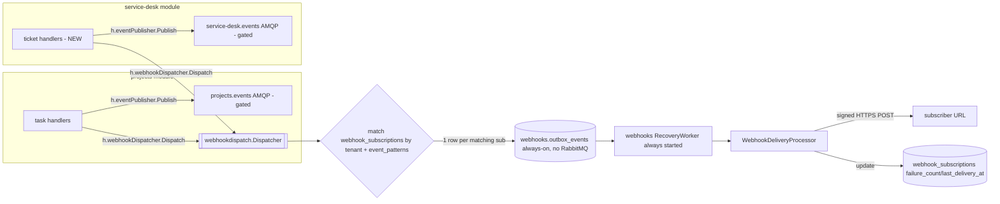

# M0 Build Blueprint — Change 00: EZY Portal Sync Surface (`updatedAfter` + Webhooks)

> Build contract for M0 (EXECUTION-PLAN §3). Verified against the live codebase — all file:line refs opened and confirmed. **DA pre-build: CONDITIONAL CERTIFY — gate-blocking decisions MB1–MB3 + four rulings folded below (§0). Target: local dev portal. Still requires standards-guardian review.**

## 0. Decisions folded after DA review (gate-blocking — build to these)

**MB1 — cursor boundary = INCLUSIVE `>=`, consumer dedups (R25).** `updated_at` is **not unique**; an exclusive `> max(updated_at)` cursor would skip forever any row sharing the exact saved-cursor timestamp observed after the save → silent drop (violates R11). **Decision:** the portal filter is `updated_at >= ?` (inclusive) on both tasks and tickets; the **contract** is that consumers dedup by entity id (the orchestrator already has `agent_inbox` UNIQUE + the M4 transition ledger — re-fetching boundary rows is harmless; skipping is not). **Unit-test the same-timestamp case** (two rows at identical `updated_at`, cursor = that value → both returned). Document `>=` identically in the task + ticket handlers.

**MB2 — glob matcher is gate-blocking; unit-test-first (gate check, not a standing risk).** Semantics, pinned: a pattern ending `.` + `*` (e.g. `projects.task.*`) → `strings.HasPrefix(eventType, strings.TrimSuffix(pattern,"*"))` (the trailing dot prevents `projects.task` / `projects.tasks.*` false matches); a bare `*` → match-all-for-tenant (explicitly allowed, documented); **any other pattern → exact equality** (so `projects.task.created` never matches `…created_extra`). Ship a unit-test table covering: `projects.task.*` ✓`projects.task.created` ✗`projects.task` ✗`projects.tasks.created`; exact `projects.task.created` matches only itself; `*` matches all. Wire only after the table is green.

**MB3 — `integrations.webhooks` permission MUST actually register.** `RegisterFromFiles` is log-and-skip on failure, so a bad UI-less `registration.yaml` could silently leave the permission unregistered → the M0.c admin CRUD becomes unreachable, or (if core default-allows unknown keys) an auth hole. **Build-time:** confirm the permission registers (log/inspect). **M0.c gate:** the scoped key CAN hit the CRUD **and** an unknown/unscoped key CANNOT (proves default-deny). This is what makes M0.c testable at all.

**Ruling 1 — crypto: COPY into `webhooks/crypto`, do NOT promote to SDK, do NOT import prospects' package (R26).** Module→module import is forbidden; SDK-promotion widens blast radius to every portal service (against R3). Copy the ~150 LOC with a pointer-comment to `prospects/crypto/encryption.go`, **reuse prospects' existing AES key env var** (no second key scheme / new secret), standards-guardian ratifies the copy, log a consolidation debt for a later dedicated change.

**Ruling 2 — Idempotency-Key: reuse the SDK middleware BP writes use; do NOT hand-roll (a second impl is a bounce).** Gate-verify the create endpoint applies it.

**Ruling 3 — `<5s` is typical, not worst-case.** Accept the 5s webhooks-worker poll interval; M0.d gate wording: *"<5s typical via `Trigger()`; worst-case = poll interval on a crash between `Add` and `Trigger`; correctness guaranteed by `updatedAfter` reconciliation regardless."*

**Advisories folded:** (a) do **not** claim M0 "fixed the outbox recovery gap" — the service-desk *audit* worker still starts without a processor (R15 defect persists on the AMQP path, correctly out of scope); M0 guarantees only the **webhook** path. (b) Webhook delivery is **at-least-once** by design (matches 00's no-ordering non-goal); make the envelope `eventId` stable, document the dedup contract. (c) Build-time: verify `webhooks/migrations/001` `outbox_events` DDL matches the SDK GORM model (`gorm_store.go:25-47`) **field-for-field** — `NewGormStore` assumes it; drift = runtime break. (d) Document the two-retry-concepts (SDK `MaxRetries=5`→dead-letter vs `failure_count=20`→auto-disable) so the 10-event downtime drill isn't misread.

## Key architecture decision

The SDK's `outbox.EventType` is a bare `string` — "services can define additional types as needed" (`sdk/go-portal-sdk/outbox/types.go:21-28`) — and `RecoveryWorker.processors` is a `map[EventType]Processor` (`recovery.go:17,53-60`): one worker can hold multiple processors. **Webhook delivery is a new `EventType("webhook_delivery")` with its own `Processor`, never an AMQP consumer.**

To satisfy R16 (must work with `RABBITMQ_ENABLED` on **and** off), the webhook pipeline is **structurally separate** from the RabbitMQ-gated outbox/publisher stack — not a processor bolted onto the existing gated `recoveryWorker`. Concretely: a **new module** `internal/modules/webhooks` owns `webhook_subscriptions` + its own `outbox_events` table (same Postgres, own `search_path=webhooks` — both projects & service-desk share one `DATABASE_URL` and differ only by search_path, `projects/config/database.go:74-79`, `service-desk/config/database.go:76-88`), with its own `RecoveryWorker` **started unconditionally** (no `RABBITMQ_ENABLED` check in its init path). Reuse the SDK's generic `outbox.NewGormStore` (`gorm_store.go:78-85`) and generic `outbox.NewHandler` admin routes (proven at `service-desk/routes/routes.go:100-102`) — don't re-hand-roll an `OutboxStore` like projects did (`projects/store/outbox_store.go`).

Cross-module wiring follows the codebase's existing pattern: shared publishers injected as interface-typed `Config` fields (`AuditPublisher`, `NotifPublisher`, `EventPublisher` are already threaded this way in `module_api_bootstrap.go`) — never a direct `internal/modules/X` → `internal/modules/Y` import. A neutral package `internal/webhookdispatch` declares:

```go
type Dispatcher interface {
    Dispatch(ctx context.Context, tenantID uuid.UUID, eventType string, envelope map[string]any)
}
```

`main` (composition root, already imports every module) builds the real `*webhooks/dispatch.Service` once and injects the same instance into `projectsserver.Config.WebhookDispatcher` and `servicedeskserver.Config.WebhookDispatcher`.



## 1. Files to create/modify, per sub-milestone

### M0.a — `updatedAfter` filters + ticket thread-touch

| File | Change |
|---|---|
| `projects/handlers/task_handlers.go` | `ListTasks` (19-104): add `updatedAfter` RFC3339 parse + `query.Where("updated_at >= ?", t)` (**inclusive per MB1**) next to the existing `sourceEntityID` block (74-82); index already exists (`idx_task_tenant_updated`, `projects/migrations/001_init_schema.up.sql:160-161`) — no migration. Add to `ListMyTasks` (128-163) for parity. |
| `service-desk/store/ticket_store.go` | `TicketListOptions` (36-57): add `UpdatedAfter *time.Time`. `applyTicketFilters` (614-657): `if opts.UpdatedAfter != nil { query = query.Where("updated_at >= ?", *opts.UpdatedAfter) }` (**inclusive per MB1**). Index exists (`idx_sd_tickets_updated_at`, `service-desk/migrations/001_init_schema.up.sql:171-173`). Add `"updatedAt":"updated_at"` to the sort allow-list (659-680) if missing. |
| `service-desk/handlers/ticket_handler_routes.go` | `listTickets` (56-100): pass `UpdatedAfter` into `store.TicketListOptions{}` (79-94). Covers both `ListTickets` and `ListMyTickets` (shared `listTickets`, 40-54). |
| `service-desk/migrations/019_ticket_thread_touch.up.sql` (new) | `CREATE FUNCTION service_desk.touch_ticket_on_thread_entry()` (`UPDATE service_desk.tickets SET updated_at=now() WHERE id=NEW.ticket_id`) + `AFTER INSERT ON service_desk.ticket_thread_entries` trigger. Trigger (not handler-level) because there are **two** insert call sites (`AppendThreadEntryTx` + non-tx `AppendThreadEntry`, `ticket_thread_routes.go:53-106,108-144`) — single-source fix, matching the `prospects.update_updated_at()` precedent (`prospects/migrations/012_...up.sql:56-58`). |
| `service-desk/migrations/019_ticket_thread_touch.down.sql` (new) | `DROP TRIGGER ...; DROP FUNCTION ...;` |

### M0.b — Service-desk domain events

| File | Change |
|---|---|
| `service-desk/handlers/event_publish.go` (new) | Mirror `projects/handlers/event_publish.go:1-209`: `publishTicketCreated/Updated/StatusChanged/ThreadEntryAdded`. Each builds one envelope via `canonicalEvents.NewEnvelope(EntityTarget("service-desk","ticket","ticket","tickets"), action, tenantID, ticket)` (mirrors projects 146-165), then **two** independent calls: (a) `h.eventPublisher.Publish(ctx, tenantID, "service-desk.events", routingKey, payload)` — nil-safe, gated like projects (`if h.eventPublisher == nil { return }`); (b) `h.webhookDispatcher.Dispatch(ctx, tenantID, "service-desk.ticket."+action, payload)` — nil-safe, always-on. |
| `service-desk/handlers/ticket_handler.go` | `TicketHandler` struct (40-52): add `eventPublisher *outbox.ResilientPublisher` + `webhookDispatcher webhookdispatch.Dispatcher`. `NewTicketHandler` (54-77): add both params. |
| `service-desk/handlers/*.go` (call sites) | Add publish calls in `CreateTicket`/`UpdateTicket`/`UpdateTicketStatus` + `ticket_thread_routes.go`'s `CreateTicketThreadEntry`/`CreateMyTicketThreadEntry`, same shape as projects' `h.publishTaskCreated(...)` (`task_handlers.go:323-324`). |
| `service-desk/routes/routes.go` | `SetupRoutes` (38-52) + `setupProtectedRoutes` (155-167): add `eventPublisher` + `webhookDispatcher` params, thread into `NewTicketHandler` (169). |
| `service-desk/server/server.go` | `Config` (36-56): add `EventPublisher *outbox.ResilientPublisher`, `WebhookDispatcher webhookdispatch.Dispatcher`. `New()` (60-71): pass through. |
| `backend/module_http_helpers.go` | `initServiceDeskAuditStack` (262-286): also **return** the `resilientPub` it already builds at line 274 (today thrown away after `audit.NewPublisher`) so it can feed `EventPublisher`. |
| `backend/module_api_bootstrap.go` | Ticket init (280-368): capture returned `resilientPub`, pass it + the (unconditionally-built) webhook dispatcher into `servicedeskserver.Config{EventPublisher, WebhookDispatcher}` (353-368). |
| `service-desk/config/registration/registration_events.yaml` | Add `publishes` entries for `ticket.status_changed` + `ticket.thread_entry_added` (existing cover `created`/`updated`, 31-45). |

### M0.c — `webhook_subscriptions` + admin CRUD (new module `internal/modules/webhooks`, Key `"webhooks"`, skeleton mirrors `inspect`)

| File | Purpose |
|---|---|
| `webhooks/module.go` | `const Key = "webhooks"`, `DefaultRegistrationDir` (mirror `inspect/module.go:14`). |
| `webhooks/config/database.go` | `InitDatabase/GetDB/RunMigrations` — copy `service-desk/config/database.go`, `search_path=webhooks`. |
| `webhooks/migrations/001_init_schema.{up,down}.sql` | See §2. |
| `webhooks/models/subscription.go` | `WebhookSubscription` GORM model (id, tenant_id, url, secret_encrypted, secret_last4, event_patterns `pq.StringArray`, active, failure_count, last_delivery_at, disabled_at, timestamps). |
| `webhooks/store/subscription_store.go` | CRUD + `ListActiveByTenant`, `IncrementFailure/ResetFailure/Disable`. |
| `webhooks/crypto/` | **COPY** `prospects/crypto/encryption.go` AES-256-GCM `Encryptor` verbatim (Ruling 1) with a pointer-comment to the original + **reuse prospects' existing AES key env var** (no new secret). NOT an SDK promotion, NOT a module→module import. standards-guardian ratifies; consolidation debt logged (R26). |
| `webhooks/handlers/subscription_handlers.go` | `Create` (32-byte secret, encrypt, return once), `List` (masked), `Update` (re-enable clears failure_count+disabled_at), `Delete`, `TestPing` (one synthetic delivery, bypasses pattern-match). |
| `webhooks/routes/routes.go` | **`router.Group("/api")`** (folding does `/api/webhooks/*`→`/api/*` in Go), `auth.CombinedAuthMiddleware` (mirror `service-desk/routes/routes.go:55-62`), `auth.UnifiedPermission("integrations.webhooks", Admin\|Read)`. Also mount `outbox.NewHandler(outboxStore, nil).RegisterRoutes(.../outbox)` for free dead-letter admin (mirror service-desk 98-102). |
| `webhooks/server/server.go` | `Config`/`New()` — mirror `service-desk/server/server.go:1-117`. |
| `webhooks/config/registration/registration.yaml` | Minimal, no dashboards/remoteEntry (no UI). **Verify** whether `menuIcon` is hard-required for a UI-less module (check `inspect`); do **not** add an iconMap.ts entry (no menu item). |
| `webhooks/config/registration/registration_authorizations.json` | `[{"name":"integrations.webhooks","displayName":"Manage Webhooks","maxLevel":4,"audience":"InternalOnly"}]` (mirror service-desk's). |
| `backend/main.go` | Add `{Key: webhooksmodule.Key, Dir: ...}` to `modules` (57-74). |
| `backend/module_api_bootstrap.go` | New `initWebhooksModule(...) (*webhooksserver.Server, webhookdispatch.Dispatcher)` — called **before** service-desk/projects blocks; returns the dispatcher injected into both. Add to `handlers` map (384-397). |

### M0.d — Webhook emitter (dispatcher + processor)

| File | Purpose |
|---|---|
| `internal/webhookdispatch/dispatcher.go` (new, top-level `internal/`) | The neutral `Dispatcher` interface only — what projects/service-desk import (module-boundary convention: interface-level, not concrete package). |
| `webhooks/dispatch/service.go` | Concrete impl: `Dispatch` → `store.ListActiveByTenant(tenantID)` → glob-match `event_patterns` → for each match `outboxStore.Add(NewEventWithIdempotencyKey(tenantID, "webhook_delivery", payload, "webhook:"+subID+":"+eventID))` → `recoveryWorker.Trigger()` (`recovery.go:124-129`) for near-real-time delivery vs the 30s default poll (`config.go DefaultConfig().PollingInterval`). |
| `webhooks/dispatch/processor.go` | `WebhookDeliveryProcessor implements outbox.Processor` (`EventType()→"webhook_delivery"`): unmarshal → fetch subscription fresh (skip if inactive/deleted) → decrypt secret → `X-Signature: sha256=<hex hmac>` over raw envelope bytes (same algo as `communications/provider/whatsapp/signature.go:29-35`) → POST 5s timeout → success: reset failure_count + set last_delivery_at; failure: increment, if `>= WEBHOOK_MAX_CONSECUTIVE_FAILURES` (default 20) set active=false+disabled_at+audit, **return error** so the SDK retry/backoff (`types.go:80-102 MarkFailed`) schedules next attempt / dead-letters after `DefaultMaxRetries`. |
| `backend/module_api_bootstrap.go` (`initWebhooksModule`) | `outboxStore := outbox.NewGormStore(webhooksconfig.GetDB())`; `rw := outbox.NewRecoveryWorker(outboxStore, cfg, logger)`; `rw.RegisterProcessor(processor)`; `rw.Start(ctx)` — **all unconditional, zero `RABBITMQ_ENABLED` check**. |

## 2. Migrations (golang-migrate up/down)

| # | Migration | Needed? |
|---|---|---|
| — | tasks `updatedAfter` | **None** — `updated_at` + `idx_task_tenant_updated` already exist (`projects/migrations/001:160-161`). |
| — | tickets `updatedAfter` | **None** — `idx_sd_tickets_updated_at` already exists (`service-desk/migrations/001:171-173`). |
| `service-desk/migrations/019_ticket_thread_touch.{up,down}.sql` | Trigger+function touching `tickets.updated_at` on thread insert. **Hard prereq** for M0.a reply-resurfacing + M1.7 ticket-reply ingestion. |
| `webhooks/migrations/001_init_schema.{up,down}.sql` | New schema `webhooks`; `webhook_subscriptions` (tenant_id FK→`public."Tenants"("Id")` per prospects convention, url, secret_encrypted, secret_last4, event_patterns TEXT[], active, failure_count, last_delivery_at, last_failure_at, disabled_at, audit cols) + `outbox_events` (exact schema from `gorm_store.go:25-47` so `NewGormStore` works with no override). Indexes: `(tenant_id) WHERE active` + the 3 outbox indexes. |

Test every `migrate down` per R12/R3 — trivial for new module + 019, no data-loss risk.

## 3. Exact wiring points

- **Processor registration**: `rw.RegisterProcessor(webhookProcessor)` inside `initWebhooksModule` — the **new, always-on** worker, not the existing projects/service-desk recovery workers (they stay as-is for their `rabbitmq` EventType; non-goal "no AMQP changes").
- **Service-desk EventPublisher exposure**: `initServiceDeskAuditStack` (`module_http_helpers.go:262-286`) returns the `resilientPub` it builds at 274 (today discarded) → `servicedeskserver.Config.EventPublisher` → routes → `NewTicketHandler`.
- **webhookDispatcher fan-out**: built once in `initWebhooksModule`, injected into `projectsserver.Config.WebhookDispatcher` (mirrors `EventPublisher` at 214,258-267) + `servicedeskserver.Config.WebhookDispatcher`. Each publish-helper calls **both** sinks (AMQP gated + webhook always-on), same envelope.
- **Route folding**: webhooks mounts at `router.Group("/api")` — not `/api/webhooks` — per CLAUDE.md + `service-desk/routes/routes.go:64-67`. `mountFoldedModuleRoutes` (`module_http_helpers.go:83-106`) needs no special case; default strips `/api/webhooks` in Go before dispatch. Folded single-binary path; no nginx change for local dev.

## 4. `RABBITMQ_ENABLED` decoupling

The entire webhook path — `webhooks.outbox_events`, its `GormStore`, `RecoveryWorker`, `WebhookDeliveryProcessor`, `Trigger()` — lives in `initWebhooksModule`, which contains **zero** `RABBITMQ_ENABLED` branches (contrast `module_api_bootstrap.go:171,200,281,297`). The `webhookDispatcher.Dispatch(...)` calls in projects/service-desk are unconditional + nil-safe **independent** of whether `h.eventPublisher` (AMQP) is nil — separate fields, separate lifecycles. Verify: run the local stack once `RABBITMQ_ENABLED=false` and once `=true`; webhook delivery identical both times, AMQP publish no-ops when false.

## 5. Build sequence (checkpoints → M0.a–d gates + `00/tasks.md §5`)

1. **M0.a**: land 019 + `updatedAfter` filters → `migrate up/down` round-trip → gate: filters return exactly changed rows; ticket reply → resurfaces (proves trigger).
2. **M0.c** (parallel to a/b): scaffold module, migration 001, admin CRUD, register in `main.go`/`module_api_bootstrap.go` → gate: create subscription, secret returned once, `SELECT secret_encrypted` is ciphertext; **MB3:** confirm `integrations.webhooks` actually registered, the scoped key CAN hit the CRUD **and** an unknown/unscoped key CANNOT (default-deny); **Ruling 2:** create endpoint applies the SDK Idempotency-Key middleware.
3. **M0.d**: build `dispatch.Service` + processor, wire unconditional `RecoveryWorker` → local echo receiver → subscribe → change a task status → signed webhook <5s (proves `Trigger()` beats the 30s poll); tamper→sig fails; kill receiver for 10 events → rows retry/dead-letter, `updatedAfter` still returns all 10 (independent of delivery).
4. **M0.b**: add service-desk `event_publish.go` + call sites + threading (needs M0.c/d dispatcher to compile) → gate (white-box-labeled): subscribe → change a ticket → 4 `service-desk.ticket.*` webhooks arrive.
5. **Close**: all of `00/tasks.md §5.1–5.4` + tested `migrate down` for 019 + new module 001 + `standards-guardian` review + DA migration-safety pass. `/restart` after every backend edit before re-testing.

## 6. Risks / sharp edges not already in the register

- **Two "retry" concepts**: SDK per-event `MaxRetries` (default 5, dead-letters one delivery) ≠ subscription `failure_count`-hits-20 auto-disable. Document, or the downtime drill (10 events < 20) could be misread as "subscription disabled" when it isn't.
- **`Trigger()` is best-effort**: crash between `outboxStore.Add` and `Trigger()` → delivery still happens next poll tick (≤30s). So <5s is *typical*, not *worst-case*. Consider a 5s `PollingInterval` for the webhooks worker specifically (independent Config instance).
- **Crypto duplication**: `prospects/crypto/encryption.go` is `package crypto` scoped inside prospects. Copying ~150 LOC into `webhooks/crypto` vs promoting to shared SDK — flag to standards-guardian (SDK touch = bigger blast radius, builder shouldn't decide unilaterally).
- **Idempotency-Key on create**: confirm the exact SDK middleware name/pattern (BP writes use it) before hand-rolling — a second impl is a DRY violation per CLAUDE.md.
- **Glob matching boundary**: `projects.task.*` must match `projects.task.status_changed` but NOT `projects.task` or `projects.tasks.foo` — use `strings.HasPrefix(eventType, strings.TrimSuffix(pattern,"*"))` guarded on pattern ending `.` + `*`; unit-test table before wiring.
- **registration.yaml schema for UI-less module**: verify whether `menuIcon`/`remoteEntry`/`dashboards` are hard-required by `registration.RegisterFromFiles` (`module_http_helpers.go:168`); failed registration is logged-and-skipped (170-176), not fatal, but would silently leave `integrations.webhooks` unregistered → check how core treats an unknown permission key (default-deny vs allow), don't assume.
- **Cursor boundary semantics**: distinguish `updatedAfter=""` (unset) from an unparsable timestamp (→ 400, not silent ignore). Document `>` vs `>=` identically on task + ticket sides so orchestrator polling doesn't miss/double-count rows at the exact cursor timestamp.
