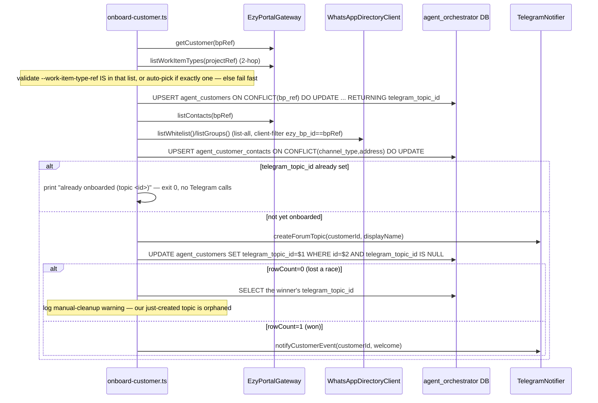
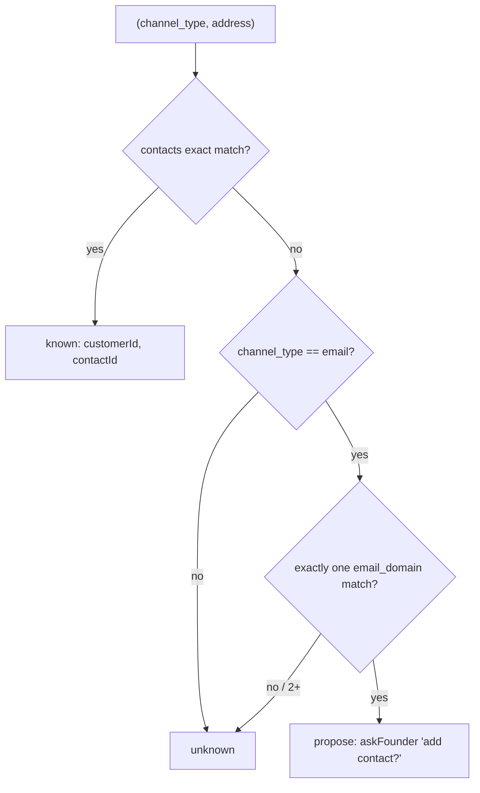

# M1.2 Blueprint — EZY read path + contact resolution + idempotent onboarding + Telegram forum-topic

> Build contract for M1.2 (EXECUTION-PLAN §4.1). Builds on the certified M1.1 scaffold. **DA pre-build review: ✅ CERTIFIED — apply the amendments below.** Build gated on Yuval's external prereqs.

## DA-certified amendments (apply during build)
1. **Rename `createForumTopic` → `ensureCustomerTopic(customerId, name): Promise<{ref}>`** everywhere (port method, `TelegramNotifier` impl, onboarding flow, build sequence) — a neutral, provider-agnostic name so change 06's web-push `FounderNotifierPort` impl isn't forced into a Telegram-only concept. (Flag 1)
2. **Idempotency-Key-reuse unit test is a REQUIRED gate item** (not optional): mock transport, force timeout→retry, assert the SAME `Idempotency-Key` header across attempts. M1.2 makes zero POSTs, so mint-per-attempt would ship unexercised and silently double-create at M1.5. (Flag 2)
3. **Two-hop WIT membership enforcement is REQUIRED**, and the gate must confirm the **seeded** work-item-type actually belongs to the **seeded project's project type** (test-data prereq, R12) — else create 422s at M1.5. (Flag 3)
4. Accepted with optional hardening: (Flag 4) add a warn-on-reparent log when a contact address moves to a new `customer_id`; (Flag 6) optionally serialize same-customer onboards with a **pg advisory lock keyed on `bp_ref`** (eliminates the double-topic race *without* holding a lock across the Telegram call). (Flag 5) `askFounder`/`onDecision` must stay **genuinely inert** until M1.5b — no fake handler, send path must not pretend to await a reply. Flags 7 (CLI) + 8 (email/whatsapp-only) accepted as-is.

## ⚠ Ground-truth correction vs project.md / design.md D5
Verified in `backend/internal/modules/projects/handlers/project_type_handlers.go:401-418` + `task_handlers.go:209-233`: `GET /api/projects/work-item-types` filters by **`projectTypeId`**, NOT `projectId` — work item types belong to a project's **project type**, not the project directly. Task creation 422s via `wit.ProjectTypeID != proj.ProjectTypeID` ("Work item type does not belong to the project's project type"). So `listWorkItemTypes(projectRef)` must be a **two-hop** resolution: `GET /api/projects/projects/:id` → read `projectTypeId` → `GET /api/projects/work-item-types?projectTypeId=<that>`. **(Verified live: the project-detail route is `/api/projects/projects/:id` — the `projects` handler group inside the `/api/projects` module fold, NOT `/api/projects/:id`.)** **This also corrects M1.5a's task-creation path** — propagate there.

## Patterns to mirror (not reinvent)
- Composition root `src/main.ts:9-46`; pure factory `src/app.ts`; `src/adapters/README.md` already names `EzyPortalGateway` (M1.2) + `TelegramNotifier` slots.
- HTTP client + retry-on-write precedent: `whatsapp_manager/src/ezy-portal/ezy-portal.service.ts:79-92` (`X-Api-Key` + fresh `Idempotency-Key` per POST against this same portal). **Mirror its shape, NOT its address** — do NOT call whatsapp_manager's `ezy-portal` proxy (guardrail).
- Credential resolution target shape: `whatsapp_manager/src/credentials/credentials.service.ts:107-118` (`resolveXKey()` = sealed-store-first, env-fallback-second) — the M1.4 swap target.
- Whitelist/group reads: `whitelist.service.ts` (`ezy_bp_id`, `phone_number`, `preferred_language`), `group.service.ts` (`ezy_bp_id` nullable, `group_id`, `subject`) — confirms **no `?bpId=` filter**; list-all + client-filter is correct.

## 1. Files to create / modify

| Path | Purpose |
|---|---|
| `src/config/env.ts` (mod) | typed non-secret `EZY_PORTAL_BASE_URL` (default `http://localhost:5040`), `WHATSAPP_MANAGER_BASE_URL` (`http://localhost:3000`), `TELEGRAM_SUPERGROUP_CHAT_ID`, `TELEGRAM_ADMIN_TOPIC_ID` (optional, manual prereq) |
| `src/config/credentials.ts` (new) | `resolveCredential(ref): string` — env-only today; **the** M1.4 swap seam |
| `src/ports/founder-notifier.port.ts` (mod) | add `createForumTopic(customerId, name): Promise<{topicId}>` to `FounderNotifierPort` (D7 needs it) |
| `src/adapters/shared/retry.ts` (new) | generic `withRetry(fn, opts)` backoff — shared by EZY + Telegram clients (reused by M1.4) |
| `src/adapters/ezy-portal/http-client.ts` (new) | `EzyPortalHttpClient` — `X-Api-Key`, retry 5xx/429, `Idempotency-Key` on POST |
| `src/adapters/ezy-portal/ezy-portal.gateway.ts` (new) | `EzyPortalGateway implements CustomerDirectoryPort` + real `listWorkItemTypes` (two-hop); full `TaskTargetPort` at M1.5a |
| `src/adapters/ezy-portal/factory.ts` (new) | `buildEzyPortalGateway()` from env + `resolveCredential('EZY_PORTAL_API_KEY')` |
| `src/adapters/ezy-portal/index.ts` (new) | barrel |
| `src/adapters/whatsapp-manager/http.ts` (new) | shared fetch helper (base URL + `X-Api-Key`) — reused by M1.3 |
| `src/adapters/whatsapp-manager/directory-client.ts` (new) | `listWhitelist()`/`listGroups()` — `GET /whitelist`,`/groups`, **no DB access** |
| `src/adapters/whatsapp-manager/factory.ts` (new) | `buildWhatsAppDirectoryClient()` |
| `src/adapters/telegram/telegram-client.ts` (new) | Bot API caller — checks `{ok:false}` not just HTTP status, 429 `retry_after` via `retry.ts` |
| `src/adapters/telegram/templates.ts` (new) | welcome + new-contact-proposal only (no other callers yet) |
| `src/adapters/telegram/telegram-notifier.ts` (new) | `TelegramNotifier implements FounderNotifierPort` — `createForumTopic`, `notifyCustomerEvent`, `notifyAdmin`, `askFounder` (send only), `onDecision` (inert until M1.5b) |
| `src/adapters/telegram/factory.ts` (new) | `buildTelegramNotifier()` |
| `src/customers/email-domain.ts` (new) | `deriveEmailDomain(website?, emailFallback?)` — pure |
| `src/customers/contact-resolution.ts` (new) | `resolveContact(...)` + `proposeAddContact(port, ...)` — core; takes `FounderNotifierPort` as param, never imports adapters |
| `src/customers/onboarding.ts` (new) | `upsertCustomer()`, `importContact()` — pure DB upserts, no adapter/HTTP imports |
| `src/customers/index.ts` (mod) | replace `export {}` placeholder |
| `scripts/onboard-customer.ts` (new) | CLI composition root (mirrors `scripts/create-db.ts`) — wires the 3 factories, calls `src/customers/*` |
| `package.json` (mod) | `"onboard": "tsx scripts/onboard-customer.ts --"` |
| `.env.example` (mod) | new vars + 3 secret ref names |

No `eslint.config.mjs` change — the existing zone already blocks `./src/customers → ./src/adapters`.

## 2. EzyPortalGateway HTTP client
- **Auth:** `X-Api-Key: <resolveCredential('EZY_PORTAL_API_KEY')>` (same ref name as migration 001's `credentials_ref`).
- **Retry:** `withRetry`, 3 attempts, 300ms base ×2 + ±20% jitter, cap 5s. Retryable: 429, 5xx, network/timeout. **Not** retryable: 4xx incl. **422** (a wrong `workItemTypeId` must surface immediately, not be masked). On 429 honor `Retry-After`: `max(backoff, retryAfterMs)`.
- **Idempotency-Key:** minted **once per logical `post()`, before the retry loop**, reused across retries (minting fresh per attempt defeats the header → double-create on timeout-after-success). M1.2 makes **zero** portal POSTs (all onboarding reads are GET), so this is **not exercised by M1.2's acceptance test** → recommend a standalone unit test (mock transport, force timeout-then-retry, assert identical header).
- **listWorkItemTypes(projectRef):** two-hop (correction above) — `GET /api/projects/projects/:id` → `projectTypeId` → `GET /api/projects/work-item-types?projectTypeId=<id>`. Not cached in M1.2.
- Logging: `{method,path,status,attempt,durationMs}` only — never payloads.
- Class declares `implements CustomerDirectoryPort` in M1.2 (`listWorkItemTypes` a real extra method); M1.5a extends to `+ TaskTargetPort` — completion, no rework.

## 3. Onboarding flow + idempotency



**Idempotency, spelled out:**
- Upsert key `agent_customers.bp_ref` (UNIQUE, mig 002) — re-run refreshes display_name/website/email_domain/project_ref/work_item_type_ref, returns same id.
- Contact key `agent_customer_contacts (channel_type,address)` (UNIQUE, mig 003) — re-import is harmless `DO UPDATE`.
- Topic guard: `telegram_topic_id IS NULL` — checked before Telegram, re-checked via conditional `UPDATE ... WHERE telegram_topic_id IS NULL`. **Deliberately NOT** a `SELECT FOR UPDATE` held across the Telegram HTTP call (holding a row lock across an external call is bad practice); for a single-operator CLI the residual race → "detect + log manual-cleanup note" (explicit trade-off).
- **No new migration** — existing UNIQUE constraints + nullable `telegram_topic_id` provide every R10 primitive; and `009` is reserved for M1.4.
- Re-run acceptance: 2nd run → "already onboarded", 0 new customer/contact rows, 0 new topics, 0 messages.
- Contacts from two sources: BP directory (`email`,`whatsapp` fields only — bare `phone`/`telegram` skipped, no `ChannelType` yet) + WA whitelist/groups (`ezy_bp_id` client-filter, never the WA DB). faith/timezone/preferred_language/default_email_instance_id left at defaults.

## 4. Contact-resolution rules (`src/customers/contact-resolution.ts`)
Assumes `address` arrives **already normalized** by the calling channel (digits-only WA, lowercased email) — core does exact-match only.


- `known` → resolved, no notification.
- `propose` → `askFounder(..., [{id:'yes'},{id:'no'}])` — **send side only**; nothing handles the tap until M1.5b wires `callback_query`/`onDecision`. Explicit expected gap.
- `unknown` → classification only; the "skip + counter" side effect has no home until a real `agent_inbox` row exists (M1.3/M1.5b). No counter table — a later digest can `GROUP BY sender_address` over skipped rows.
- Verified by direct calls on seeded data (seeded WA → known; unseeded `@<seeded domain>` → propose; unrelated domain → unknown), not live E2E (M1.3 has no ingestion yet).

## 5. Env credential seam (`src/config/credentials.ts`)
```ts
export function resolveCredential(ref: string): string {
  const v = process.env[ref];
  if (!v?.trim()) throw new Error(`Missing credential "${ref}" (env; M1.4 moves this to the sealed store)`);
  return v;
}
```
- Refs: `EZY_PORTAL_API_KEY`, `WHATSAPP_MANAGER_API_KEY` (reuse migration-001 `credentials_ref` names), `TELEGRAM_BOT_TOKEN` (new). Never in the zod schema, never in `channel_instances.config`.
- Non-secret config (base URLs, chat/topic ids) stays typed in `env.ts`.
- **M1.4 swap:** body becomes sealed-store-first, env-fallback-second — zero call-site changes.
- Resolved lazily (first network call), not at boot.

## 6. Migrations — NONE.

## 7. Build sequence → acceptance

Prereqs (gate the BUILD/test, not the blueprint): Telegram bot+supergroup+Manage-Topics+chat id+pinned Admin topic; EZY scoped `ten_` key; seeded test customer (BP + project + **matching** work-item-type + WA whitelist/group link + known email domain); whatsapp_manager reachable (existing read key).

- [ ] `env.ts` + `credentials.ts` → typecheck; `resolveCredential` throws clearly when unset.
- [ ] `retry.ts` → fake-timer unit test (2 fails → success = 3 attempts, increasing delay).
- [ ] `EzyPortalHttpClient` → `getCustomer(seededBpRef)` 200 on local portal; bad port → retry logs then clean throw.
- [ ] `EzyPortalGateway.listWorkItemTypes(seededProjectRef)` → returns seeded type (proves two-hop).
- [ ] `WhatsAppDirectoryClient` → whitelist/groups include seeded link.
- [ ] `TelegramNotifier.createForumTopic` → throwaway topic; `notifyAdmin` → Admin topic.
- [ ] `src/customers/*` → typecheck; `lint:boundary` still fails-closed only on the fixture.
- [ ] **Acceptance:** `npm run onboard -- --bp-ref=<seeded> --project-ref=<seeded>` → `agent_customers` row (derived email_domain) + `agent_customer_contacts` rows (BP+WA) + new Telegram topic + welcome.
- [ ] Re-run identical → "already onboarded", identical counts, no new topic.
- [ ] Contact-resolution spot checks (known/propose/unknown).
- [ ] Idempotency-Key reuse unit test (flag 2).

## Flags for devil's-advocate pre-review
1. `createForumTopic` on the generic `FounderNotifierPort` — Telegram concept in a backend-agnostic port. Deliberate (task says "implement against the port"); confirm.
2. Idempotency-Key reuse built but **not exercised** by M1.2 (zero POSTs) → dedicated unit test now vs trusting M1.5a.
3. Two-hop `listWorkItemTypes` easy to get wrong (filtering by `projectId` → portal returns wrong rows) — confirm CLI enforces membership before writing `work_item_type_ref`.
4. Contact upsert reparents an address to a new `customer_id` silently — fine solo, unsafe if multi-operator.
5. `askFounder` renders buttons but `onDecision` has no receiver until M1.5b — accepted visible gap, not to be "completed" with a fake handler.
6. Topic-creation race → optimistic conditional UPDATE (no lock across Telegram call) accepts a rare orphaned-duplicate-topic residual — confirm acceptable for Phase 1.
7. Onboarding is a CLI, not an HTTP endpoint — deliberate (avoids premature admin auth); confirm reading of task 4.3's "(CLI or admin endpoint)".
8. BP-contact import maps `email`/`whatsapp` only — confirm the seeded customer's verifiable contact method survives the filter.
