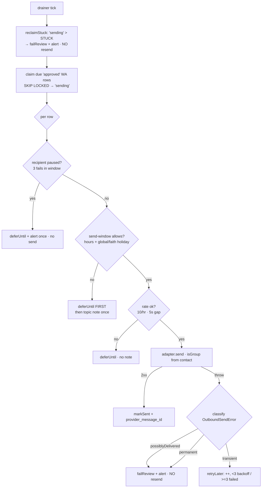

# M1.8 — Outbound delivery + real send (blueprint)

> Change 01 §8 ("Outbound delivery"), spec `specs/outbound-delivery/spec.md` (shipped; change 01 archived).
> The half that closes the two-way loop: an `agent_outbound_queue` **drainer** that
> dispatches `approved` rows through the channel adapter's already-built `send()`,
> gated by **per-recipient rate limits + a failure circuit-breaker** and a
> **business-hours/holiday window**, with the **R1** write credential and **R37**
> group-routing wired for real. Reply *generation* (the `'draft'` LLM role) is
> **change 02** — explicitly out of scope.
>
> **Status: DA-CERTIFIED (v2)** — v1 was BLOCKED on the timeout/5xx-after-delivery
> duplicate (F1); v2 folds all 11 findings. Change log at §11.

## 1. Scope — what ships

- **Outbound drainer worker**, generic machinery but **claiming WhatsApp instances
  only in M1.8** (`channel_type='whatsapp'`): claims due `approved`/non-draft rows,
  dispatches via `registry.get(instanceId).adapter.send()`, records
  `provider_message_id`, retries/fails per the **delivery-outcome classification**
  (F1). Email + service-desk outbound stay deferred to change 02 (F8).
- **Per-recipient rate limit** — 10/hr + 5s min-gap (DB-based, restart-safe) —
  **plus a failure circuit-breaker**: after 3 recent failures to one recipient,
  pause that recipient + alert once (spec `:13`, F3).
- **Business-hours/holiday gate** — customer-tz window (`agent_business_hours`) +
  **global-or-faith** holidays (`agent_holidays`); outside → defer + one topic note.
- **Holiday seeding at boot** — `date-holidays` public → `faith='global'`;
  `@hebcal/core` yom-tov → `faith='jewish'`; idempotent.
- **R1 write credential** — two-key `WhatsAppHttp` so `send()` presents a
  write-scoped key; pairs with the Yuval-owned whatsapp_manager fork (§9).
- **R37 close-out** — `isGroup` from `agent_customer_contacts.is_group`, with the
  recipient **normalized at enqueue** so the group join actually hits (F2).
- **Enqueue seam** — `POST /admin/outbound` (x-admin-key): the real operator seam
  change-02's approve-flow reuses; makes the gate a one-liner curl.
- **Kill-switch** — `OUTBOUND_ENABLED` (default **false**); write-key **fail-loud
  at boot** when enabled (F7).
- **One index-only migration (012)** — a partial index for the per-send
  rate/failure scans (F4). No schema/column change.

**Out of scope (explicit):** AI reply drafting (change 02); email + service-desk
outbound send (change 02 — F8); per-customer rate-limit *overrides* (no schema
support → R59, documented deferral of the spec's "configurable per customer");
email `References[]` chaining.

## 2. Ground truth (from code recon — cite before building)

| Fact | Location |
|---|---|
| **Spec SHALL:** per-recipient cap 10/hr + 5s gap; **3 failures → recipient pauses + alert** | `specs/outbound-delivery/spec.md` |
| **Spec SHALL:** business-hours + **global + customer-faith** holidays; outside → `send_after`=next-open + topic note | `…/spec.md:19-24` |
| **Spec SHALL:** retry w/ backoff ≤3 → `failed` + admin alert with provider error (503 scenario) | `…/spec.md:26-31` |
| WA `send()` already routes `isGroup ? {groupId} : {number}` | `whatsapp-manager.adapter.ts:134-141` |
| WA `/outbound/send`: `{number\|groupId,message}`; pre-send rejects = **400**(`:53`)/**403**(`:63,71` not-whitelisted/monitored)/**429**(rate `:22-31`)/**503**(`:78-80` not ready); real send `:83` then **unguarded** `buildRoutable` `:88` → a throw = **500 AFTER delivery** | whatsapp_manager `outbound.routes.ts` |
| WA read-only 403 wall (POST under `x-api-key` when JWT set) | whatsapp_manager `auth.middleware.ts:80-84` |
| WA HTTP: single `x-api-key`; **`AbortSignal.timeout(15_000)`** → a post-send timeout throws `AbortError`, indistinguishable from never-delivered | `whatsapp-manager/http.ts:34,58,63`; both error branches throw opaque `Error` `:66-70` |
| **Self-send loop is CLOSED** by ingestion: `direction==='outbound' → status='skipped'`; triage claims `direction='inbound'` only | `inbox/ingestion.ts:50`; `inbox/inbox-repo.ts:37` |
| Address normalizers are **core** (importable by a core enqueue fn) | `customers/onboarding.ts:154` (email), `:159` (whatsapp) |
| Contacts store `address` digits-only (join key must match) | `003_agent_customer_contacts.sql:6`; `onboarding.ts:159` |
| `agent_outbound_queue` schema; index `idx_agent_outbound_pending (status,send_after) WHERE status IN ('pending','approved','failed')` — **excludes `'sent'`**; `updated_at` trigger load-bearing | `migrations/006_agent_outbound_queue.sql:27-28,23-24` |
| `agent_business_hours.day_of_week` **0=Sunday..6=Sat** (luxon `weekday` is 1=Mon..7=Sun) | `008_business_hours_and_holidays.sql:4,19-22` |
| `agent_holidays` `UNIQUE(holiday_date, faith)` (**NULL faith would not dedupe → use `'global'` sentinel**); empty; no code reads it | `008_…sql:10-16` |
| `agent_customers.timezone` (default `America/Panama`) + `.faith` | `002_agent_customers.sql:12-13` |
| Claim pattern (WITH claimed AS UPDATE … FOR UPDATE SKIP LOCKED … JOIN; never SET updated_at) | `inbox/inbox-repo.ts:30-68` |
| Worker + backoff; `registry.get()`; notifier `notifyCustomerEvent`/`notifyAdmin`; `tryResolveCredential` (non-throwing) | `worker-runner.ts`; `channel-registry.ts:103`; `founder-notifier.port.ts:29-34`; `credentials.ts:17` |
| Drainer insertion marker | `main.ts:118` |

## 3. Key decisions (DA: challenge these) — v2

**D-A — Milestone = DELIVERY, not drafting.** Build the drainer + rate/failure +
business-hours gate + real WhatsApp send. Content generation is change 02. Enqueue
is a manual/admin seam.

**D-B — Generic drainer, WhatsApp-only claim in M1.8 (F8).** The claim filters
`channel_type='whatsapp'`. The machinery is channel-generic (change 02 widens the
filter), but email (`canSend=true`) is **not** armed by `OUTBOUND_ENABLED` in M1.8
— avoiding a stray live Gmail send on gate day. Service-desk (`canSend=false`) is
moot (never claimed). The `canSend` guard stays as defense-in-depth.

**D-C — Claim/terminal state via `outbound-repo.ts` (core, db-only), mirroring
`inbox-repo` MINUS the increment-at-claim.** Claim: `status='approved' AND
is_draft=false AND (send_after IS NULL OR send_after<=now())`, `ORDER BY id`, `FOR
UPDATE SKIP LOCKED LIMIT N`, set `status='sending'`. **`retry_count` is NOT touched
on claim** (a deferral must not burn an attempt); **never SET `updated_at`** (the
trigger owns it). Claim `SELECT` joins `channel_instances` (channel_type),
`LEFT JOIN agent_customers` (tz/faith), `LEFT JOIN agent_customer_contacts` on
`(channel_type, recipient_address)` (is_group). Terminal fns: `markSent(id,pmid)`,
`retryLater(id,err)` (`retry_count++`; `<3` → `approved` + `send_after=now()+backoff`;
`>=3` → `failed` + alert), `deferUntil(id,sendAfter)` (→ `approved` + `send_after`,
no retry change), `failReview(id,err)` (→ `failed` + alert, "possibly delivered").
Termination proven (DA F12): the only `retry_count++` is `retryLater`; a stuck
`sending` row is reclaimed by age (`reclaimStuck`), so no `approved↔sending` loop.

**D-C1 — Delivery-outcome classification (F1, the ex-blocker).** A `send()` throw
is classified by whether delivery could have happened, because whatsapp_manager has
**no idempotency key** — a blind resend is a duplicate customer message:
- **Definitely-not-delivered, transient → `retryLater`:** `429`, `503`, and
  connection-level errors (ECONNREFUSED/ENOTFOUND/ECONNRESET — whatsapp_manager
  down/restarting; matches the spec's 503 retry scenario).
- **Definitely-not-delivered, permanent → `failReview` immediately (no 3× churn):**
  `400` (bad body), `403` (not whitelisted/monitored, or the read-only wall).
- **Possibly-delivered, AMBIGUOUS → `failReview`, NEVER retry:** client **timeout**
  (`AbortError` after the request was written — `http.ts:63`), any **`5xx`** (the
  unguarded `buildRoutable` throws *after* `client.sendMessage` at
  `outbound.routes.ts:83→88`), and any unclassified throw (safest default).

Mechanism: `WhatsAppHttp.postJson` throws a typed `WhatsAppHttpError { status?:
number; timedOut: boolean; connError: boolean }` instead of an opaque `Error`; the
WA adapter's `send()` maps it to a core `OutboundSendError { retriable: boolean;
possiblyDelivered: boolean; reason: string }` (new, `src/outbound/send-error.ts` —
core, importable by adapters). The drainer reads the flags: `possiblyDelivered` →
`failReview`; else `retriable` → `retryLater`; else `failReview` (permanent, no
resend risk, still surfaced). A non-`OutboundSendError` throw → treated as
`possiblyDelivered` (conservative). **This makes "never a silent duplicate" true.**

**D-D — `send-window.ts` (core, pure, luxon).** `computeSendWindow(nowUtc, tz,
businessHours[], holidays[], faith) → {allowed, nextOpenUtc, reason}`:
- Weekday map: `agent_business_hours.day_of_week` is 0=Sunday; luxon `weekday` is
  1=Mon..7=Sun → index by **`weekday % 7`** (Sun 7%7=0 ✓) (F5).
- A **missing** `day_of_week` row → **non-working** (fail-safe) (F5).
- Business hours **always** apply. A holiday defers iff **`holiday.faith='global'
  OR holiday.faith=customer.faith`** (spec's "global + customer-faith"); `faith`
  null/`'none'` → only global holidays defer.
- `nextOpenUtc` = forward-scan working days to the next open window; **cap the scan
  at 14 days** → if none found, `notifyAdmin` + defer 24h rather than infinite-loop
  (F5). Customer-less rows use `OUTBOUND_DEFAULT_TZ` + faith `'none'`.

**D-E — Deferral: `deferUntil` FIRST, then notify once (F11).** `!allowed` →
`deferUntil(nextOpenUtc)` **then** notify (`customerId ? notifyCustomerEvent :
notifyAdmin`). A crash between them parks the row (re-sent at the window) instead
of a stuck `sending`. The `send_after` gate + serialized ticks
(`worker-runner.ts:44`) + `SKIP LOCKED` guarantee note-once — **no
`deferred_notified` column needed** (DA F11 confirmed).

**D-F — Rate limit (per-recipient, DB-based).** Before send:
`countSentSince(instanceId, recipient, 1h) >= OUTBOUND_RATE_PER_HOUR` →
`deferUntil(oldestInWindow + 1h)`; `lastSentAt` within `OUTBOUND_MIN_GAP_MS` →
`deferUntil(last + gap)`. Rate deferrals **do not** notify (internal pacing).
whatsapp_manager's global limit is defense-in-depth (R60). Per-customer *override*
= deferred (R59 — no schema column; documented, not silent).

**D-L — Failure circuit-breaker per recipient (spec `:13`, F3).** Before send:
`failuresSince(instanceId, recipient, OUTBOUND_FAILURE_WINDOW_MIN) >=
OUTBOUND_MAX_RECIPIENT_FAILURES (3)` → **do not send**; `deferUntil(now +
window)` (pause) + `notifyAdmin` **once** ("sends to <recipient> paused after 3
failures"). The window auto-clears the pause; an operator can requeue sooner. This
is the per-recipient pause the spec mandates — distinct from D-C's per-row retry.

**D-G — R1 write credential (two-key `WhatsAppHttp`).** Optional
`resolveWriteApiKey`; `postJson` uses it, falling back to `resolveApiKey`.
`buildWhatsAppAdapter` passes `() => tryResolveCredential('WHATSAPP_MANAGER_WRITE_KEY')
?? resolveCredential(readRef)`. Pre-fork → read key → clean 403. Keys resolve
lazily per call (`http.ts:58`) so a key set later via `/admin/credentials` is
picked up without restart. No secret in `env.ts`.

**D-M — Write-key fail-loud at boot (F7).** In `main.ts`, when
`OUTBOUND_ENABLED && !tryResolveCredential('WHATSAPP_MANAGER_WRITE_KEY')`, emit a
loud WARN at boot (still register the drainer — a live-set key resolves lazily).
Better than discovering missed sends via per-row 403s at gate time.

**D-H — R37 close-out via normalized enqueue (F2).** `enqueueOutbound` normalizes
`recipient_address` per `channel_type` (`normalizeWhatsappAddress` /
`normalizeEmailAddress`, both core), so the drainer's `(channel_type,
recipient_address)` join against digits-only contact rows actually hits → real
groups resolve `is_group=true` → adapter sends `{groupId}`. D-I also accepts an
explicit `isGroup` override in the body. **"R37 closes at M1.8" is contingent on
the group gate step (§8.3) passing** — until then it's "code-complete, gate-pending".

**D-I — Enqueue seam `POST /admin/outbound` (x-admin-key).** Body `{channel|
instanceId, recipient, body, threadKey?, subject?, inReplyTo?, customerId?,
isGroup?}` → validate → `enqueueOutbound` (core: normalize + `INSERT …
status='approved', is_draft=false, approved_by='admin'`). Validation (F10): empty
`body`/`recipient` → **400**; `channel:'whatsapp'` with no ready WA instance
(`registry.whatsappPrimary()===null`) → **503**; unknown `instanceId`
(`registry.get()` miss) → **400** (not an FK-violation 500). `buildAdminRouter`
gains a `registry` dep; router stays thin (validate → core enqueue).

**D-J — `OUTBOUND_ENABLED` kill-switch (default false).** Drainer registered in
`main.ts` only when true; off → rows sit in `approved` (visible on `/health`).

**D-K — Holiday seeding at boot (F9).** `seedHolidays()` (idempotent, `ON CONFLICT
(holiday_date, faith) DO NOTHING`) for current + next year:
- `date-holidays` `getHolidays(year)` filtered to **`type==='public'`** for
  `HOLIDAY_COUNTRY` (default `'PA'`) → `faith='global'` (business closed for all).
- `@hebcal/core` → **melacha-forbidden yom-tov only** (major CHAG days, not minor
  fasts / Rosh Chodesh / modern observances) → `faith='jewish'`.
- Both libs are **offline** (no boot network). muslim/buddhist unseeded (R58).
- `'global'` sentinel (never NULL) so `ON CONFLICT (holiday_date, faith)` dedupes;
  a date that is both global and jewish inserts two distinct-faith rows (correct).

**New deps:** `luxon` + `@types/luxon`, `date-holidays`, `@hebcal/core`.
**New env (non-secret):** `OUTBOUND_ENABLED` (false), `OUTBOUND_DRAIN_INTERVAL_MS`
(5000), `OUTBOUND_RATE_PER_HOUR` (10), `OUTBOUND_MIN_GAP_MS` (5000),
`OUTBOUND_MAX_RECIPIENT_FAILURES` (3), `OUTBOUND_FAILURE_WINDOW_MIN` (60),
`OUTBOUND_DEFAULT_TZ` (`America/Panama`), `OUTBOUND_STUCK_MINUTES` (10),
`HOLIDAY_COUNTRY` (`PA`).
**New credential ref (resolved, not in `env.ts`):** `WHATSAPP_MANAGER_WRITE_KEY`.

### Drainer flow

## 4. Files

**Create**
- `src/outbound/outbound-repo.ts` — core, db-only: `claimDue`, `reclaimStuck`,
  `markSent`, `retryLater`, `deferUntil`, `failReview`, `countSentSince`,
  `lastSentAt`, `failuresSince`, `enqueueOutbound` (normalizes).
- `src/outbound/send-window.ts` — core, pure: `computeSendWindow` (luxon).
- `src/outbound/send-error.ts` — core: `OutboundSendError` (runtime class; no db/adapter import).
- `src/adapters/outbound/outbound-drainer.factory.ts` — the `WorkerDefinition`.
- `src/adapters/outbound/holiday-seeder.ts` — `seedHolidays()`.
- `src/db/migrations/012_outbound_sent_index.sql` — partial index
  `(channel_instance_id, recipient_address, updated_at) WHERE status IN ('sent','failed')`
  (serves `countSentSince`/`lastSentAt`/`failuresSince`) (F4).
- Tests: `send-window.test.ts` (weekday %7, Sunday, DST, weekend rollover,
  global-vs-faith holiday, 14-day cap), `outbound-repo.test.ts` (db — claim
  excludes drafts/not-due, defer, retry vs reclaim), `outbound-drainer.test.ts`
  (classification matrix: 429/503/conn→retry, 400/403→failReview, timeout/5xx→
  failReview-no-resend; isGroup from contact; failure-pause; off-hours defer),
  `self-send-regression.test.ts` (a drained WA send re-pulled by reconcile lands
  `skipped`, never `pending` — F6), `holiday-seeder.test.ts` (idempotent, distinct
  faith rows), `admin-outbound.test.ts` (enqueue + validation + auth).

**Modify**
- `whatsapp-manager/http.ts` — throw typed `WhatsAppHttpError {status?,timedOut,connError}`;
  optional `resolveWriteApiKey`; `postJson` uses it.
- `whatsapp-manager/whatsapp-manager.adapter.ts` — `send()` maps `WhatsAppHttpError`
  → `OutboundSendError` (D-C1).
- `whatsapp-manager/factory.ts` — pass the write resolver (D-G).
- `admin/admin.router.ts` — `POST /admin/outbound`; take `registry`.
- `main.ts` — `seedHolidays()` at boot; write-key boot-warn (D-M); build+register
  drainer when `OUTBOUND_ENABLED`; pass `registry` to `buildAdminRouter`.
- `config/env.ts` — the nine new outbound vars.
- `.env.example` + `package.json` — new vars + deps.

## 5. Invariants held

- **D1 boundary:** `outbound-repo` / `send-window` / `send-error` are core (db/pure,
  no `src/adapters` import); drainer + seeder are adapter-layer. `lint:boundary` green.
- **HTTP-only to whatsapp_manager** (#5); **no secret in `env.ts`** (write key via
  `resolveCredential`); **no message body logged**; **single-gateway** (#4/#5);
  **fail-closed** (`OUTBOUND_ENABLED` default false; write key → 403 not silent-open).
- **No silent duplicate** (D-C1) and **no self-send loop** (`ingestion.ts:50`,
  regression-tested).

## 6. New risks (RISK-REGISTER)

- **R57** — Outbound at-least-once: an **ambiguous** send outcome (client timeout
  after the 201, or a whatsapp_manager 5xx raised *after* `client.sendMessage`) →
  **`failReview`, never auto-resent** → a rare *missed* send surfaced for manual
  requeue (chosen over a silent duplicate). 🟡
- **R58** — Holiday coverage: `global` (national/public, single `HOLIDAY_COUNTRY`)
  + `jewish` only; muslim/buddhist unseeded; per-customer country not modeled. 🟡
- **R59** — Per-customer rate-limit **override** not implemented (spec says
  "configurable per customer" but no schema column) — global env defaults only;
  documented deferral to a later phase. 🟢
- **R60** — Double rate-limit (orchestrator per-recipient + whatsapp_manager global)
  may over-defer under bursts — acceptable/defensive. 🟢
- **R1 → closes at M1.8** (scoped write key E2E). **R37 → code-complete; closes on
  the group gate step (§8.3).**

## 7. Test plan

`typecheck` 0 · `eslint` 0 · `lint:boundary` 0 (core→adapter fixture rejected) ·
full suite green + the new specs above. Non-negotiable cases: the **classification
matrix** (F1 — timeout & 5xx → failReview-no-resend; 429/503/conn → retry;
400/403 → failReview); **self-send regression** (F6); **failure-pause** (F3);
send-window **Sunday/weekday %7** + **global-vs-faith holiday** + **14-day cap**
(F5); enqueue **normalization** makes the group join hit (F2); enqueue validation
returns 400/503 not 500 (F10).

## 8. Yuval's acceptance test (the gate)

1. **Real send (R1 + R37 number path):** business hours,
   `curl -H "x-admin-key: …" POST /admin/outbound {channel:'whatsapp',
   recipient:'<your whitelisted number>', body:'M1.8 test'}` → **arrives on
   WhatsApp**; row `status='sent'`, `provider_message_id` set.
2. **Off-hours / holiday defer:** same outside 09:00–18:00 (or seed a today-holiday
   + pass a `customerId`) → row `approved`, `send_after=next-open`, **one note in
   the customer topic** (admin topic if no customer); nothing sends until the window.
3. **Group path (R37 close):** enqueue to a monitored group (contact
   `is_group=true`) → routes `{groupId}` → arrives in the group. *This step closes R37.*
   **Preconditions (DA NITs F4/F5):** use a MODERN group id (`…@g.us`, digits-only
   after normalization) — a legacy hyphenated `<num>-<num>` id is lossy through
   `normalizeWhatsappAddress` and will misroute; and the group must have a
   pre-existing `agent_customer_contacts` row with `is_group=true` (else the drainer
   defaults `isGroup=false` → routes as `{number}` → whatsapp_manager 403 → failReview,
   no wrong send but no delivery).
4. *(optional)* **Kill-switch:** `OUTBOUND_ENABLED=false` → drainer absent → row
   stays `approved`, nothing sends.

## 9. Prerequisites (Yuval)

1. **whatsapp_manager fork #1 (one-file, on the `:3000` clone — NOT production):**
   in `auth.middleware.ts`, before the read-only 403 (`:81`), allow a scoped key
   (`env.OUTBOUND_API_KEY`, timing-safe) to `POST /outbound/send` **only**; existing
   read key stays read-only, personal JWT stays full. Set `ENABLE_OUTBOUND=true`.
2. Hand the scoped key to the orchestrator as credential
   **`WHATSAPP_MANAGER_WRITE_KEY`** (`POST /admin/credentials`, or `.env` fallback).
3. Set **`OUTBOUND_ENABLED=true`** on the orchestrator for the gate.
4. Confirm the gate recipient (and, for §8.3, the group) are whitelisted/monitored.

## 10. Verify & code-review outcome (frozen build `5bec6d3` → fix `50e3653`)

**Gates (independently reproduced on `5bec6d3`):** `tsc` 0 · `eslint` 0 ·
`lint:boundary` 0 (core→adapter fixture rejected) · **155/155 tests, 0 skipped**
(DB-backed tests genuinely ran).

**Two parallel adversarial passes:**
- **Code-review:** no high-confidence issues. Independently confirmed the claim SQL
  (`SKIP LOCKED` nesting, no `retry_count` bump, no manual `updated_at`), `retryLater`
  no-double-increment, `weekday % 7`, deferUntil-before-notify, the strict
  `OUTBOUND_ENABLED` parse, and fail-closed wiring.
- **DA adversarial verify:** **BLOCKED** on one finding (F1 recurrence):
  **`ECONNRESET` was classified retriable, but whatsapp_manager delivers BEFORE it
  responds** (`outbound.routes.ts:83→88`), so a mid-send reset (restart) can fire
  *after* delivery → auto-resend → duplicate customer message. Everything else
  cleared as safe (timeout/5xx/permanent classification, claim/reclaim termination,
  send-window, secrets/boundary/no-body-logging).

**Batch-fix applied (fix commit):**
- **F1 (BLOCKER):** `ECONNRESET` removed from `CONN_ERROR_CODES` → falls through to
  the possibly-delivered path → `failReview`, never resent. Test flipped +
  `possiblyDelivered` flag asserted across the matrix.
- **F2 (SHOULD-FIX):** breaker alert deduped to once-per-recipient-per-tick; a new
  `possibly-delivered:` sentinel on `last_error` excludes ambiguous failures from
  `failuresSince` so a delivered-but-timed-out send never over-pauses a recipient.
- **F3 (SHOULD-FIX):** admin enqueue validates `customerId` (UUID) + catches
  FK/parse errors → 400, never 500.
- **F6/reviewer-#1:** admin enqueue rejects a non-WhatsApp instance → 400 (no silent
  dead-letter).
- **F4/F5/F7 (NITs):** documented as §8.3 gate preconditions (modern group id +
  pre-existing `is_group=true` contact; the defer note needs an onboarded customer).

Post-fix gates: `tsc`/`eslint`/`lint:boundary` 0 · **161/161 tests, 0 skipped**
(+6: ENOTFOUND retry, ECONNRESET→failReview, breaker alert-once, possibly-delivered
breaker exclusion, non-WhatsApp enqueue 400, malformed+FK customerId 400).

## 11. v1→v2 change log (folded DA findings)

- **F1 (BLOCKER)** → D-C1 delivery-outcome classification + `OutboundSendError` +
  typed `WhatsAppHttpError`; timeout & 5xx-after-send → `failReview`, never resend.
- **F2** → D-H/D-I enqueue normalization; R37 close gated on §8.3.
- **F3** → D-L per-recipient failure circuit-breaker (spec `:13`).
- **F4** → migration 012 partial index; "no migration" → "one index-only migration".
- **F5** → D-D weekday `%7`, missing-row→non-working, 14-day cap.
- **F6** → cite `ingestion.ts:50` + self-send regression test.
- **F7** → D-M write-key boot-warn.
- **F8** → D-B WhatsApp-only claim in M1.8 (email/SD → change 02).
- **F9** → D-K pinned predicates (date-holidays `public`; hebcal melacha yom-tov);
  `'global'` sentinel; global+faith gate predicate (D-D).
- **F10** → D-I enqueue validation (400/503, not 500).
- **F11** → D-E `deferUntil`-before-notify.
- **F12/F6 (self-send), note-once, libs** → confirmed safe; documented, not changed.
