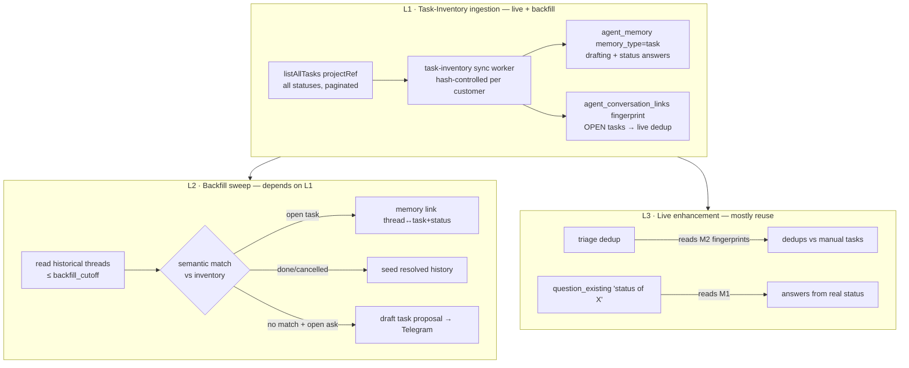

# Blueprint — Task-Inventory Reconciliation & Customer Backfill

**Status:** DESIGN — approved-to-spec 2026-07-13, NOT built. Net-new multi-layer → phased, each layer gate-passed before the next.
**Owner loop:** main session orchestrates; `devils-advocate` pre-reviews before build.
**Context memory:** [[backfill-task-inventory-design]], [[agent-orchestrator-execution-status]].

---

## 1. Problem & evidence

Going live means backfilling each customer's history so first drafts are warm and no
already-tracked work gets re-created. The naive sweep is unsafe: the live dedup
(`src/triage/dedup.ts` → `findTasksBySource`) is **source-keyed** — it only recognizes
tasks the AO itself created (carrying a `sourceService/sourceEntityId` triple).

Measured on the LIVE portal (HolaDoc, project `PRJ-00005` / `90fcb3d0…`):

| | |
|---|---|
| Total tasks | **65** |
| By status | 49 done · 7 backlog · 4 todo · 2 review · 2 in-progress · 1 cancelled |
| **Carry an AO source-ref (dedup-visible)** | **3 / 65** |

So **62 of 65** tasks — all created manually in the portal over months — are invisible to
dedup. A naive backfill would duplicate ongoing work (e.g. `TSK-00032` "Onboarding whatsapp",
in-progress) and re-surface 49 done items as new. Backfill must reconcile against the
**full task inventory + statuses**, content-keyed, not source-keyed.

## 2. Locked decisions (Yuval, 2026-07-13)

1. **Match → existing OPEN task** (backlog/todo/in-progress/review): **link in memory only**
   (record thread↔task_ref + status in `agent_memory`; NO portal write; reversible).
   done/cancelled → seed as *resolved history*, never reopen/recreate.
2. **No match + open ask**: **queue a draft proposed task** to Telegram for approval;
   nothing auto-created.
3. **Inventory use**: **ingest the full task list (all statuses) into context** — used by
   BOTH the live loop (dedup against manual tasks, answer "status of X" from real data) AND
   backfill — not backfill-only.

Global invariant (unchanged): task inventory is the customer's OWN data → customer-scoped
`agent_memory` (`customer_id` set), NEVER `internal_knowledge`. No autonomous portal writes —
the only portal mutation anywhere in this feature is an **approved** draft task.

---

## 3. Architecture — three layers



---

## 4. Layer 1 — Task-Inventory ingestion (build first, independently gate-able)

### 4.1 Port extension
`src/ports/task-target.port.ts` — add:
```ts
/** All tasks for a project across EVERY status, paginated to completion. Used by the
 *  task-inventory sync (content-keyed reconcile) — distinct from findOpenTasks (page-1,
 *  open-only). Returns the full inventory; the caller diffs by content hash. */
listAllTasks(projectRef: string): Promise<TargetTask[]>;
```
`TargetTask` already carries `ref/title/status/updatedAt/projectRef`. Add `description?`,
`code?` (portal `code` e.g. `TSK-00214`) so the fingerprint/content is meaningful.

Adapter `src/adapters/ezy-portal/ezy-portal.gateway.ts`: implement over
`GET /api/projects/tasks?projectId=<ref>&page=N&pageSize=200`, looping pages until drained
(the existing `findOpenTasks` is deliberately page-1-only; do NOT change it). Proven live:
the endpoint returns all 65 with `status`, `code`, `title`, `updatedAt`, `version`.

### 4.2 Sync model — REUSE the reconciler
The core reconciler (`src/knowledge/sync.ts`, ports-only) already does
new→embed / hash-changed→re-embed / hash-same→skip / removed→tombstone / resurrect, with a
per-source zero-doc guard + tombstone-ratio ceiling + advisory lock. Reuse it by feeding a
**portal task source** through the same path:

- New adapter `src/adapters/knowledge/portal-task-source.ts` implementing `DocSourcePort`:
  for each onboarded customer with a `project_ref`, `listAllTasks` → one `ScannedDoc` per task:
  - `sourceId = "task-inventory:<customer_id>"`  ← per-customer so the zero-doc/tombstone
    guard scopes per customer (a customer with 0 tasks is "unknown/skip", never all-tombstone).
  - `docKey = "task:<customer_id>:<code>"`
  - `scope = 'customer'`, `customerId = <resolved>`, `bpRef` = customer's bp_ref (fail-closed
    if unresolved — same invariant as customer doc sources).
  - `content` = a compact rendering: `# <code> <title>\nStatus: <status>\n\n<description>`
  - `contentHash = sha256(title + description + status)` → a **status change re-embeds**
    (so "in-progress → done" refreshes the memory + is reflected in status answers).
- **memory_type threading (the one core generalization):** the reconciler currently writes
  Layer-B chunks as `memory_type='guide'`. Add an optional `memoryType` to `ScannedDoc`
  (default `'guide'`) and thread it into the chunk insert; the task source sets `'task'`.
  This keeps product-knowledge and task-history cleanly separated at the row level while
  reusing 100% of the diff/tombstone/guard machinery. (`memory_type='task'` is ALREADY in
  the `agent_memory` CHECK constraint and ALREADY in the drafter's history default
  `['task','conversation']` — so retrieval lights up with zero further change.)
- **Chunking:** a task is short → 1 chunk (`chunk_index 0`). `metadata` = `{ task_ref, code,
  status, project_ref }` so retrieval surfaces the live status.

### 4.3 Live-dedup fingerprint seed
In the SAME sync pass, for each **OPEN** task (backlog/todo/in-progress/review — NOT
done/cancelled), upsert a fingerprint into `agent_conversation_links` (mig 020) via the
existing `record()` shape `{customerId, taskRef, channelType:'portal', embedding}`. This is
what makes L3 live-dedup work against manual tasks (see §6). Skip closed tasks — we never
fold a new message into a done task. Idempotent upsert keyed on `(customer_id, task_ref)`.
NOTE: the cross-channel finder applies a time window; inventory-seeded fingerprints must
either bypass or use a wide window (build-time confirm — see §9).

### 4.4 Worker
`src/adapters/knowledge/task-inventory-sync.worker.ts` — `WorkerDefinition`,
`runImmediately:true`, interval ~15–30 min (tasks change more often than docs; cheaper than
doc corpus — ≤ a few hundred rows/customer). Own advisory-lock key (distinct from
knowledge-sync `0x696e746b`). Per-run summary log (created/updated/skipped/tombstoned/failed).

### 4.5 Config / flags
`TASK_INVENTORY_ENABLED` (default off). `TASK_INVENTORY_SYNC_INTERVAL_MS`. Reuses
`OPENAI_API_KEY`, `KNOWLEDGE_TOMBSTONE_MAX_RATIO`, the embedding model/dim.

### 4.6 What L1 unlocks on its own (the reason to ship it first)
The moment L1 lands + syncs: (a) live triage can dedup against manual tasks (via §4.3 +
existing step-2); (b) `question_existing` "what's the status of X?" retrieves the task memory
and answers from **real portal status** — both BEFORE any backfill runs.

---

## 5. Layer 2 — Backfill sweep (depends on L1)

### 5.1 Trigger & watermark
Per-customer job (admin endpoint `POST /admin/backfill {customerId}` + Telegram command).
`agent_customers.backfill_status`: `pending → running → done|failed`;
`backfill_cutoff` = go-live timestamp. The live ingestion watermark uses `backfill_cutoff`
(mode-B action watermark) so the live loop only triages NEW inbound; the backfill reads
threads **at or before** the cutoff (mode-A context). No double-processing.

### 5.2 Historical thread reader (port `HistorySourcePort`, new)
- **Email:** Gmail adapter already has thread search/read — pull the customer's threads
  (by contact address / directory_contact_ref) up to cutoff.
- **WhatsApp:** `whatsapp_manager` `GET /messages/:groupId` returns thread history — pull per
  known contact/group. Retention depth is provider-limited → **confirm at build** how far back
  each channel actually yields (§9); the sweep processes what's available and logs the horizon
  (no silent truncation).
Reader yields normalized `HistoricalThread { customerId, channel, participants, messages[],
lastAt }`.

### 5.3 Per-thread reconcile
For each thread (idempotent — re-runnable; keyed on a thread digest in `agent_decisions`
metadata so a re-run skips already-processed threads):
1. Summarize the thread → an intent-like `{summary, is_open_ask}` (reuse the triage LLM
   question-classifier prompt family).
2. Embed the summary → semantic match against the customer's inventory. Candidate retrieval
   via the existing customer-scoped memory search (`memory_type='task'`), then an **LLM judge**
   confirms the nearest candidate genuinely refers to the same work (confidence-gated — a
   false link is worse than none). This mirrors dedup.ts step-2/3's "search then judge" shape.
3. Route by outcome:
   - **matched OPEN task** → write a Layer-A memory link: `memory_type='conversation'`,
     `document_id NULL`, `content` = thread summary, `metadata = {linked_task_ref, code,
     status, channel, backfill:true}`. NO portal write.
   - **matched done/cancelled** → same, but `metadata.resolved=true` — seeds context as
     historical/answered; never reopened.
   - **no match + `is_open_ask`** → enqueue a **draft task proposal**:
     `agent_decisions(decision_type='backfill_task_proposal', outcome='pending')` +
     Telegram card (proposed title/description/priority + the source thread), buttons
     approve/edit/reject. Approve → `createTask` in the customer's project (with a
     `source` triple so it's dedup-visible henceforth); reject → drop.
   - **not an open ask** (chit-chat/resolved) → optional Layer-A conversation memory for
     voice/context; no task, no proposal.

### 5.4 Config / flags
`BACKFILL_ENABLED` (default off). `BACKFILL_MATCH_MAX_DISTANCE` (confidence gate).
Rate-limited LLM calls; per-customer, resumable.

---

## 6. Layer 3 — Live enhancement (mostly reuse, from decision 3)

- **Dedup vs manual tasks:** falls out of §4.3 — once open manual tasks are fingerprinted in
  `agent_conversation_links`, `decideDedup` step-2 (`CrossChannelFinder`) folds a new message
  into the right existing task with no dedup-code change. (Optional hardening: also consult
  `findOpenTasks({projectRef, text})` for a title pass — deferred.)
- **Status answers:** `question_existing` about a task already retrieves `memory_type='task'`
  memories (drafter default history) → the grounded draft can state the real status. Minor
  prompt note so the drafter surfaces status when the retrieved context is a task. No new path.

---

## 7. Data / migrations
- **No new migration required for L1** if we reuse `knowledge_documents` (manifest) +
  `agent_memory` (`memory_type='task'` already allowed) + `agent_conversation_links`
  (existing). The only code change to core is the optional `ScannedDoc.memoryType`.
- L2 reuses `agent_decisions` (new `decision_type='backfill_task_proposal'`; the outcome
  enum already supports pending/accepted/rejected — confirm no CHECK addition needed, else a
  tiny migration like 021 did for `revised`).
- `agent_customers.backfill_status` + `backfill_cutoff` columns already exist.

## 8. Isolation & safety (must hold)
- Task inventory + links are customer-scoped (`customer_id` set); a fail-closed skip when
  `bpRef`/`project_ref` is unresolved — NEVER `customer_id NULL` (that would leak one
  customer's tasks into every customer's drafts).
- NEVER `internal_knowledge`.
- No portal write except an approved draft task. Memory links are internal + reversible.
- Best-effort everywhere: an embed/search/read error is caught+logged and never blocks the
  live loop or fails the whole backfill run (per-thread try/catch, like the reconciler).
- No message text or vectors in logs — ids/counts/distance/status only.

## 9. Build-time confirmations (open questions)
1. `agent_conversation_links` time-window: does inventory-seeding need a window bypass for
   old-but-open tasks? (Decide: widen window vs a `source='inventory'` exempt flag.)
2. WhatsApp/email history retention horizon per channel (how far back readable) — sets
   backfill depth; log the horizon.
3. `agent_decisions.outcome` CHECK — does `backfill_task_proposal` need an enum add?
4. Confirm the drafter's history retrieval already ranks a `memory_type='task'` row usefully
   (k / maxDistance) for status answers, or needs a small boost.

## 10. Phasing & gates
- **Phase 1 (L1):** port + adapter + task source + `memoryType` thread + worker + fingerprint
  seed. Gates: typecheck/lint/lint:boundary/test (unit: task→ScannedDoc mapping, hash-on-status
  -change, per-customer zero-doc guard, fail-closed unresolved, fingerprint open-only).
  **Live gate:** sync HolaDoc → 65 memories, status-change re-embeds, "status of X" answered
  from real data, a new live message folds into a manual open task.
- **Phase 2 (L2):** history reader + per-thread reconcile + draft-proposal queue. Gates + a
  **dry-run mode** (classify + match + would-propose, writes NOTHING) run on HolaDoc first;
  Yuval reviews the reconciliation report before any memory link / proposal is written.
- **Phase 3 (L3):** the small status-answer prompt note (dedup already covered by Phase 1).

## 10b. Layer-2 BUILD-LEVEL addendum (execution 2026-07-13)

Concrete decisions locked at build time (Layer 1 shipped `495670d`):
- **No migration** — `decision_type` is free TEXT; `outcome` CHECK already has pending/accepted/
  rejected. Proposals: `decision_type='backfill_task_proposal'`, `outcome='pending'` → approve
  ='accepted' / reject='rejected'. Memory links = Layer-A rows (document_id NULL).
- **Reuse, not reinvent:** classify a thread with the existing `AgentLlmPort.extractIntents`
  (→ Intent{category, summary, suggested_title, priority}); `is_open_ask` = category ∈ ACTIONABLE
  (bug_report/new_feature_request/custom_development/question_existing/follow_up). Confirm a
  candidate match with the existing `judgeSimilarity(a, candidates)` (same primitive as dedup.ts).
- **Task-scoped vector search:** a NEW dedicated `searchTasksByCustomer(embedding, customerId,
  {maxDistance,k})` intersected onto the concrete `memoryRepo` (memory_type='task', customer leg
  ONLY — tasks are always customer-scoped) via a PURE SQL builder. The shared drafter `search()` is
  NOT touched (critical path stays untouched).
- **Idempotency:** an `app_state` marker per thread (`backfill:thread:<sha256(customerId+threadKey)>`)
  written after EVERY outcome (incl. skip) so a re-run skips processed threads. No new table.
- **Core reconcile** (`src/knowledge/backfill.ts`, ports-only, pure): `reconcileThread(thread, deps)
  → BackfillOutcome` = link-open | link-resolved | propose | skip. Injected: extractIntents, embed,
  searchTasks, judge. Status from the matched task memory's metadata routes open vs done/cancelled.
- **Orchestrator** (`runBackfill`): history-source → per-thread reconcile → outcome sink, with
  **dryRun default true** (reads only; emits a REPORT of would-be links/proposals; writes NOTHING,
  posts NOTHING). Live mode (dryRun=false) writes the memory link / records the proposal decision.
- **History reader** `HistorySourcePort.readThreads(customer)`: WA adapter over the proven read-only
  `GET /messages/:groupId` (per group contact); Gmail reader via `getThread`/search is defined and
  wired attended (real-account nuance) — WA path is exercised in the dry-run.
- **Flag** `BACKFILL_ENABLED` (default off). Admin trigger `POST /admin/backfill {customerId,dryRun}`.
- **Proposal→task:** the Telegram card + approve callback (approve → `createTask` with a source
  triple so it's dedup-visible henceforth) is the attended finishing step; the proposal decision row
  + `createTask` wiring are built, the callback surface is documented for the attended gate.

## 11. Test plan (highlights)
- Unit: `portal-task-source` mapping + hash; `memoryType` threading keeps existing guide rows
  at 'guide'; fingerprint seed only for open statuses; fail-closed on unresolved customer.
- Isolation test: a task-inventory row is UNREACHABLE from `internal_knowledge` search and a
  customer-scoped task never appears in another customer's drafter context.
- L2: matched-open → link-no-write; matched-done → resolved flag; no-match-open-ask → proposal
  only (no portal write until approve); re-run skips processed threads (idempotent).
