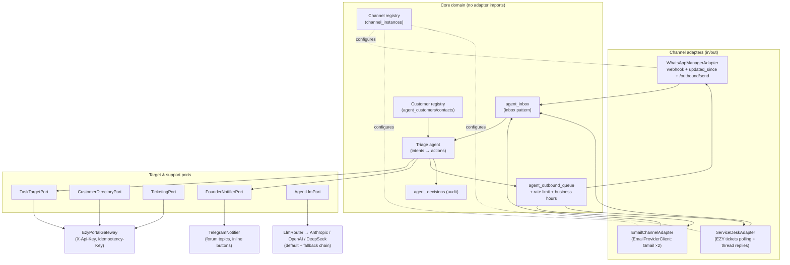
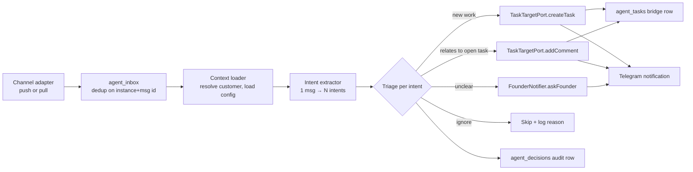

# Design — Channel Foundation & Basic Triage

## Context

One person operates sales, dev, QA and support. Messages arrive via WhatsApp (through the existing whatsapp_manager service), two Gmail accounts, and the EZY Portal service desk. The target system (EZY Portal) is fixed for the foreseeable future but must sit behind interfaces; the channel set will grow (Teams/Slack candidates) and the email account set may grow or change provider.

## Goals / Non-goals

**Goals:** normalize all inbound into one inbox; triage into EZY tasks/comments; notify founder on Telegram; make channels, email providers, and the task target pluggable.
**Non-goals:** drafting replies, memory/RAG, backfill, auto-send, mobile — later changes layer onto these ports without reworking them.

## Architecture



### Message pipeline



## Decisions

### D1 — Hexagonal core
Core domain packages (`inbox`, `triage`, `customers`, `outbound`, `decisions`) depend only on port interfaces defined in `src/ports/`. Adapters live in `src/adapters/<name>/` and are wired in `src/main.ts` composition root. Enforced by convention + an ESLint import-boundary rule.

### D2 — Channel model: type / provider / instance
- **ChannelType** — interaction semantics: `whatsapp`, `email`, `service_desk` (future: `teams`, `slack`). Determines threading model and identity format.
- **Provider** — concrete implementation: `whatsapp_manager`, `gmail`, `ezy_service_desk` (future: `outlook`, `msteams`).
- **ChannelInstance** — a configured account/connection, a row in `channel_instances`. Phase 1 seeds four: `whatsapp:primary`, `email:gmail:personal`, `email:gmail:work`, `service_desk:ezy`.

Contact identity keys on **channel type + address** (a phone number or email address is the same identity whichever instance observed it); inbox/outbound rows record the **instance** they traveled through. `agent_customers.default_email_instance_id` selects which email instance sends *new* outbound emails per customer (replies always go out through the instance that received the thread).

### D3 — WhatsApp over HTTP, never DB-to-DB
whatsapp_manager already exposes exactly what a channel adapter needs: signed webhook push (primary ingestion), `GET /messages?updated_since=` (startup catch-up + hourly reconciliation), `POST /outbound/send` (delivery), `GET /messages/:id/media` (attachments). The orchestrator stores a per-instance sync cursor and treats whatsapp_manager as the single owner of WhatsApp state.
**Prerequisite:** the orchestrator needs a write-capable credential — whatsapp_manager's external `x-api-key` is read-only whenever JWT auth is configured. Options: (a) use the personal JWT (works today, weakest hygiene), (b) small whatsapp_manager change adding a scoped API key allowed to POST `/outbound/send`. Plan assumes (b) as a one-file auth-middleware change; (a) is the fallback to avoid blocking.

### D4 — EZY Portal behind three ports, one gateway
`TaskTargetPort` (work management), `CustomerDirectoryPort` (BP directory), `TicketingPort` (service desk ops) — all implemented by `EzyPortalGateway` over a shared HTTP client (`X-Api-Key`, retries, `Idempotency-Key` on writes). Core stores refs as opaque `TEXT` (`bp_ref`, `task_ref`, `ticket_ref`, `project_ref`, `work_item_type_ref`); only the gateway knows they are UUIDs. Swapping targets later = new gateway + data migration, no core changes.

### D5 — Task creation requires `workItemTypeId`
Portal task creation 422s without a valid `workItemTypeId` — and the WIT must belong to the project's **project type** (verified: create 422s on `wit.ProjectTypeID != proj.ProjectTypeID`). Onboarding therefore captures per customer: `project_ref` (the customer's project) and `default_work_item_type_ref` (resolved **two-hop**: `GET /api/projects/projects/:id` → `projectTypeId` → `GET /api/projects/work-item-types?projectTypeId=<id>` — a `projectId` filter param is silently ignored and returns the whole tenant list; cached). Task dedup/reconciliation uses the portal's index-backed `sourceService/sourceEntityType/sourceEntityId` list filters — `sourceService='agent-orchestrator'`, `sourceEntityType=<channel type>`, `sourceEntityId=<thread key>`.

### D6 — Service desk is a channel for ingestion, a port for operations
Inbound tickets/replies are ingested using the change-00 contract: `GET /api/service-desk/tickets?updatedAfter=<cursor>` polling as the baseline (exact incremental cursor, no client-side diffing), upgradable to the change-00 portal webhooks (`service-desk.ticket.*` events → `/webhooks/ezy-portal`) as a push path with polling as reconciliation/backfill. Rows land in `agent_inbox` like any channel message. Outbound replies post to the ticket thread via the adapter's `send()`. Status transitions (resolve/close — Phase 4) go through `TicketingPort`, not the channel. **No AMQP anywhere** — production portal is a cloud instance; the broker is unreachable by design (D11).

### D7 — Telegram: forum topics, not channels; inline buttons, not reactions
The Bot API cannot create channels programmatically, so "one private channel per customer, created on onboarding" is not implementable as specced. Instead: one **forum supergroup** (manual one-time setup; bot admin with Manage Topics) and one **topic per customer** created via `createForumTopic` at onboarding, plus a pinned **admin topic** for system/ops messages. Approve/reject uses **inline keyboard buttons** (`callback_query`) — reliable, attributable, and works in topics. `agent_customers.telegram_channel_id` becomes `telegram_topic_id`.

### D8 — Own database, plain SQL migrations
New `agent_orchestrator` database on the existing Postgres instance. Forward-only numbered `.sql` migrations applied on boot (copy whatsapp_manager's runner). pgvector extension installed in change 02.

### D9 — Workers, not brokers
Ingestion pollers, inbox processor, outbound drainer are `setInterval` workers in one process, each claiming rows via `FOR UPDATE SKIP LOCKED`. Retry with exponential backoff, `retry_count`, `status='failed'` after 3 attempts + admin-topic alert. No message broker anywhere — portal events arrive as HTTPS webhooks (change 00 / D11).

### D10 — Multi-provider LLM gateway with default + fallback
Out-of-the-box provider clients for **Anthropic**, **OpenAI**, and **DeepSeek**, each with free model selection. `AgentLlmPort` is implemented by an `LlmRouter` that resolves per-role config (`triage`, `classify`, `draft` → `provider:model`, e.g. `anthropic:claude-sonnet-5`, `deepseek:deepseek-chat`) and walks a configured fallback chain on hard provider failure (auth / exhausted rate limit / 5xx after retries) — failovers logged + admin-notified. API tokens are runtime-manageable, stored in an AES-256-GCM sealed `credentials` table (whatsapp_manager pattern; env fallback). Structured outputs are normalized per provider (Anthropic `output_config.format`; OpenAI/DeepSeek JSON-schema/function modes) behind one port method, so triage output is schema-valid regardless of provider. Every call is cost-accounted (provider, model, role, tokens) in an `api_costs`-style table. Suggested defaults: `LLM_DEFAULT_PROVIDER=anthropic` (triage/draft `claude-sonnet-5`), fallback `openai`; `claude-haiku-4-5`/`deepseek-chat` as cheap classifier options. The product spec's hardcoded `claude-sonnet-4-6` is superseded.

### D11 — Portal change detection is webhooks + updatedAfter, never AMQP
Production EZY Portal is a cloud instance; its RabbitMQ broker is not reachable from the orchestrator and never will be part of the contract. Change 00 adds the portal-side surface: `updatedAfter` filters (tickets — used from this change; tasks — used from change 04) and tenant webhooks with HMAC signatures. The orchestrator's pattern for the portal mirrors the whatsapp_manager pattern: webhook push when connected, cursor-based `updatedAfter` pull to backfill after downtime.

## Port interfaces (authoritative shapes)

```ts
// ---------- channel-gateway ----------
type ChannelType = 'whatsapp' | 'email' | 'service_desk'; // open set — DB stores TEXT

interface ChannelInstanceConfig {
  id: string;                // channel_instances.id (UUID)
  channelType: ChannelType;
  provider: string;          // 'whatsapp_manager' | 'gmail' | 'ezy_service_desk' | ...
  name: string;              // 'whatsapp:primary', 'email:gmail:work'
  config: Record<string, unknown>;   // non-secret provider config (base URLs, account email)
  credentialsRef: string;    // env var / secret-store key — never secrets in DB
}

interface ChannelCapabilities {
  canSend: boolean;
  threads: boolean;          // email threads, tickets — WhatsApp uses contact as thread
  groupChats: boolean;
  media: boolean;
  voiceTranscripts: boolean;
  subjects: boolean;         // email/ticket subject line exists
  deliveryReceipts: boolean;
}

interface InboundMessage {
  instanceId: string;
  providerMessageId: string;         // dedup key within instance
  threadKey: string | null;          // WA contact/group number, email threadId, ticket id
  sender: { address: string; displayName?: string };  // address keyed by channel TYPE
  recipients?: { to: string[]; cc: string[] };        // email TO/CC awareness
  direction: 'inbound' | 'outbound'; // adapters may surface own outbound for context
  sentAt: Date;
  subject?: string;
  body: string | null;               // best text: transcript for voice, text/plain for email
  language?: string;                 // provider hint (WA detected_language)
  attachments: Array<{ kind: string; ref: string; mimeType?: string }>;
  replyToProviderMessageId?: string;
  raw: unknown;                      // full provider payload → agent_inbox.raw_metadata
}

interface OutboundMessage {
  instanceId: string;
  recipientAddress: string;
  threadKey?: string;                // reply into thread/ticket when set
  inReplyTo?: string;                // email Message-ID chain header
  subject?: string;
  body: string;
}

interface ChannelAdapter {
  readonly instance: ChannelInstanceConfig;
  readonly capabilities: ChannelCapabilities;
  /** Push ingestion (webhook/SSE). Optional — pull-only channels omit it. */
  startPush?(sink: (msg: InboundMessage) => Promise<void>): Promise<void>;
  /** Incremental pull from a persisted cursor. Used for catch-up and pull-only channels. */
  pull(cursor: string | null): AsyncIterable<{ message: InboundMessage; cursor: string }>;
  /** Historical fetch for backfill (change 03). Optional in Phase 1, part of the port from day one. */
  fetchHistory?(scope: { address?: string; threadKey?: string; until: Date }): AsyncIterable<InboundMessage>;
  send(msg: OutboundMessage): Promise<{ providerMessageId: string }>;
  health(): Promise<{ ok: boolean; detail?: string }>;
}

/** Inside the email adapter — provider-swappable (gmail now, outlook later). */
interface EmailProviderClient {
  listChanges(cursor: string | null): Promise<{ messages: ProviderEmail[]; nextCursor: string }>;
  getThread(threadId: string): Promise<ProviderEmail[]>;
  send(input: { to: string; subject?: string; bodyText: string; threadId?: string;
                inReplyTo?: string; references?: string[] }): Promise<{ messageId: string }>;
}

// ---------- task-target ----------
interface TaskRef { ref: string; url?: string; display?: string } // opaque

interface TaskTargetPort {
  createTask(input: {
    customerRef: string; projectRef: string; workItemTypeRef: string;
    title: string; description: string;
    priority: 'low' | 'medium' | 'high' | 'urgent';
    source: { service: string; entityType: string; entityId: string; display: string; url?: string };
    tags: string[];
  }): Promise<TaskRef>;
  addComment(task: TaskRef, body: string): Promise<void>;
  findOpenTasks(q: { customerRef?: string; projectRef?: string;
                     sourceEntity?: { type: string; id: string }; text?: string }): Promise<TargetTask[]>;
  listWorkItemTypes(projectRef: string): Promise<Array<{ ref: string; name: string }>>;
  setStatus(task: TaskRef, status: string): Promise<void>; // used from change 04
}

interface CustomerDirectoryPort {
  getCustomer(ref: string): Promise<{ ref: string; name: string; website?: string; email?: string }>;
  searchCustomers(q: string): Promise<Array<{ ref: string; name: string; code: string }>>;
  listContacts(ref: string): Promise<Array<{ ref: string; name: string;
    email?: string; phone?: string; whatsapp?: string; telegram?: string; isPrimary: boolean }>>;
}

interface TicketingPort {
  listChangedTickets(cursor: string | null): Promise<{ tickets: TargetTicket[]; nextCursor: string }>;
  getThread(ticketRef: string): Promise<Array<{ ref: string; body: string; authorName: string;
    isExternal: boolean; visibility: 'public' | 'internal'; at: Date }>>;
  postReply(ticketRef: string, body: string, visibility: 'public' | 'internal'): Promise<void>;
  setStatus(ticketRef: string, status: 'open' | 'pending' | 'resolved' | 'closed'): Promise<void>;
}

// ---------- founder-notifications ----------
interface FounderNotifierPort {
  notifyCustomerEvent(customerId: string, n: Notification): Promise<void>;   // → customer topic
  notifyAdmin(n: Notification): Promise<void>;                               // → admin topic
  askFounder(customerId: string, question: Notification,
             options: Array<{ id: string; label: string }>): Promise<void>;  // inline buttons
  onDecision(handler: (d: { notificationRef: string; optionId: string; by: string }) => Promise<void>): void;
}

// ---------- llm ----------
interface AgentLlmPort {
  extractIntents(input: TriageContext): Promise<Intent[]>;          // structured output
  judgeSimilarity(a: string, candidates: string[]): Promise<number[]>; // task dedup scores
}

/** One adapter per provider — Anthropic, OpenAI, DeepSeek out of the box (D10). */
interface LlmProviderClient {
  readonly provider: string;   // 'anthropic' | 'openai' | 'deepseek' | future
  complete(req: { model: string; system: string; messages: LlmMessage[];
                  maxTokens: number }): Promise<{ text: string; usage: TokenUsage }>;
  completeStructured<T>(req: { model: string; system: string; messages: LlmMessage[];
                  maxTokens: number; schema: object }): Promise<{ value: T; usage: TokenUsage }>;
}

/** Implements AgentLlmPort: role → provider:model resolution + fallback chain + cost accounting. */
interface LlmRouterConfig {
  defaultProvider: string;
  fallbackChain: string[];                       // ordered, e.g. ['openai']
  roles: Record<'triage' | 'classify' | 'draft', { provider?: string; model: string }>;
  providers: Record<string, { credentialsRef: string; defaultModel: string }>;
}

interface EmbeddingPort { embed(texts: string[]): Promise<number[][]> } // used from change 02
```

## Schema (Phase 1 migrations)

Deviations from the product spec DDL are marked ◆. Everything else follows the spec.

```sql
-- 001: channel registry ◆ (replaces all channel CHECK enums)
CREATE TABLE channel_instances (
  id              UUID PRIMARY KEY DEFAULT gen_random_uuid(),
  channel_type    TEXT NOT NULL,             -- 'whatsapp' | 'email' | 'service_desk' | future
  provider        TEXT NOT NULL,             -- 'whatsapp_manager' | 'gmail' | 'ezy_service_desk'
  name            TEXT NOT NULL UNIQUE,      -- 'whatsapp:primary', 'email:gmail:work'
  config          JSONB NOT NULL DEFAULT '{}',
  credentials_ref TEXT,
  status          TEXT NOT NULL DEFAULT 'active' CHECK (status IN ('active','paused','error')),
  sync_cursor     TEXT,                      -- adapter pull cursor (updated_since / historyId / updatedAt)
  created_at      TIMESTAMPTZ DEFAULT now(),
  updated_at      TIMESTAMPTZ DEFAULT now()
);

-- 002: customers
CREATE TABLE agent_customers (
  id              UUID PRIMARY KEY DEFAULT gen_random_uuid(),
  bp_ref          TEXT NOT NULL UNIQUE,      -- ◆ opaque CustomerDirectoryPort ref (today: EZY BP UUID)
  display_name    TEXT NOT NULL,
  website         TEXT,
  email_domain    TEXT,                      -- derived from website on save
  project_ref     TEXT,                      -- ◆ target project for new tasks
  work_item_type_ref TEXT,                   -- ◆ required by portal task creation (D5)
  faith           TEXT CHECK (faith IN ('jewish','christian','muslim','buddhist','none')),
  timezone        TEXT DEFAULT 'America/Panama',
  preferred_language TEXT DEFAULT 'es',
  default_email_instance_id UUID REFERENCES channel_instances(id),  -- ◆ was reply_from_email
  telegram_topic_id  TEXT,                   -- ◆ forum topic, was telegram_channel_id (D7)
  backfill_status TEXT DEFAULT 'pending' CHECK (backfill_status IN ('pending','in_progress','done','failed')),
  backfill_cutoff TIMESTAMPTZ,
  created_at      TIMESTAMPTZ DEFAULT now(),
  updated_at      TIMESTAMPTZ DEFAULT now()
);

-- 003: contact identities  ◆ keyed by channel TYPE (identity spans instances)
CREATE TABLE agent_customer_contacts (
  id              UUID PRIMARY KEY DEFAULT gen_random_uuid(),
  customer_id     UUID NOT NULL REFERENCES agent_customers(id),
  channel_type    TEXT NOT NULL,
  address         TEXT NOT NULL,             -- phone digits, lowercased email, SD contact ref
  display_name    TEXT,
  is_group        BOOLEAN DEFAULT false,     -- WhatsApp group ids
  is_primary      BOOLEAN DEFAULT false,
  directory_contact_ref TEXT,                -- EZY contact UUID when linked
  created_at      TIMESTAMPTZ DEFAULT now(),
  UNIQUE(channel_type, address)
);

-- 004: inbox  ◆ channel_instance_id FK instead of channel enum
CREATE TABLE agent_inbox (
  id              BIGSERIAL PRIMARY KEY,
  channel_instance_id UUID NOT NULL REFERENCES channel_instances(id),
  channel_message_id  TEXT NOT NULL,
  channel_thread_id   TEXT,
  customer_id     UUID REFERENCES agent_customers(id),   -- null until resolved
  sender_address  TEXT,
  sender_name     TEXT,
  direction       TEXT NOT NULL DEFAULT 'inbound' CHECK (direction IN ('inbound','outbound')),
  subject         TEXT,
  body            TEXT,
  raw_metadata    JSONB,
  received_at     TIMESTAMPTZ NOT NULL,
  status          TEXT NOT NULL DEFAULT 'pending'
                  CHECK (status IN ('pending','processing','processed','failed','skipped')),
  retry_count     INT NOT NULL DEFAULT 0,
  last_error      TEXT,
  processed_at    TIMESTAMPTZ,
  is_backfill     BOOLEAN DEFAULT false,
  created_at      TIMESTAMPTZ DEFAULT now(),
  updated_at      TIMESTAMPTZ DEFAULT now(),
  UNIQUE(channel_instance_id, channel_message_id)
);
CREATE INDEX idx_agent_inbox_pending ON agent_inbox(status) WHERE status IN ('pending','failed');
CREATE INDEX idx_agent_inbox_customer ON agent_inbox(customer_id, received_at DESC);

-- 005: task bridge  ◆ opaque task_ref
CREATE TABLE agent_tasks (
  id              BIGSERIAL PRIMARY KEY,
  task_ref        TEXT NOT NULL,             -- opaque TaskTargetPort ref (today: EZY task UUID)
  customer_id     UUID REFERENCES agent_customers(id),
  inbox_message_id BIGINT REFERENCES agent_inbox(id),
  relationship    TEXT CHECK (relationship IN ('created_from','contributed_to','follow_up')),
  created_at      TIMESTAMPTZ DEFAULT now()
);
CREATE INDEX idx_agent_tasks_ref ON agent_tasks(task_ref);
CREATE INDEX idx_agent_tasks_inbox ON agent_tasks(inbox_message_id);

-- 006: outbound queue  ◆ channel_instance_id FK
CREATE TABLE agent_outbound_queue (
  id              BIGSERIAL PRIMARY KEY,
  customer_id     UUID REFERENCES agent_customers(id),
  channel_instance_id UUID NOT NULL REFERENCES channel_instances(id),
  recipient_address TEXT NOT NULL,
  thread_key      TEXT,
  in_reply_to     TEXT,
  subject         TEXT,
  body            TEXT NOT NULL,
  status          TEXT NOT NULL DEFAULT 'pending'
                  CHECK (status IN ('pending','approved','sending','sent','failed','cancelled')),
  is_draft        BOOLEAN NOT NULL DEFAULT true,
  approved_at     TIMESTAMPTZ,
  approved_by     TEXT,
  send_after      TIMESTAMPTZ,
  provider_message_id TEXT,
  retry_count     INT NOT NULL DEFAULT 0,
  last_error      TEXT,
  created_at      TIMESTAMPTZ DEFAULT now(),
  updated_at      TIMESTAMPTZ DEFAULT now()
);

-- 007: decisions audit (unchanged from spec)
CREATE TABLE agent_decisions (
  id              BIGSERIAL PRIMARY KEY,
  customer_id     UUID REFERENCES agent_customers(id),
  inbox_message_id BIGINT REFERENCES agent_inbox(id),
  decision_type   TEXT NOT NULL,
  agent_output    JSONB NOT NULL,
  human_override  JSONB,
  outcome         TEXT CHECK (outcome IN ('accepted','modified','rejected','pending')),
  created_at      TIMESTAMPTZ DEFAULT now(),
  resolved_at     TIMESTAMPTZ
);

-- 008: business hours + holidays (unchanged from spec)
-- agent_business_hours(day_of_week, start_time, end_time, is_working_day)
-- agent_holidays(holiday_date, name, faith)

-- 009: sealed credentials + LLM cost accounting  ◆ (D10)
-- credentials(name PK, ciphertext BYTEA, iv BYTEA, auth_tag BYTEA, last4 TEXT, updated_at)
--   — AES-256-GCM, port of whatsapp_manager's credentials table; holds provider API tokens
--     ('anthropic','openai','deepseek', 'ezy_portal', ...), settable via admin endpoint, env fallback
-- llm_costs(id, provider, model, role, customer_id NULL, input_tokens, output_tokens,
--           cost_usd NUMERIC(10,6), created_at)
```

Deferred to their changes: `agent_memory` + pgvector (02), `agent_backfill_progress` (03).

## Triage contract

Intent categories (unchanged from product spec): `new_feature_request`, `custom_development`, `bug_report`, `question_existing`, `follow_up`, `info_provided`, `compliment`, `unclear`, `new_contact`. The extractor returns structured output:

```json
{
  "intents": [{
    "category": "bug_report",
    "summary": "Export button fails on commissions report",
    "suggested_title": "Fix commissions report export error",
    "priority": "high",
    "confidence": 0.86,
    "related_open_task_ref": null
  }]
}
```

Routing rules: confidence < 0.5 or category `unclear` → `askFounder`; same email thread / recent same-thread task (7 days) → always comment, never new task; `question_existing` in Phase 1 → create task + flag (drafting arrives in change 02); CC-only emails → context-only (no task) unless body contains an explicit ask.

## Risks & mitigations

| Risk | Mitigation |
|---|---|
| whatsapp_manager write auth blocks outbound | Fallback: personal JWT in env (D3); scoped-key change tracked as its own task |
| Gmail push (Pub/Sub watch) complexity | Phase 1 polls History API on 60s interval — well under the 5-min SLA; watch is an optimization, not a dependency |
| Change 00 (portal `updatedAfter` on tickets) slips | Temporary fallback: `updatedAt`-sorted list + client-side diff inside the adapter — swap to the filter when 00 lands; `TicketingPort` shape is identical either way |
| LLM misclassification creates noise tasks | Every action Telegram-notified with ❌ undo button; `agent_decisions` captures corrections for change 03 learning |
| Single LLM provider outage stalls triage | Provider fallback chain (D10); if all providers fail, inbox retry lifecycle holds work safely |
| Portal API drift | All portal calls in one gateway; contract tests against test tenant (`EZY_PORTAL_URL=https://account-test.portal.net`) |

## Open questions (non-blocking, defaults chosen)

1. WhatsApp media in Phase 1: stored as attachment refs only (no download) — triage uses text/transcripts. Revisit in change 02.
2. Unknown sender from unknown domain: skip + counter (per spec). A weekly digest of skipped senders goes to the admin topic so real leads aren't lost silently.
