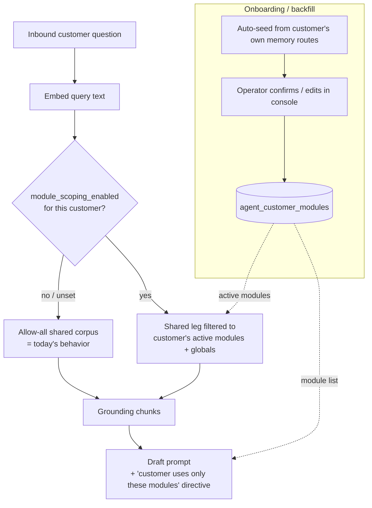

# Per-customer module scoping for RAG retrieval

**Status:** BUILT 2026-07-20 (migration 047 + data layer + retrieval scoping + prompt directive +
console Modules step, all behind the opt-in `module_scoping_enabled` flag → allow-all by default).
Enable per customer by saving a module set in the console onboarding "Modules" step.
**Origin:** 2026-07-20 Pilates Gal incident — a "ubicación" question retrieved `maintenanceApp`
(`/maintenance/locations`) docs and the agent answered about a "maintenance module" the tenant
does not have. Root cause: the shared-corpus retrieval leg (`customer_id IS NULL`) has **no module
scoping** — it matches the nearest chunk across the entire ~40-module product corpus.

## Guiding requirement (founder)
- **New customers default to EVERYTHING** (allow-all) — no regression, no config needed to work.
- **Narrow per-customer**: the operator restricts a customer to the modules they actually use.
- **Set at onboarding**: the onboarding screen is where the operator declares what the customer has.

So scoping is **opt-in per customer**: it engages only once an operator saves a module set;
until then retrieval behaves exactly as today.



## A. Schema — migration `047_customer_active_modules.sql`
Child table (mirrors `003_agent_customer_contacts`), NOT an array column — we need per-module
provenance (auto vs operator), soft-remove, and audit.

```sql
CREATE TABLE agent_customer_modules (
  id            UUID PRIMARY KEY DEFAULT gen_random_uuid(),
  customer_id   UUID NOT NULL REFERENCES agent_customers(id) ON DELETE CASCADE,
  module_key    TEXT NOT NULL,          -- EXACT token from agent_memory.metadata->>'module' (e.g. 'financeApp','pilates-gal')
  source        TEXT NOT NULL DEFAULT 'operator' CHECK (source IN ('auto','operator','portal')),
  active        BOOLEAN NOT NULL DEFAULT true,   -- soft-remove: operator can deny an auto-seed
  created_at    TIMESTAMPTZ NOT NULL DEFAULT now(),
  updated_at    TIMESTAMPTZ NOT NULL DEFAULT now(),
  UNIQUE (customer_id, module_key)
);
CREATE INDEX idx_agent_customer_modules_customer ON agent_customer_modules (customer_id) WHERE active;

-- Opt-in flag on the parent. false/unset = allow-all (default; no regression for existing customers).
ALTER TABLE agent_customers
  ADD COLUMN IF NOT EXISTS module_scoping_enabled BOOLEAN NOT NULL DEFAULT false;
```

**Vocabulary is the corpus itself** — `module_key` must equal a live
`agent_memory.metadata->>'module'` value (no invented canonical keys that could drift). The picker
options = `SELECT DISTINCT metadata->>'module' FROM agent_memory WHERE customer_id IS NULL` plus the
customer's own custom-module tokens. 40 shared modules exist today; families: feature modules
(`financeApp`↔`/finance`, `commerceApp`, `itemsApp`, `maintenanceApp`, …), cross-cutting globals
(`settings`, `getting-started`, `concepts`, `reference`, `troubleshooting`, `portal`, `connectors`,
`docs`), WMS sub-modules, and bare-named custom modules (`pilates-gal`).

## B. Derivation — auto-seed + operator override
Auto-seed harvests what is observable from the customer's OWN rows (custom modules + any
module/route tokens present); the operator fills in the shared-feature modules the customer uses
(these are NOT observable from their own memory — proven for Pilates Gal, whose own rows only carry
`{pilates-gal, tasks}`). Insert-only, `source='auto'`, `ON CONFLICT DO NOTHING` so it never
overwrites an operator decision.

```sql
WITH observed AS (
  SELECT DISTINCT metadata->>'module' AS module_key
    FROM agent_memory WHERE customer_id = $1 AND metadata->>'module' IS NOT NULL
  UNION
  SELECT DISTINCT split_part(metadata->>'route','/',2) || 'App' AS module_key
    FROM agent_memory WHERE customer_id = $1 AND metadata->>'route' IS NOT NULL AND metadata->>'module' IS NULL
)
INSERT INTO agent_customer_modules (customer_id, module_key, source)
SELECT $1, module_key, 'auto' FROM observed
 WHERE module_key IS NOT NULL AND btrim(module_key) <> '' AND module_key NOT IN ('tasks','docs','App')
ON CONFLICT (customer_id, module_key) DO NOTHING;
```

New core query module `src/customers/customer-modules.ts` (mirrors `customer-doc-sources.ts` — db
only, no adapter import): `getActiveModules(customerId)`, `getModuleScoping(customerId) →
{enabled, modules}`, `seedActiveModulesFromMemory(customerId)`. Seed call sites: onboarding
composition root next to `stampBackfillCutoff` / `registerCustomerDocsRoot`
(`src/customers/onboarding-backfill.ts`), plus a one-shot backfill over existing customers.

## C. Usage
**(i) Retrieval scoping** — shared leg only; customer leg is NEVER filtered (own + custom docs
always retrievable). Effective allow-list = `activeModules ∪ GLOBAL_MODULES`
(`getting-started, concepts, reference, troubleshooting, portal, settings, connectors, docs`).
Predicate added to the shared leg of the three builders in `src/knowledge/memory-repo.ts`
(`buildSearchSql`, `buildHybridVectorSql`, `buildKeywordSearchSql`):
```sql
AND (metadata->>'module' = ANY($moduleList) OR metadata->>'module' IS NULL)
```
Semantics: `module_scoping_enabled=false` OR empty list → **no filter (allow-all)**. Plumb the list
through `KnowledgeRetrievalOptions`/`retrieve()` (`src/knowledge/retrieval.ts`) — loaded once per
triage run in `retrieveKnowledge` (`src/triage/triage.service.ts:397`) via `getModuleScoping`.
This also structurally fixes the revise loop: a scoped customer can never re-pull an out-of-scope
doc (fix B becomes belt-and-suspenders once C ships for that customer).

**(ii) Draft/triage prompt** — a distinct, un-numbered context block (like the brief/voice blocks,
"NOT a source, do NOT cite") listing the customer's modules, plus a standing directive in
`DRAFT_SYSTEM` (`src/adapters/llm/draft-prompt.ts`): *"the customer uses only the listed modules;
never explain or attribute behavior to a portal module that is not listed; if a question seems to
need an unlisted module, ask the founder rather than assume."* Mirror into the extractor + revise
prompts. Defense-in-depth: retrieval stops the wrong doc being fetched; the directive stops the
model inventing an unlisted module from its own weights.

**(iii) Console onboarding UI** — a "Modules" step on the onboarding screen
(`src/adapters/console/console-onboarding.router.ts`): `GET …/modules/vocabulary` (picker options),
`GET …/:customerId/modules` (current set + `module_scoping_enabled` + each row's `source`),
`PUT …/:customerId/modules` (CSRF-guarded, audited) → upsert operator picks `source='operator'`,
soft-`active=false` the deselected, set `module_scoping_enabled=true`. Show an "unscoped — sees all
modules" banner while the flag is off. (Every `<Select>` option needs a non-empty `value`.)

## D. Edge cases
- **Custom module** (`pilates-gal`): stored for prompt naming; retrieval never depends on it (own
  rows always retrieve via the customer leg).
- **Brand-new customer**: `module_scoping_enabled=false` → allow-all (never default-deny — an empty
  list would starve retrieval). A populated-but-flag-off, or flag-on-but-empty, set = allow-all too.
- **Global/module-agnostic docs**: always retrievable via `GLOBAL_MODULES` ∪ the
  `metadata->>'module' IS NULL` clause.

## Phasing
1. **Data + auto-seed** (no behavior change): migration 047, `customer-modules.ts`, seed wired into
   onboarding + backfill. Flag false everywhere → zero retrieval/prompt change. Verify by inspecting
   seeded rows.
2. **Retrieval scoping + prompt directive** behind `module_scoping_enabled`: enable Pilates Gal
   first (`{pilates-gal, financeApp, commerceApp, itemsApp}`), confirm "ubicación" no longer returns
   `maintenanceApp` and the draft stops citing maintenance.
3. **Console Modules step** (vocabulary + GET/PUT + UI) for self-serve; optional portal-subscription
   `source='portal'` seeding.

## Key files
migration `src/db/migrations/047_customer_active_modules.sql` (new) · `src/customers/customer-modules.ts`
(new) · `src/customers/onboarding-backfill.ts` · `src/triage/context-loader.ts` ·
`src/knowledge/retrieval.ts` · `src/knowledge/memory-repo.ts` (3 builders) ·
`src/triage/triage.service.ts:397` · `src/ports/llm.port.ts` · `src/adapters/llm/draft-prompt.ts` ·
`src/adapters/console/console-onboarding.router.ts`.
