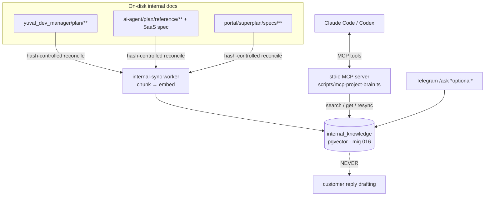

# Project Brain — internal-knowledge RAG + MCP

**Project Brain** is a semantic memory over *your own* internal project docs — the
Agent Orchestrator's planning, decisions, architecture, risk register, backlog, and
specs. It lets Claude Code / Codex recall *why* and *how* a decision was made mid-task
instead of grepping markdown, and it can be queried from Telegram too.

It reuses the same RAG engine as the customer knowledge base (embeddings + pgvector
cosine search), but over a **separate, isolated corpus**.

## Add the MCP server (copy one line)

Prereq (once): embed the corpus — `npm run migrate && OPENAI_API_KEY=… npm run internal:reconcile:once` — and keep `OPENAI_API_KEY` resolvable. The `cd` wrapper is required so `.env` loads.

**Claude Code** — user scope (drop `-s user` to scope to the current repo):

```bash
claude mcp add project-brain -s user -- bash -lc 'cd /mnt/dev/tools/agent_orchestrator && exec npx tsx scripts/mcp-project-brain.ts'
```

**Codex** — one-liner (recent CLIs):

```bash
codex mcp add project-brain -- bash -lc 'cd /mnt/dev/tools/agent_orchestrator && exec npx tsx scripts/mcp-project-brain.ts'
```

…or add this block to `~/.codex/config.toml` (works on every Codex version):

```toml
[mcp_servers.project-brain]
command = "bash"
args = ["-lc", "cd /mnt/dev/tools/agent_orchestrator && exec npx tsx scripts/mcp-project-brain.ts"]
```

Verify with `claude mcp list` / `codex mcp list` (expect `project-brain … ✔`); it shows up in your **next** session. Remove with `claude mcp remove project-brain -s user`. Details on scope, tools, and how it works are below.



## The isolation invariant (why a separate table)

Internal planning/decision/audit notes must be **structurally unreachable** from the
customer-facing reply drafter. A leak of an internal chunk into a customer's reply is
the nightmare case. So:

- Internal knowledge lives in its **own table `internal_knowledge`** (migration 016),
  with its **own search function** (`internalKnowledgeRepo.search`).
- The customer path (`memoryRepo.search` over `agent_memory`) queries a **different
  table** and is *incapable by construction* of returning an internal row.
- This is enforced by a test (`internal-repo.test.ts`) asserting neither SQL string
  ever names the other's table.

The two knowledge layers, side by side:

| | Customer knowledge | Project Brain (internal) |
|---|---|---|
| Table | `agent_memory` | `internal_knowledge` |
| Audience | drives **customer replies** | **founder / dev only** |
| Scope | per-customer + shared | never customer-scoped |
| Reachable by the drafter? | **yes** | **no — by construction** |
| Enabled by | `KNOWLEDGE_SYNC_ENABLED` / `KNOWLEDGE_RETRIEVAL_ENABLED` | `KNOWLEDGE_INTERNAL_ENABLED` |

## What gets indexed

The corpus is a **curated allow-list**, not a blanket scan — defined as a typed const
in `src/adapters/knowledge/internal-sources.ts` (`INTERNAL_SOURCES`). Current sources:

| Source id | Repo | Includes |
|---|---|---|
| `ao-plan` | `yuval_dev_manager` | `plan/EXECUTION-PLAN.md`, `plan/RISK-REGISTER.md`, `plan/project.md`, `plan/blueprints`, `plan/changes`, `plan/specs` |
| `ai-agent-ref` | `ai-agent` | `plan/reference`, `docs/AI_Agent_SaaS_Platform_Specification.md` |
| `portal-specs` | `portal` | `superplan/specs` |

Directory segments **excluded everywhere** (superseded scratch, not decision truth):
`archive`, `active`, `executed`, `sessions`, `session-logs`, `prompts`, `tmp`.

Absolute checkout roots per repo are `INTERNAL_REPO_ROOTS` in the same file.

### Adding / changing a source

Edit `INTERNAL_SOURCES` (add an entry, or add an `include` path / adjust `excludeDirs`),
then re-embed (`npm run internal:reconcile:once`, or call the `resync_project_knowledge`
MCP tool with no path). Identity is `docKey = "<sourceId>:<repo-relative-path>"`; a doc
that drifts out of the includes is tombstoned (hidden from search) on the next reconcile.

## One-time setup

From the repo root (`/mnt/dev/tools/agent_orchestrator`):

```bash
# 1. Apply migrations (creates internal_knowledge — migration 016)
npm run migrate

# 2. Embed the internal corpus once (needs OPENAI_API_KEY resolvable).
#    Hash-controlled + idempotent: re-running re-embeds only changed docs.
OPENAI_API_KEY=… npm run internal:reconcile:once
```

Embedding uses `text-embedding-3-small` (1536 dims); the whole internal corpus is a few
hundred chunks — cents, not dollars. Each embed request writes one `llm_costs` row.

## About the MCP server

The command to register it is at the [top of this doc](#add-the-mcp-server-copy-one-line)
(Claude Code + Codex). A few notes on how it runs:

- It speaks **stdio JSON-RPC** — no network listener. The `cd …` wrapper is required so
  the repo's `.env` (hence `OPENAI_API_KEY`) loads; without it embeds fail.
- `-s user` registers it for all your projects; use `-s local` (or drop the flag) to
  scope it to the current repo only.
- It appears in your **next** session; verify with `claude mcp list` / `codex mcp list`.

> The MCP server only *reads* whatever is already ingested — it does not depend on
> `KNOWLEDGE_INTERNAL_ENABLED` (that flag controls the in-process background re-sync
> worker, below). But it needs the corpus embedded (step 2 above) to return anything.

## MCP tools

| Tool | Args | Does |
|---|---|---|
| `search_project_knowledge` | `query`, `k?` | Semantic search → cited chunks nearest-first as JSON `[{repo, path, section, snippet, distance}]`. |
| `get_project_doc` | `docKey`, `source?` | Returns the **full markdown** of a doc by its citation (the `docKey` from a search result). |
| `resync_project_knowledge` | `path?` | Re-index after docs change (see below). |

### `resync_project_knowledge` — keeping the index fresh

When you edit an internal doc, tell Project Brain so its index reflects the change:

- **With `path`** (absolute path, repo-relative path, or a `docKey`): re-syncs **only
  that doc** —
  - changed on disk → re-embed;
  - unchanged → skip (no embed cost);
  - deleted from disk → tombstone (drops from search);
  - not under any configured source → `out-of-scope` no-op.

  Returns e.g. `{ "docKey": "ao-plan:plan/EXECUTION-PLAN.md", "action": "updated" }`.

- **Without `path`**: a full hash-controlled reconcile of the whole corpus (only changed
  docs re-embed). Returns `{ scope: "all", created, updated, skipped, tombstoned, failed }`.

A resync is serialized with the background worker via a Postgres advisory lock, so two
reconciles never run at once — if one is already running you get a *"try again"* message.
Resync embeds are auditable (they write `llm_costs` rows).

Typical Claude Code loop: edit a plan doc → call
`resync_project_knowledge({ path: "<the file you edited>" })` → subsequent
`search_project_knowledge` calls see the new content.

## Background re-sync worker (optional)

Set `KNOWLEDGE_INTERNAL_ENABLED=true` to also register an **in-process worker** that
reconciles the corpus on an interval (default hourly), so edits are picked up even if you
never call `resync_project_knowledge`. It shares the same advisory lock and hash control,
so it re-embeds only what changed. Dormant by default.

## Configuration

| Variable | Default | Purpose |
|---|---|---|
| `KNOWLEDGE_INTERNAL_ENABLED` | `false` | Register the hourly internal re-sync worker. |
| `KNOWLEDGE_INTERNAL_SYNC_INTERVAL_MS` | `3600000` | Re-scan cadence (1h). |
| `KNOWLEDGE_INTERNAL_K` | `8` | Default top-k chunks per search. |
| `KNOWLEDGE_INTERNAL_MAX_DISTANCE` | `0.6` | Cosine-distance ceiling (0–2); weaker chunks dropped. |
| `OPENAI_EMBEDDING_MODEL` / `OPENAI_EMBEDDING_DIM` | `text-embedding-3-small` / `1536` | Shared embedding model (must match the `vector(N)` column). |
| `KNOWLEDGE_TOMBSTONE_MAX_RATIO` | `0.5` | Shared refuse-to-tombstone guard. |
| `OPENAI_API_KEY` | — | Credential (sealed store / env), needed to embed. Never in `env.ts`, never logged. |

## Files

| Path | Role |
|---|---|
| `src/adapters/knowledge/internal-sources.ts` | The curated `INTERNAL_SOURCES` const + repo roots. |
| `src/adapters/knowledge/internal-doc-source.ts` | Filesystem walker (`listDocs`, `scanPath`). |
| `src/knowledge/internal-sync.ts` | Reconciler — full (`reconcileInternalKnowledge`) + targeted (`reconcileInternalDoc`). |
| `src/knowledge/internal-repo.ts` | DB repo over `internal_knowledge` only (the isolation boundary). |
| `src/knowledge/internal-search.ts` | Embed-then-search + snippet/citation shaping. |
| `scripts/mcp-project-brain.ts` | The stdio MCP server. |
| `scripts/internal-reconcile-once.ts` | One-shot corpus embed (`npm run internal:reconcile:once`). |
| `src/db/migrations/016_internal_knowledge.sql` | The `internal_knowledge` table. |
