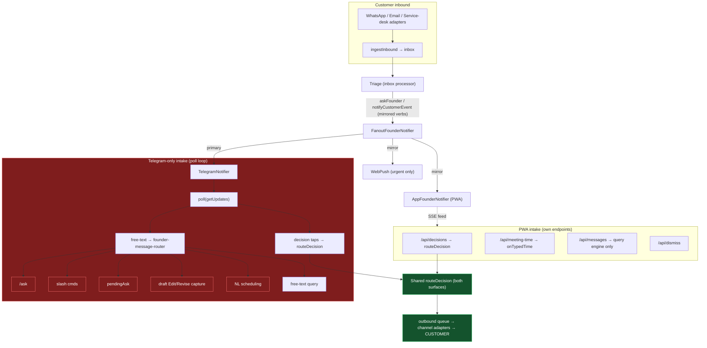
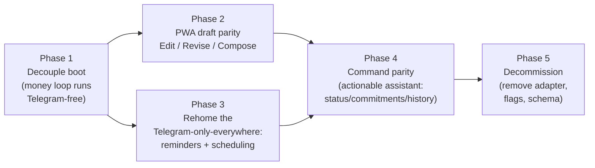

# Dropping Telegram: audit & migration plan

**Status:** Phases 1–4 DELIVERED (2026-07-17) · all flagged residual gaps CLOSED (2026-07-20) · Phase 5 (decommission) pending a Telegram-free soak · **Owner:** founder

## Delivered

| Phase | What | Commits |
|---|---|---|
| 1 | Money loop boots without Telegram (`HeadlessPrimaryNotifier`; callback poller nullable-notifier; app decision sinks always wired; console onboarding unhooked from Telegram at boot) | 4a5d370, 34c411e, 69eefda |
| 2 | PWA draft **Edit / Revise** + **Compose** a new draft | a97c597, 0dab55d, d84e8dc |
| 2+ | **Voice input** lands on the PWA — record → transcribe → composer (the last Telegram-only input) | a337252 |
| 3a | Reminders **delivered** to the PWA (not just the Telegram thread) | 1cf3b0b |
| 3b | Reminders **created** from the PWA (migration 045 + `/api/reminders` + ReminderSheet) | aa673cf |
| — | Cancel/commitment **and** backfill acks mirrored to the app | 015c08c, 92c3a45 |
| — | **Iterative meeting composer** (propose → refine → book) + calendar day view + meeting scheduling, entirely from the PWA | e403999 |
| — | **Calendar soft holds** (walk/gym) + **meeting-card dismiss** + **attendee-pick** resolution on the PWA | af18e37 |
| 4 | Actionable assistant | already covered by the WP8 agentic toolset (`list_open_tasks`, `open_commitments`, `pending_approvals`, `customer_brief`, `search_memory`, …) — no new work |
| — | Housekeeping: the deferred residual gaps below are closed (nullable `ScheduledAction` typed; outbound-drainer boot line reworded; agentic-tools cross-customer fan-out now surfaces a Coverage note when truncated) | 3fe54d3 |

**Telegram is still configured and running.** Everything above is a *capability*; the flip happens when you unset `TELEGRAM_*` and the loop comes up app-only.

### Residual gaps (now closed)

All three gaps flagged when Phase 4 delivered have since been closed:

- **Voice-note input** — closed by `a337252` (PWA `/api/transcribe` reuses the Telegram path's OpenAI transcription adapter).
- `ScheduledAction` TS type — closed by `3fe54d3` (the four migration-045 nullable columns are now `string | null`; surfaced + fixed a latent `notifyCustomerEvent` null-customer bug in `schedule.worker`).
- The outbound-drainer's misleading "Telegram unconfigured" log line — closed by `3fe54d3` (reworded to "no founder surface"; with the app configured, drainer alerts already reach it via the fanout).

## Phase 5 — decommission checklist (run only after a Telegram-free soak)

1. **Soak first:** run with `TELEGRAM_*` unset in production for a soak period; confirm the app-only money loop (cards, decisions, reminders, drafts) behaves.
2. Remove the Telegram adapter (`src/adapters/telegram/*`), `buildTelegramNotifier`, and the `telegram:callbacks` poll worker; collapse `buildCallbackPollerWorker`'s Telegram-intake branch (the `if (notifier)` block, `poll`, the whole `onMessage` founder-router chain, thread markers).
3. Retire the Telegram-only schema: `agent_customers.telegram_topic_id`, `telegram_notification_refs`, and the Telegram anchor columns on `scheduled_actions` — plus the scope-binding lookups (`findCustomerByTelegramTopic`, `resolveTelegramReplyOrigin`).
4. Drop `TELEGRAM_*` env/flags; make `FanoutFounderNotifier` app-primary by construction (no headless shim needed once there's no Telegram).
5. Delete the Telegram-only founder-message chain: slash commands, draft edit/revise *capture* (the app endpoints replace them), NL scheduling capture (ReminderSheet + meeting picker replace it).
6. Decide voice notes (drop or PWA audio upload).

Original audit + architecture follow below.

**Original date:** 2026-07-17 · **Owner:** founder

Goal: retire Telegram as the founder's control surface and run the founder
experience on the **PWA** (mobile, `/app`) + **Console** (desktop, `/console`).
This doc audits every Telegram-only seam, maps current coverage, and lays out a
phased plan to close the gaps.

---

## TL;DR

- **Telegram is only the founder's control + notification surface**, plus the
  "which customer does this concern" scope binding. **Customer-facing outbound
  (WhatsApp / email / service-desk) is already Telegram-independent** — it goes
  through the outbound queue + channel adapters, never a Telegram topic. So
  dropping Telegram does **not** touch how customers are reached.
- **The Console already has full desktop parity** for the heavy flows: draft
  review (approve/edit/revise/reject), memory/guidance, connectors, settings,
  onboarding, backfill. Those are not blockers.
- **Three things are Telegram-only on _every_ surface** and must be rehomed
  before Telegram can go:
  1. **The money loop won't even boot without Telegram** (the inbox processor +
     callback poller are skipped if `buildTelegramNotifier()` throws).
  2. **Reminder delivery** is hard-wired to a Telegram thread.
  3. **Natural-language scheduling** (deferred sends, reminders, founder-initiated
     meetings) has no other surface.
- **The PWA (mobile) additionally lacks**, though the Console has them: draft
  **Edit/Revise**, **compose a new draft**, and typed **slash-command**
  equivalents.

---

## Current architecture

Red = Telegram-only founder intake with no (or partial) PWA path. Green = already
surface-independent.

---

## Coverage matrix

| Capability | Telegram | Console | PWA | Verdict |
|---|:---:|:---:|:---:|---|
| notifyCustomerEvent / notifyAdmin / askFounder / onDecision (mirrored verbs) | ✅ | ✅ (feed/approvals) | ✅ | **Covered** |
| Decision button taps (Approve, Reject, cancel, meeting duration/slot…) | ✅ | ✅ | ✅ (`/api/decisions`, shared router) | **Covered** |
| Meeting typed-time ("thursday 3pm") | ✅ | — | ✅ (datetime picker `/api/meeting-time`) | **Covered** |
| Cancel / commitment **acks** | ✅ | — | ✅ (`appConfirm`) | **Covered** |
| Customer outbound send (WhatsApp/email) | ✅ | ✅ | ✅ (channel adapters) | **Covered — Telegram-independent** |
| Draft **Approve / Reject** | ✅ | ✅ | ✅ (no thread needed) | **Covered** |
| Draft **Edit** (replace body) | ✅ | ✅ | ❌ needs threadId to arm marker | **PWA gap** |
| Draft **Revise** (regenerate from instruction) | ✅ | ✅ | ❌ same | **PWA gap** |
| Compose a **new** draft (`/draft email`) | ✅ | ❌ | ❌ | **Everywhere-but-Telegram gap** |
| `/pending` `/briefing` `/summary` | ✅ | ◑ Overview/Approvals | ◑ Attention/Activity | Partial analogs |
| `/status` (open portal tasks) | ✅ | ❌ | ❌ | **Gap** |
| `/history <kw>` (inbox+memory+WA search) | ✅ | ◑ per-source | ◑ per-customer | Partial |
| `/commitments` cards (✔/✖) | ✅ | ❌ | ❌ | **Gap** |
| Typed answer to an askFounder question | ✅ | — | ◑ tap-only (choice reachable) | Soft gap |
| **Natural-language scheduling** (send-later, meetings) | ✅ | ❌ | ❌ | **Hard gap (Telegram-only anywhere)** |
| **Reminder delivery** | ✅ | ❌ | ❌ | **Hard gap (Telegram-only anywhere)** |
| Voice-note input (transcription) | ✅ | ❌ | ❌ | Telegram-specific input |
| Memory/guidance CRUD, connectors, settings, onboarding, backfill | — | ✅ | ❌ | **Console owns (desktop)** |
| **Money-loop boot** | ✅ required | — | — | **Structural blocker** |

Legend: ✅ full · ◑ partial · ❌ none · — n/a.

---

## The structural blockers (must fix first)

1. **Boot dependency** (`src/main.ts:330-374`). The whole money loop (inbox
   processor + callback poller) is wrapped in `try { buildTelegramNotifier() … }`
   and skipped with "money-loop disabled — Telegram not configured" if the
   Telegram env is absent. Several workers (acceptance report, weekly review,
   outbound-drainer founder alerts) also short-circuit without Telegram. Nothing
   runs without it today.

2. **Founder message intake is Telegram's poll loop.** The entire
   `founder-message-router` chain (ask, slash, pendingAsk, draft edit/revise
   capture, scheduling, free-text query) is driven by `TelegramNotifier.poll` →
   `onMessage`. The PWA's `/api/messages` routes **only** to the query engine.

3. **Capture state is Telegram-thread-scoped.** Thread markers
   (`ask_founder`, `draft_edit`, `draft_revise`, `schedule`) are keyed by the
   Telegram topic id (`<kind>:<threadId>`). The PWA has no per-thread "your next
   message means X" state — it keys everything by `messageId` / `notificationRef`
   instead (which is actually cleaner and should be the target model).

4. **Scope binding via `agent_customers.telegram_topic_id`.** Free-text query and
   scheduling infer the customer from the Telegram topic. The PWA already solves
   this differently and better: **explicit** customer selection (customer screens
   pass `customerId`), so this is a non-issue on the PWA — it just needs the
   Telegram-topic lookups removed from the shared paths.

---

## Migration plan

### Phase 1 — Decouple the boot _(foundation; nothing else ships without it)_
**Why:** today the PWA is strictly a best-effort mirror behind a required Telegram
primary. It must become able to stand alone.
**What:**
- Make `FanoutFounderNotifier` work with **no primary** (or the app as primary) —
  today it's `new FanoutFounderNotifier(telegram, mirrors)`. Introduce a headless/
  no-op primary so the fanout, the inbox processor, and the decision router all
  run when Telegram is absent.
- Register the money-loop workers when **either** Telegram **or** the app is
  configured, not only Telegram (`main.ts`). The callback poller's Telegram
  `poll()` becomes conditional; the shared `routeDecision` + decision sinks stay.
- Remove the Telegram-topic scope lookups from the shared query/scheduling paths
  (the PWA already passes `customerId` explicitly).
**Risk:** medium — it's the composition root. Guardrail: keep Telegram working in
parallel throughout (feature-flag the "app-only" boot) so this is reversible.

### Phase 2 — PWA draft Edit / Revise / Compose _(highest value, lowest risk)_
**Why:** the mobile founder can only Approve/Reject a draft today; Edit and Revise
dead-end (no `threadId`). The **Console already proves the exact pattern** — its
`console-approvals.router.ts` calls the same core fns with the body/instruction in
the POST, no thread markers.
**What:**
- Add PWA endpoints mirroring console-approvals: `POST /api/drafts/:id/edit`
  (new body), `POST /api/drafts/:id/revise` (instruction) → reuse
  `replaceDraftBodyAndApprove` / `reviser.reviseFromInstruction` verbatim.
- Add a draft-card affordance (inline edit textarea + revise-instruction input),
  mirroring `ApprovalsView`'s `DraftsTab`.
- Add **compose** (`/draft email` equal): a customer-screen "Draft a reply" action
  → prompt → `draftEmail` presenter → new draft card.
**Risk:** low — reuses shared, first-writer-wins core fns (idempotent, 409 on
conflict). No new domain logic.

### Phase 3 — Rehome reminders + scheduling _(the true functionality-loss risk)_
**Why:** these are Telegram-only on **every** surface. Drop Telegram today and
they vanish silently.
**What:**
- **Reminder delivery:** `schedule.worker.ts:92` fires `⏰ Reminder` via
  `replyInThread(source_thread_id, …)`. Re-route to an app notification
  (`notifyCustomerEvent` / a new `notifyFounder` verb → feed card + FCM push).
  Make `scheduled_actions.source_thread_id` nullable / app-origin.
- **Scheduling input:** replace natural-language "message X thursday 8am" with
  PWA-native UI — a "schedule this send" action with a datetime picker (same
  pattern as the meeting picker), and a first-class **Reminders** surface. Keep NL
  parsing optional via the actionable assistant (Phase 4).
- Decouple `scheduled_actions` / `telegram_notification_refs` from Telegram ids.
**Risk:** medium — touches the scheduling schema and a live worker. Ship reminder
re-delivery first (pure win), then the input UI.

### Phase 4 — Command parity via an actionable assistant
**Why:** `/status`, `/commitments`, `/history`, `/briefing`, `/summary`,
`/draft email` have no (or partial) PWA path. See [[actionable-chat-plan]] — the
PWA Assistant becoming actionable is the natural vehicle.
**What:**
- Give the Assistant chat tools that run the existing core command fns
  (`runStatus`, `runCommitments`, `runHistory`, `runBriefing`, `runSummary`) —
  the founder asks in words, the assistant calls the tool. Reuses `src/query/
  commands.ts` verbatim.
- Surface **commitments** as first-class cards (a screen or in Attention) with the
  ✔/✖ decisions (the decision handler already exists and is surface-agnostic).
**Risk:** low-medium — mostly wiring existing core fns to a tool-calling surface.

### Phase 5 — Decommission
**What:** remove the Telegram adapter, `TELEGRAM_*` flags, `telegram_topic_id` /
`telegram_notification_refs` / Telegram columns on `scheduled_actions`; decide
voice-note input (add audio upload to the PWA, or drop); consolidate auth. Do this
only once Phases 1-4 have run in production Telegram-free for a soak period.

---

## What you get to keep for free

The customer never notices — outbound is already channel-based. The **Console**
remains the desktop admin surface (connectors, settings, memory, onboarding,
draft review), so the PWA doesn't have to grow those; it only needs the **mobile**
founder-in-the-loop flows above. The decision/booking/ack paths the PWA already
has all route through the **same shared core handlers** Telegram used — so this is
mostly about giving the PWA **entry points** to logic that already exists, not
rewriting the logic.
